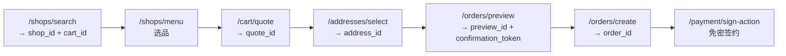

Clawdot Gateway 同时提供 **REST API** 与 **MCP** 两套接口，底层复用同一服务层。REST 面向常规后端集成，MCP（Model Context Protocol）面向 AI Agent 直连。两者覆盖完全相同的 18 个能力。

## Base URL

REST API：

```
https://api.clawdot.ai/api/v1
```

MCP（Streamable HTTP）端点：

```
https://api.clawdot.ai/mcp/v1
```

## 认证

Gateway 使用**双层认证**：**API Key** 标识 Agent 身份，**用户授权（consent grant）** 标识已授权的外卖用户。

<Tabs>
  <Tab title="REST">
    - **API Key（标识 Agent）：** 所有 `/api/v1/*` 请求都需要，通过请求头传递：

      ```bash
      Authorization: Bearer clw_<随机hex>
      ```

    - **用户授权（标识已授权用户）：** 操作用户资源的端点额外需要，通过请求头传递（绑定类端点除外）：

      ```bash
      X-Consent-Grant-Id: cg_<...>
      ```

      `consent_grant_id` 只走请求头，不要放进 JSON body。
  </Tab>
  <Tab title="MCP">
    - **API Key（标识 Agent）：** 走 Streamable HTTP 的 `Authorization: Bearer clw_...` 头。
    - **用户授权（标识已授权用户）：** 不使用请求头，而是作为**每个工具的 `consent_grant_id` 参数**传入。
  </Tab>
</Tabs>

<Note>
  API Key 与 Agent 在 [Portal](https://portal.clawdot.ai) 创建。`consent_grant_id`（`cg_` 前缀）由用户绑定流程返回，详见 [认证机制](/gateway/authentication)。
</Note>

## 接口分组

### REST API

<Columns cols={2}>
  <Card title="User Binding" icon="user-plus" href="/api-reference/user/bind-request">
    用户授权绑定（SMS / H5）、授权状态、解绑、主页链接。
  </Card>
  <Card title="Addresses" icon="location-dot" href="/api-reference/addresses/search">
    地址搜索、选择与更新。
  </Card>
  <Card title="Shops" icon="store" href="/api-reference/shops/search">
    商家搜索、菜单查询与分享链接。
  </Card>
  <Card title="Cart & Coupons" icon="cart-shopping" href="/api-reference/cart/quote">
    购物车算价与优惠券列表。
  </Card>
  <Card title="Orders" icon="receipt" href="/api-reference/orders/preview">
    订单预览、创建与状态查询。
  </Card>
  <Card title="Payment" icon="credit-card" href="/api-reference/payment/sign-action">
    免密签约动作与签约状态。
  </Card>
</Columns>

### MCP 工具

<Card title="MCP 概览" icon="plug" href="/mcp/overview">
  18 个 MCP 工具，每个对应一个 REST 端点，与 REST API 共享服务层，专为 AI Agent 集成设计。
</Card>

<Note>
  MCP 工具与 REST 端点一一对应：参数除 `consent_grant_id` 外与 REST 请求体一致（`consent_grant_id` 是工具参数，不是请求头）。例如 `search_shops` ↔ `POST /shops/search`、`create_order` ↔ `POST /orders/create`、`get_order_status` ↔ `GET /orders/{order_id}`。
</Note>

## 下单链路

各端点产出的 ID 串成一条完整下单链路：



<Note>
  所有金额字段单位为**分（整数）**，不是元。例如 `payable_price: 1500` 表示 ¥15.00。
</Note>

## 统一错误格式

所有接口的错误响应都是统一结构：

```json
{
  "error": {
    "code": "ERROR_CODE",
    "message": "人类可读的错误描述"
  }
}
```

常见错误码：

| 错误码 | HTTP | 说明 |
|--------|------|------|
| `AUTH_REQUIRED` | 401 | 缺少 API Key |
| `AUTH_INVALID` | 401 | API Key 无效或已禁用 |
| `CONSENT_GRANT_REQUIRED` | 401 | 缺少 `consent_grant_id` |
| `CONSENT_GRANT_INVALID` | 401 | `consent_grant_id` 无效或已过期 |
| `CONSENT_GRANT_EXPIRED` | 401 | 用户授权已过期，需重新授权 |
| `CAP_NOT_BOUND` | 403 | 当前 Agent 未开通该能力 |
| `CONSENT_GRANT_WRONG_CAP` | 403 | 授权属于其它能力 / 服务商 |
| `PUBLIC_REFERENCE_INVALID` | 400 | 平台 ID（店铺 / 地址 / 订单等）无效、过期或不属于当前授权用户 |
| `SHOP_NOT_FOUND` | 404 | 店铺不存在 |
| `ADDRESS_NOT_FOUND` | 404 | 地址不存在或不属于当前 Agent |
| `RATE_LIMITED` | 429 | 请求频率超限 |
| `SMS_COOLDOWN` | 429 | 验证码 60 秒冷却中 |
| `QUOTA_EXCEEDED` | 429 | 每日配额用尽 |
| `ORDER_FAILED` | 500 | 订单创建失败 |
| `ELEME_ERROR` | 502 | 上游 API 错误，稍后重试 |

完整错误码与处理建议见 [错误处理](/gateway/error-handling)。

## 速率限制与配额

基于 Redis 滑动窗口，按 Agent 维度限流：

| 操作 | 限制 |
|------|------|
| 下单（`POST /orders/create`） | 10 次/分钟/Agent |
| 其他接口 | 60 次/分钟/Agent |
| SMS 发送 | 60 秒冷却/手机号 |

超限返回 `429 RATE_LIMITED`（SMS 冷却返回 `SMS_COOLDOWN`）。每日配额按开发者层级区分，超限返回 `429 QUOTA_EXCEEDED`。
