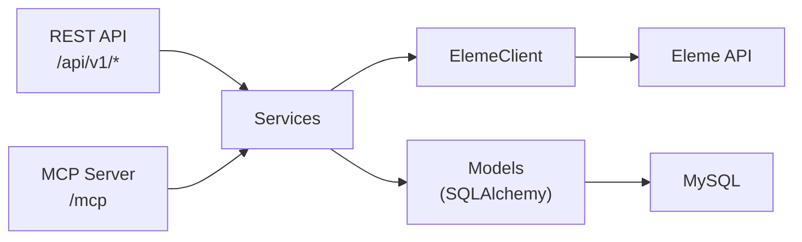
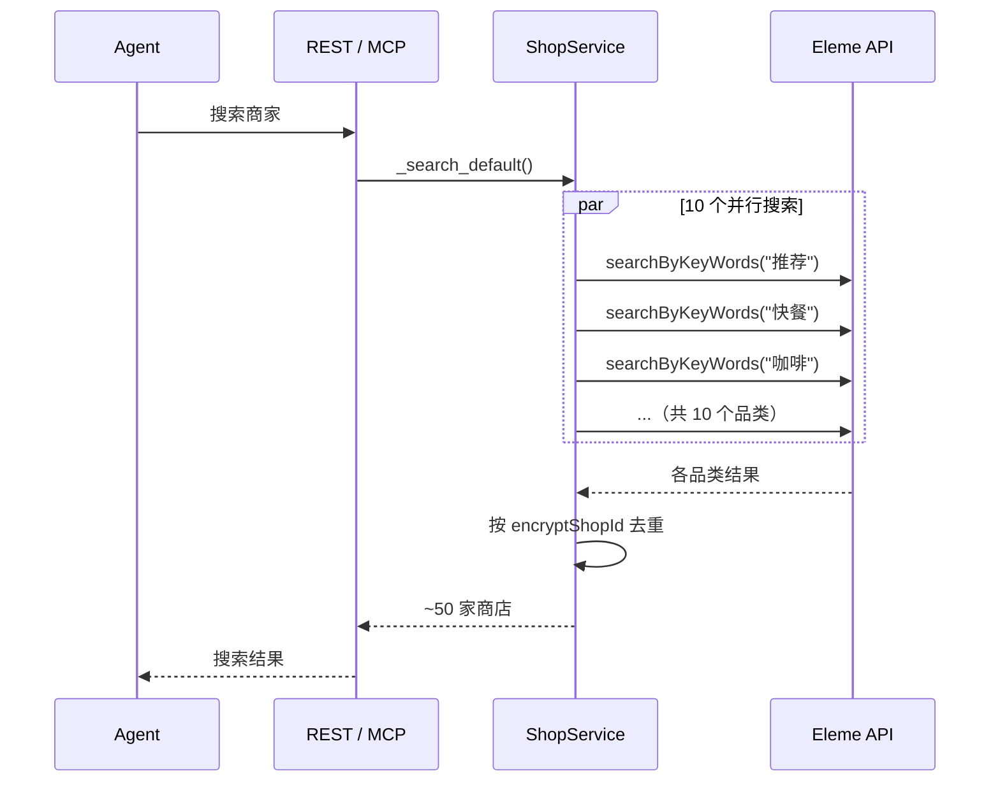
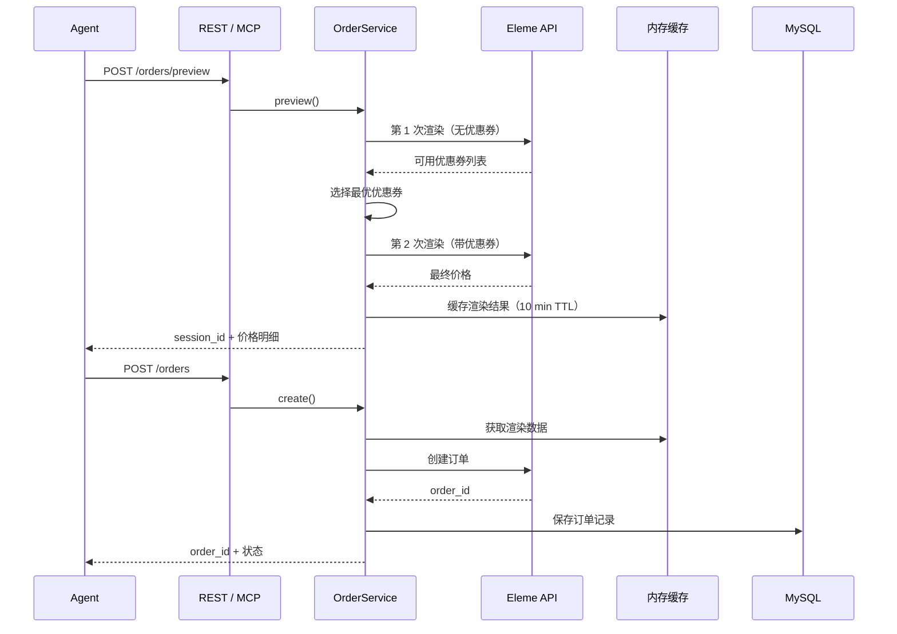

## 整体架构

Clawdot Gateway 采用三层架构，REST 和 MCP 两个入口共享同一套服务层和业务逻辑。

## 层级说明

<AccordionGroup>
  <Accordion title="Gateway 层 — 入口与路由" icon="door-open">
    **位置：** `src/gateway/`

    负责协议适配和输入验证，不包含业务逻辑。

    - **REST routers** — FastAPI 路由，处理 HTTP 请求/响应序列化
    - **MCP tools** — 9 个 MCP 工具定义，将 MCP 调用转换为服务层调用
    - **Auth middleware** — `require_agent()` 和 `require_user()` 依赖注入

    两个入口的区别仅在参数传递方式：REST 使用 Header，MCP 使用参数。
  </Accordion>

  <Accordion title="Service 层 — 业务逻辑" icon="gears">
    **位置：** `src/services/`

    核心业务逻辑所在，通过构造函数接收依赖（DB session, Eleme client）：

    - **AuthService** — Agent 注册、API Key 生成与验证
    - **UserService** — SMS 发送、验证码校验、用户绑定
    - **ShopService** — 商家搜索（含并行多品类搜索）、菜单获取（含规格/属性/加料解析）
    - **AddressService** — POI 搜索、地址选择与创建
    - **OrderService** — 订单预览（含自动优惠券）、创建与查询
  </Accordion>

  <Accordion title="Eleme Client 层 — API 封装" icon="cloud">
    **位置：** `src/eleme/`

    饿了么 API 的 HTTP 客户端封装：

    - **Token 管理** — `ensure_token` 自动刷新过期 Token
    - **请求签名** — 按饿了么要求的签名算法
    - **UA 管理** — 不同端点使用不同 User-Agent（订单用 MTOPSDK 格式，搜索用 Rajax 格式）
    - **错误处理** — 统一的饿了么 API 错误转换
  </Accordion>
</AccordionGroup>

## 数据流

### 典型搜索请求

### 典型下单请求

## 数据库模型

<Tabs>
  <Tab title="agents">
    | 字段 | 类型 | 说明 |
    |------|------|------|
    | id | int (PK) | 自增主键 |
    | name | varchar(100) | Agent 名称 |
    | is_active | boolean | 是否启用 |
    | created_at | datetime | 创建时间 |
  </Tab>
  <Tab title="api_keys">
    | 字段 | 类型 | 说明 |
    |------|------|------|
    | id | int (PK) | 自增主键 |
    | agent_id | int (FK) | 关联 Agent |
    | key_hash | varchar(64) | SHA-256 哈希 |
    | prefix | varchar(8) | Key 前缀（如 `clw_a1b2`）|
    | is_active | boolean | 是否启用 |
    | created_at | datetime | 创建时间 |
  </Tab>
  <Tab title="user_bindings">
    | 字段 | 类型 | 说明 |
    |------|------|------|
    | id | int (PK) | 自增主键 |
    | agent_id | int (FK) | 关联 Agent |
    | phone_hash | varchar(64) | 手机号 SHA-256 |
    | eleme_user_id | varchar(256) | AES-256-GCM 加密 |
    | user_token | varchar(36) | UUID，唯一索引 |
    | token_expires_at | datetime | Token 过期时间 |
    | created_at / updated_at | datetime | 时间戳 |
  </Tab>
  <Tab title="orders">
    | 字段 | 类型 | 说明 |
    |------|------|------|
    | id | int (PK) | 自增主键 |
    | agent_id | int (FK) | 关联 Agent |
    | user_binding_id | int (FK) | 关联用户绑定 |
    | eleme_order_id | varchar(64) | 饿了么订单 ID |
    | shop_name | varchar(200) | 商家名称 |
    | total_amount | decimal(10,2) | 订单总额 |
    | status | varchar(32) | 订单状态 |
    | raw_response | JSON | 原始响应 |
    | created_at / updated_at | datetime | 时间戳 |
  </Tab>
</Tabs>

## 安全设计

| 机制 | 实现 |
|------|------|
| API Key 存储 | SHA-256 哈希，数据库不存明文 |
| 手机号存储 | SHA-256 哈希，用于去重 |
| 用户 ID 存储 | AES-256-GCM 加密（base64 编码的 32 字节密钥）|
| User Token | UUID v4（128 位熵）|
| 管理员认证 | 单一 `X-Admin-Secret` 请求头 |
