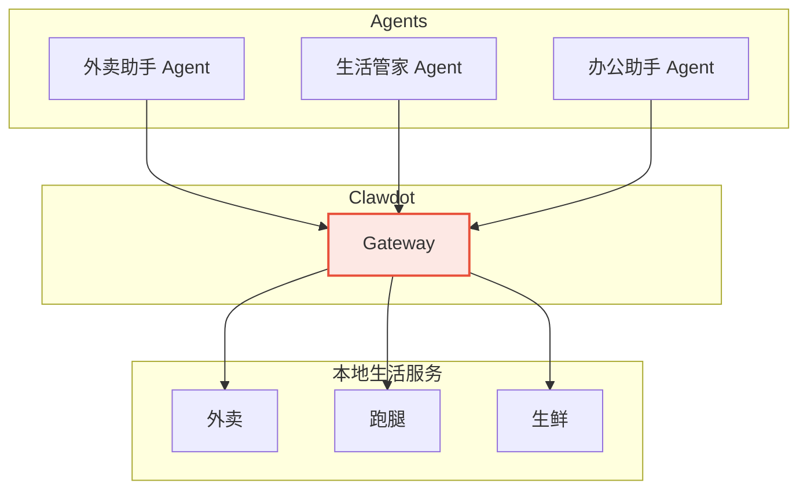

## 什么是 Clawdot Agent

Clawdot Agent 是能够通过 Clawdot Gateway 访问本地生活服务的 AI 应用。每个 Agent 拥有独立的身份（API Key）和权限，可以代表用户执行外卖点餐等操作。

## Agent 类型

<Columns cols={2}>
  <Card title="对话式 Agent" icon="comments">
    嵌入在 Claude、GPT 等对话平台中，通过 MCP 协议直接调用 Gateway。用户用自然语言下单，Agent 完成全流程。
  </Card>
  <Card title="自动化 Agent" icon="gears">
    独立运行的后台服务，通过 REST API 调用 Gateway。适合定时下单、团餐管理等场景。
  </Card>
  <Card title="集成 Agent" icon="puzzle-piece">
    嵌入到现有应用（企业微信、钉钉、Slack）中的 Agent，将外卖能力带入用户已有的工作流。
  </Card>
  <Card title="自定义 Agent" icon="wand-magic-sparkles">
    基于 Clawdot SDK 构建的自定义 Agent，可以组合多种本地生活服务，创造全新的使用场景。
  </Card>
</Columns>

## Agent 生命周期

<Steps>

### 注册

管理员通过 Admin API 创建 Agent，获取 API Key。

### 用户绑定

Agent 引导用户完成 SMS 验证，获取 User Token。每个 Agent 的用户绑定相互独立。

### 服务调用

Agent 使用 API Key + User Token 调用 Gateway，代表用户执行操作。

### 监控

通过日志和订单记录追踪 Agent 的使用情况（控制台功能规划中）。

</Steps>

## 安全模型

| 层级 | 机制 | 说明 |
|------|------|------|
| Agent 身份 | API Key (SHA-256) | 每个 Agent 独立的 Key，哈希存储 |
| 用户授权 | User Token (UUID) | 用户通过 SMS 验证主动授权 |
| 数据隔离 | Agent-User 绑定 | 每个 Agent 只能访问自己绑定的用户 |
| 操作限流 | Token Bucket | 防止滥用，下单 10 次/分钟 |
