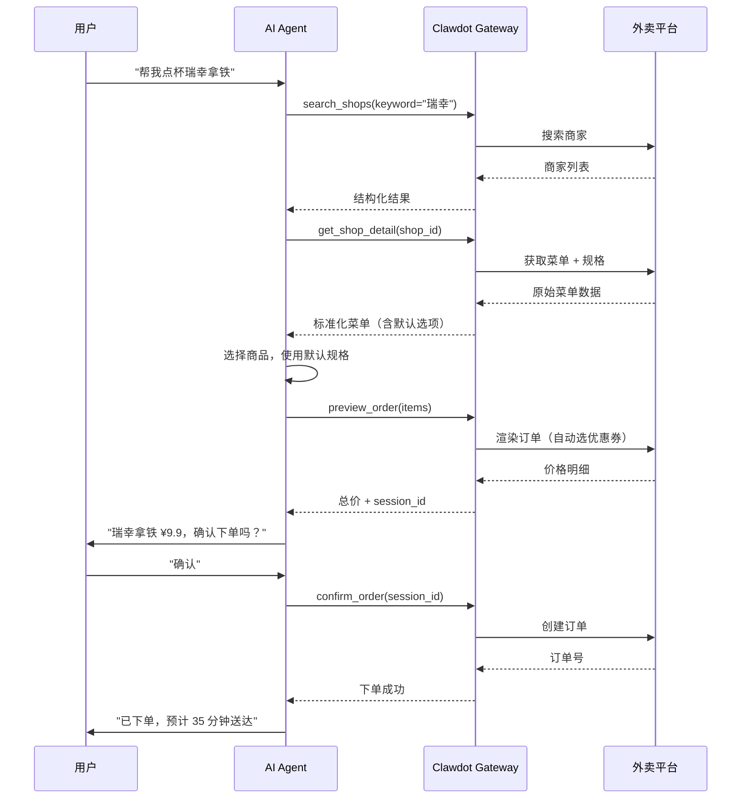

## 整体流程



## Clawdot 做了什么

AI Agent 直接对接外卖平台会遇到很多问题。Clawdot Gateway 在中间解决了这些复杂性：

| Agent 看到的 | Gateway 帮你处理的 |
|-------------|-------------------|
| 简单的 `shop_id` | 多种 ID 格式转换（加密 ID、内部 ID、淘宝 ID）|
| 标准化的菜单结构 | 规格/属性/加料解析，互斥规则计算 |
| `default_ingredients` 一键下单 | 遍历所有规格组，排除互斥项，选择默认项 |
| 一个最终价格 | 两次渲染：先获取优惠券列表，再用最优券重新渲染 |
| 统一的认证方式 | Token 自动刷新、请求签名、UA 适配 |
| 统一的错误码 | 各种平台错误归类为标准错误码 |

## 双协议入口

同一个 Gateway 实例同时暴露两种协议：

<Tabs>
  <Tab title="REST API">
    标准 HTTP 接口，适合任何编程语言和框架：

    ```
    GET  /api/v1/shops/search
    GET  /api/v1/shops/{id}
    POST /api/v1/orders/preview
    POST /api/v1/orders
    ...
    ```

    认证通过 HTTP Header 传递。
  </Tab>
  <Tab title="MCP Protocol">
    Model Context Protocol，AI 原生调用方式：

    ```
    search_shops / get_shop_detail
    search_pois / select_address / list_addresses / create_address
    preview_order / confirm_order / get_order
    ```

    9 个 MCP 工具，Claude Desktop 等 MCP 客户端直接连接。
  </Tab>
</Tabs>
