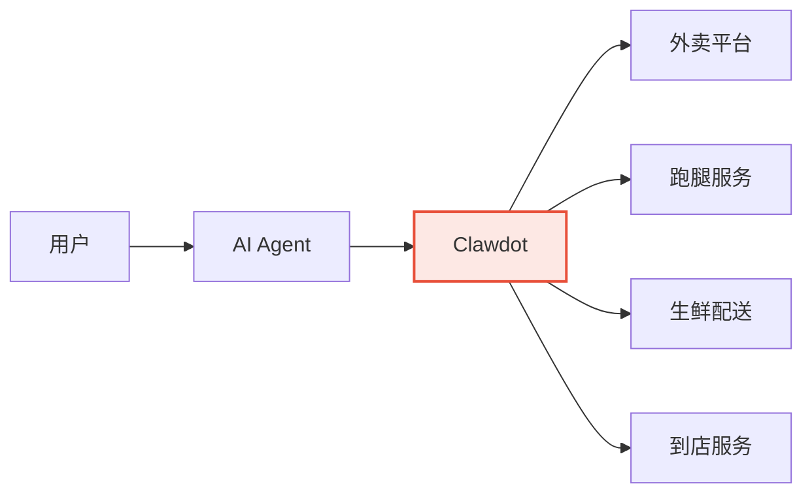

## 愿景

Clawdot 的目标是成为 **AI 时代的本地生活基础设施**。

当 AI Agent 需要帮用户点一杯咖啡、叫一个跑腿、预约一次到店服务时，它需要一个标准化的方式来连接这些本地生活平台。Clawdot 就是这个连接层。

## 核心理念

<AccordionGroup>
  <Accordion title="Agent-First" icon="robot">
    所有 API 设计以 AI Agent 的使用场景为出发点。例如菜单返回的 `default_ingredients` 字段，让 Agent 无需理解复杂的规格互斥逻辑就能快速下单。
  </Accordion>

  <Accordion title="协议标准化" icon="plug">
    同时支持 REST 和 MCP 协议。无论你的 Agent 运行在 Claude、GPT、还是自研平台上，都可以无缝接入。
  </Accordion>

  <Accordion title="安全优先" icon="shield">
    用户隐私数据全程加密：手机号 SHA-256 哈希、用户 ID AES-256-GCM 加密、API Key 哈希存储。Agent 无法接触到用户的原始敏感信息。
  </Accordion>

  <Accordion title="持续扩展" icon="layer-group">
    从外卖场景开始验证，逐步扩展到更多本地生活服务。每个新场景都遵循相同的 Agent-First 设计原则和双协议标准。
  </Accordion>
</AccordionGroup>

## 组成部分

| 组件 | 说明 | 状态 |
|------|------|------|
| **Gateway** | 本地生活 API 网关，桥接 Agent 与外卖平台 | 已上线 |
| **Agent SDK** | 面向开发者的 Agent 构建工具包 | 规划中 |
| **控制台** | Agent 管理、监控、分析面板 | 规划中 |
| **Marketplace** | Agent 发现与分发平台 | 规划中 |
