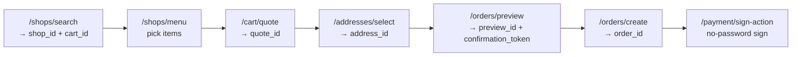

Clawdot Gateway exposes both a **REST API** and an **MCP** interface, both backed by the same service layer. REST targets conventional backend integration; MCP (Model Context Protocol) targets direct AI Agent integration. Both cover exactly the same 18 capabilities.

## Base URL

REST API:

```
http://eleme-gateway.hicaspian.com/api/v1
```

MCP (Streamable HTTP) endpoint:

```
http://eleme-gateway.hicaspian.com/mcp/v1
```

## Authentication

The Gateway uses **two-layer authentication**: the **API Key** identifies the Agent, and the **user authorization (consent grant)** identifies an authorized food-delivery user.

<Tabs>
  <Tab title="REST">
    - **API Key (identifies the Agent):** required on every `/api/v1/*` request, passed via a header:

      ```bash
      Authorization: Bearer clw_<random_hex>
      ```

    - **Consent grant (identifies the authorized user):** additionally required by endpoints that operate on user resources, passed via a header (except the binding endpoints):

      ```bash
      X-Consent-Grant-Id: cg_<...>
      ```

      `consent_grant_id` is sent only in the header — do not put it in the JSON body.
  </Tab>
  <Tab title="MCP">
    - **API Key (identifies the Agent):** sent via the Streamable HTTP `Authorization: Bearer clw_...` header.
    - **Consent grant (identifies the authorized user):** not sent as a header; instead passed as the **`consent_grant_id` parameter on each tool**.
  </Tab>
</Tabs>

<Note>
  API Keys and Agents are created in the [Portal](http://console.hicaspian.com). The `consent_grant_id` (`cg_` prefix) is returned by the user binding flow — see [Authentication](/en/gateway/authentication).
</Note>

## Endpoint Groups

### REST API

<Columns cols={2}>
  <Card title="User Binding" icon="user-plus" href="/en/api-reference/user/bind-request">
    User authorization binding (SMS / H5), authorization status, unbind, and homepage URL.
  </Card>
  <Card title="Addresses" icon="location-dot" href="/en/api-reference/addresses/search">
    Address search, selection, and update.
  </Card>
  <Card title="Shops" icon="store" href="/en/api-reference/shops/search">
    Shop search, menu queries, and share URLs.
  </Card>
  <Card title="Cart & Coupons" icon="cart-shopping" href="/en/api-reference/cart/quote">
    Cart pricing and coupon listing.
  </Card>
  <Card title="Orders" icon="receipt" href="/en/api-reference/orders/preview">
    Order preview, creation, and status queries.
  </Card>
  <Card title="Payment" icon="credit-card" href="/en/api-reference/payment/sign-action">
    No-password sign action and sign status.
  </Card>
</Columns>

### MCP Tools

<Card title="MCP Overview" icon="plug" href="/en/mcp/overview">
  18 MCP tools, each mapping to one REST endpoint, sharing the same service layer and built for AI Agent integration.
</Card>

<Note>
  MCP tools map one-to-one to REST endpoints: parameters match the REST request body except for `consent_grant_id` (which is a tool parameter, not a header). For example, `search_shops` ↔ `POST /shops/search`, `create_order` ↔ `POST /orders/create`, `get_order_status` ↔ `GET /orders/{order_id}`.
</Note>

## Ordering Flow

The IDs produced by each endpoint chain together into a complete ordering flow:



<Warning>
  All amount fields are in **cents (integers)**, not yuan. For example, `payable_price: 1500` means ¥15.00.
</Warning>

## Unified Error Format

Every endpoint returns errors in the same structure:

```json
{
  "error": {
    "code": "ERROR_CODE",
    "message": "Human-readable error description"
  }
}
```

Common error codes:

| Code | HTTP | Description |
|------|------|------|
| `AUTH_REQUIRED` | 401 | Missing API Key |
| `AUTH_INVALID` | 401 | API Key invalid or disabled |
| `CONSENT_GRANT_REQUIRED` | 401 | Missing `consent_grant_id` |
| `CONSENT_GRANT_INVALID` | 401 | `consent_grant_id` invalid or expired |
| `CONSENT_GRANT_EXPIRED` | 401 | User authorization expired; re-authorization required |
| `CAP_NOT_BOUND` | 403 | The Agent has not been granted this capability |
| `CONSENT_GRANT_WRONG_CAP` | 403 | The grant belongs to a different capability / provider |
| `PUBLIC_REFERENCE_INVALID` | 400 | A platform ID (shop / address / order, etc.) is invalid, expired, or does not belong to the current authorized user |
| `SHOP_NOT_FOUND` | 404 | Shop not found |
| `ADDRESS_NOT_FOUND` | 404 | Address not found or not owned by the current Agent |
| `RATE_LIMITED` | 429 | Request rate exceeded |
| `SMS_COOLDOWN` | 429 | Verification code is in 60-second cooldown |
| `QUOTA_EXCEEDED` | 429 | Daily quota exhausted |
| `ORDER_FAILED` | 500 | Order creation failed |
| `ELEME_ERROR` | 502 | Upstream API error; retry later |

Full error codes and handling guidance: see [Error Handling](/en/gateway/error-handling).

## Rate Limiting and Quota

A Redis sliding window enforces per-Agent rate limits:

| Operation | Limit |
|------|------|
| Place order (`POST /orders/create`) | 10 requests/minute/Agent |
| Other endpoints | 60 requests/minute/Agent |
| SMS sending | 60-second cooldown/phone number |

Exceeding the limit returns `429 RATE_LIMITED` (SMS cooldown returns `SMS_COOLDOWN`). The daily quota varies by developer tier; exceeding it returns `429 QUOTA_EXCEEDED`.