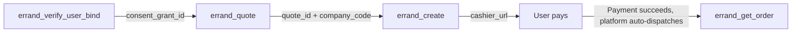

Errand (same-city delivery-run) is a capability independent from food ordering: it helps a user move an item from one place to another — picking up a package, sending documents, running an errand — and does not itself involve ordering food or shopping. Errand exposes its Agent interface via **MCP (Model Context Protocol)** over the **Streamable HTTP** transport, with **19 tools** (all prefixed `errand_`) covering the full flow from user authorization, saving addresses, and pricing, to placing an order, payment, and delivery tracking.

## Connecting

**Endpoint:**

```
https://paotui.hicaspian.com/mcp/v1
```

<Note>
  Errand and food ordering are **two independent MCP services** (different endpoints) that share the same credential but must be connected to separately. The MCP Client discovers tools via `tools/list` and calls them via `tools/call`.
</Note>

## Authentication

Two layers — **Agent identity** at the connection layer, **user authorization** via a tool parameter:

<Tabs>
  <Tab title="Agent identity (API Key)">
    Passed at the **connection layer** via the `Authorization: Bearer <agent_credential>` header, required on every MCP request; uses the same credential as food ordering.
  </Tab>
  <Tab title="User authorization (consent grant)">
    Passed as the **`consent_grant_id` parameter on every business tool** (`cg_` prefix), not as a header. Obtained via SMS code binding; one binding is reused long-term.

    ```json
    {
      "consent_grant_id": "cg_...",
      "...": "..."
    }
    ```

    `errand_request_user_bind` / `errand_verify_user_bind` are the exception — they are how you obtain a grant, so they need only Agent identity and take no `consent_grant_id`.
  </Tab>
</Tabs>

<Note>
  Errand's `consent_grant_id` is issued independently from food ordering's and the two cannot be mixed; passing an Errand grant to a food-ordering tool (or vice versa) returns `CONSENT_GRANT_WRONG_CAP`. If your Agent has cross-capability interop enabled, unbinding shares one grant across both and invalidates it for both at once — see the authorization tool pages for details.
</Note>

## Units and coordinate system

<Warning>
  **All amount fields are in cents (integers)**, not yuan; **distance is in meters, weight in grams**; the coordinate system is always **GCJ-02**.
</Warning>

## Full flow

Minimal loop:

```
First time: errand_request_user_bind → errand_verify_user_bind   # SMS code binding → get consent_grant_id (reused long-term)
0. errand_search_addresses            # (optional) search an address by keyword → get candidate coordinates; errand_save_address to save it for reuse
0. errand_list_goods_categories       # (optional) item category list → let the user pick one, pass it into errand_quote
0. errand_list_schedule_slots         # (optional) scheduled-delivery time slot list → user picks one, pass it as errand_quote's scheduled_at
1. errand_quote                       # multi-provider quote → get quote_id + each provider's company_code/fee
2. errand_create                      # redeem quote_id to place the order → get order_id + cashier_url
3. User opens cashier_url to pay      # after payment succeeds the platform dispatches a rider automatically (no tool call needed)
4. errand_get_order                   # track status (waiting for rider / delivering / completed)
```

| Stage | Tool order | Notes |
|---|---|---|
| Authorization (first time) | `errand_request_user_bind` → `errand_verify_user_bind` | Bind the user via SMS code and get a `consent_grant_id`; one binding is reused long-term and carried on every later tool call. |
| Save an address (optional) | `errand_search_addresses` → `errand_save_address` | Search an address by keyword to get coordinates; save the selected one to reuse it later. Skip this if you already know the coordinates. |
| Quote | `errand_quote` | Submit pickup/drop-off details and items; returns live quotes from multiple providers. `quote_id` is valid for 600 seconds and **single-use**. **Pickup and drop-off must be in the same city.** |
| Place order | `errand_create` | Redeem `quote_id` with a chosen provider (`company_code`). This step only creates a **pending-payment order** and returns the cashier link `cashier_url`. **No rider is dispatched before payment succeeds.** |
| Payment | (no tool) | The user opens `cashier_url` and pays via Alipay/WeChat Pay on the cashier page; the payment result is written back to the platform, which **dispatches automatically**. |
| Tracking | `errand_get_order` / `errand_get_rider` | Order details sync the delivery provider's latest status in real time (with a Chinese status label and timeline); rider location is queryable while delivering. |
| Add a tip | `errand_add_tip` (optional) | Add a tip to expedite the order while it's waiting for a rider (a tip is a separate payment and only takes effect once paid); can be called more than once. |
| Cancel | `errand_pre_cancel` → `errand_cancel` | Pre-check the cancellation fee first (cancelling after a rider has accepted may incur a fee), then cancel once the user confirms; a paid order is refunded automatically for "amount paid − cancellation fee". |
| Reuse | `errand_list_orders` | The order history list returns everything needed to refill a new `errand_quote` (from/to/goods), supporting "same as last time". |



## Key field flow

| Field | Source tool | Used by | Notes |
|---|---|---|---|
| `consent_grant_id` | `errand_verify_user_bind` | Every tool parameter | The user authorization record ID; re-binding the same phone number rotates it and invalidates the old value. |
| `lat` / `lng` | `errand_search_addresses` (`candidates[]`) | `errand_quote`'s `from_address`/`to_address` | Coordinates from a POI search, filled into the pickup/drop-off address. |
| `address_id` | `errand_save_address` / `errand_list_addresses` / `errand_search_addresses` (`saved_matches`) | `errand_quote`'s `from_address`/`to_address` | Address ID (`plat_` prefix); use either this or `address_text`+`lat`+`lng`. |
| `goods_category_code` | `errand_list_goods_categories` | `errand_quote`; read back in order details | The item category code. **This is authoritative for claims, independent of the item name** — remember to carry it over when reusing a past order. |
| `quote_id` | `errand_quote` | `errand_create` | The quote confirmation token, **valid once within 600 seconds**; invalid after redemption, reusing it returns `QUOTE_INVALID_OR_EXPIRED`. |
| `company_code` | `errand_quote` (`quotes[]`) | `errand_create` | The chosen provider code, must be within this quote's result set; **determines the amount charged = that provider's fee**. |
| `order_id` | `errand_create` | Order details / rider / cancel / tip | The Errand order ID (`err_` prefix). |
| `cashier_url` | `errand_create` | Hand to the user to open | The cashier payment page link; the platform dispatches automatically once payment succeeds. |
| `callback_url` | `errand_create` (optional) | Status callback push | The platform POSTs to this address whenever the order status changes — see [Status callbacks](/en/errand/callbacks). |

## Tool list

Grouped by function, 19 tools in total.

### Authorization

| Tool | Description |
|---|---|
| `errand_request_user_bind` | Send an SMS verification code (the entry point for obtaining consent; only needs the Agent credential). |
| `errand_verify_user_bind` | Verify the code to establish authorization, returning `consent_grant_id`. |
| `errand_get_auth_status` | Check whether a given authorization grant is still valid. |
| `errand_revoke_user_bind` | Revoke the user's authorization (unbind). |

### Addresses

| Tool | Description |
|---|---|
| `errand_search_addresses` | Search addresses by keyword; returns candidate coordinates plus the user's already-saved matches. |
| `errand_save_address` | Save an address to the address book for reuse. |
| `errand_list_addresses` | List the address book (addresses Errand has saved). |
| `errand_update_address` | Edit a saved address. |
| `errand_delete_address` | Delete an address from the address book. |

### Quoting

| Tool | Description |
|---|---|
| `errand_list_goods_categories` | List of item categories for the user to pick from. |
| `errand_list_schedule_slots` | List of optional scheduled-delivery time slots (15-minute grid) for the user to pick "deliver by when". |
| `errand_quote` | Live quotes from multiple providers plus a single-use confirmation token. |

### Ordering

| Tool | Description |
|---|---|
| `errand_create` | Redeem the token to create a pending-payment order and return the cashier link. |

### Orders

| Tool | Description |
|---|---|
| `errand_list_orders` | Order history list (returns everything needed to refill a quote). Supports filtering by order time and status, plus pagination. |
| `errand_get_order` | Order details plus real-time status/timeline/rider for an in-progress order. |
| `errand_get_rider` | The rider's real-time location. |

### Cancellation

| Tool | Description |
|---|---|
| `errand_pre_cancel` | Cancellation pre-check: cancellation fee and refundable amount (does not cancel). |
| `errand_cancel` | Cancel the order; a paid order is refunded automatically (amount paid − cancellation fee). |

### Tips

| Tool | Description |
|---|---|
| `errand_add_tip` | Add a tip to expedite the order (before a rider accepts it; can be added more than once). |

See each tool's page for its full parameters and return fields. See [Status enums](/en/errand/status) for status values, [Error handling](/en/errand/errors) for error codes, and [Status callbacks](/en/errand/callbacks) for the callback format.
