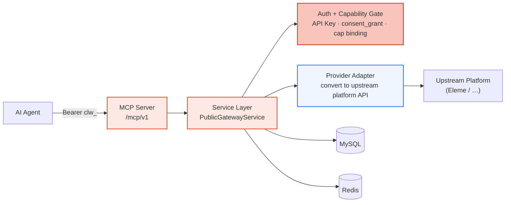
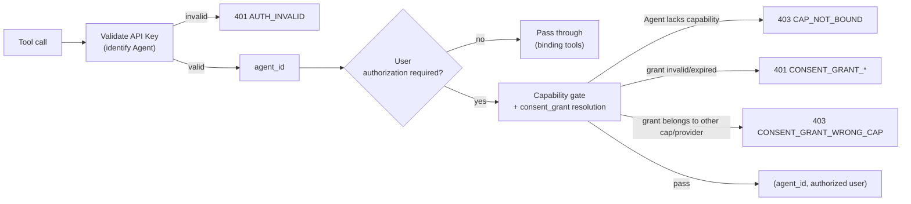
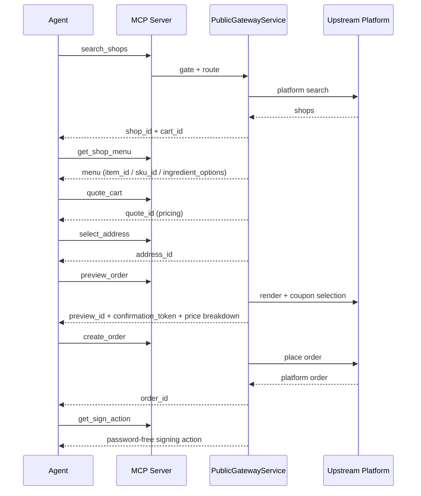

Clawdot Gateway exposes food-delivery capabilities over **MCP (Model Context Protocol)**: an Agent calls the gateway's tools through the MCP Server (`/mcp/v1`), presents its identity with an API Key, and asserts "I have been authorized by a given food-delivery user" with a `consent_grant`. The gateway routes the request to the upstream platform accordingly and converts the response into a unified standard format.

## Overall Architecture



- **MCP is the only external entry point** — an Agent connects to `/mcp/v1` over Streamable HTTP and calls food-delivery capabilities as a set of standard tools. Underneath is a single service layer, `PublicGatewayService`; externally only the MCP protocol is exposed.
- **Auth + capability gate** — Before execution, every tool call passes the same gate: validate the API Key (identify the Agent), validate the consent_grant (identify the authorized user), and check whether the Agent has the corresponding capability enabled (cap binding).
- **Provider adapter** — Converts standard tool calls into upstream platform API calls, and converts platform responses back into the unified standard format and error codes.
- **State storage** — MySQL holds records for Agents / API Keys / user bindings / orders; Redis carries short-lived state such as pricing context, single-flight locks, and shop-list caches.

<Note>
  This page only covers the **public** contract: the MCP tools on `/mcp/v1`. Operational actions such as creating an Agent, issuing an API Key, and enabling a capability go through the console ([console.hicaspian.com/agents](https://console.hicaspian.com/agents)) and are not part of the public API.
</Note>

## Connection and Authentication

The MCP Server is mounted at `/mcp/v1` with Streamable HTTP transport (FastMCP); the external host is `eleme-gateway.hicaspian.com`. Authentication has two layers:

- **Agent identity** — the connection-layer header `Authorization: Bearer clw_...` (sent on every MCP request). Issued when an Agent is created in the console.
- **User authorization** — passed as the **`consent_grant_id` parameter** of each business tool (not a header). The binding tools `request_user_bind` / `verify_user_bind` are the exception — they are the entry points for obtaining authorization and themselves take no `consent_grant_id`.

For a full connection example and the auth chain, see [Authentication](/en/gateway/authentication).

## MCP Tools

The gateway exposes 18 tools covering the full chain: authorization, addresses, shops, cart, coupons, orders, and payment signing:

| Group | Tool | Purpose |
|---|---|---|
| Auth | `request_user_bind` | Start binding (SMS code or H5; Agent identity only) |
| Auth | `verify_user_bind` | Confirm binding; mints `consent_grant_id` on success |
| Auth | `get_user_auth_status` | Query authorization status |
| Auth | `revoke_user_bind` | Unbind (old `consent_grant_id` invalidated instantly) |
| Auth | `get_homepage_url` | Get the Taoshan homepage link |
| Address | `search_addresses` | Search / list addresses |
| Address | `select_address` | Select / save an address, returns `address_id` |
| Address | `update_address` | Edit an address (unit / label; `address_id` unchanged) |
| Shop | `search_shops` | Search / browse shops, returns `shop_id` + `cart_id` |
| Shop | `get_shop_menu` | Shop menu, returns `item_id` / `sku_id` / `ingredient_options` |
| Shop | `get_shop_share_url` | Shop share link |
| Order | `quote_cart` | Price the cart, returns `quote_id` |
| Order | `list_coupons` | Account coupon list |
| Order | `preview_order` | Preview an order, returns `preview_id` + `confirmation_token` |
| Order | `create_order` | Create an order, returns `order_id` |
| Order | `get_order_status` | Query order status |
| Payment | `get_sign_action` | Get the password-free signing action (H5 link) |
| Payment | `get_sign_status` | Query signing status |

For each tool's parameters and return fields, see [MCP Tools](/en/mcp/overview).

## Authentication Model

The gateway uses a two-layer identity:

- **API Key identifies the Agent** — `Authorization: Bearer clw_...`, prefix `clw_`. The server stores only the SHA-256 hash, never the plaintext, and compares by hash on every request; a disabled key fails immediately. Issued when an Agent is created in the console.
- **consent_grant identifies the authorized user** — prefix `cg_`, representing "a given food-delivery user has authorized a given Agent to use a given capability." Obtained through the binding flow (`request_user_bind` + `verify_user_bind`), and revocable instantly via `revoke_user_bind`.



For the full auth chain, error codes, and how credentials are passed, see [Authentication](/en/gateway/authentication).

### Agent — Capability — Provider

Authorization is not "the Agent directly gets the user"; it is bound to a specific **capability (cap)** and **provider**:

- **Capability binding (cap binding)** — An `(agent_id, cap_code)` record declaring that a given Agent has a given capability enabled (the cap code for the food-delivery chain is `delivery`), carrying the provider coordinate (`provider_code`) on that record. Before any tool call executes, it must first resolve an `active` capability binding; otherwise it returns `CAP_NOT_BOUND`.
- **User binding (consent_grant)** — When a user authorizes, a user-binding record is written down recording which `agent_id`, which `cap_code`, and which `provider_code` it belongs to. When a request comes in, the gateway hashes `consent_grant_id` to look up this record and verifies that its capability/provider coordinates match the Agent's capability binding — a mismatch yields `CONSENT_GRANT_WRONG_CAP`.

In other words, a successful call must satisfy three things at once: **the API Key is valid** (the Agent is trusted), **the capability is enabled** (the Agent is allowed to use this capability), and **the consent_grant is valid with matching coordinates** (the user did authorize this Agent to use this capability).

## Ordering Flow

In a standard ordering flow, upstream-and-downstream IDs are chained hop by hop, with each step's output feeding the next:



1. `search_shops` → get `shop_id` + `cart_id` (`cart_id` already encapsulates the shop and delivery coordinates)
2. `get_shop_menu` → pick items, get `item_id` / `sku_id` / `ingredient_options`
3. `quote_cart` → get `quote_id` (pricing)
4. `select_address` → get `address_id`
5. `preview_order` → get `preview_id` + `confirmation_token` and the final price breakdown
6. `create_order` → get `order_id`
7. `get_sign_action` → password-free signing action (`get_sign_status` queries the signing status)

For the full sequence and fields, see [Ordering Flow](/en/gateway/order-flow).

<Note>
  All amount fields are in **cents (integers)**; everything exposed externally is an opaque ID issued by the gateway (`shop_id` / `cart_id` / `quote_id` / `address_id` / `preview_id` / `order_id`), and the upstream platform's raw IDs are never leaked.
</Note>

## Error Handling

All errors return a unified structure, with no extra fields like `next_action`:

```json
{
  "error": {
    "code": "CONSENT_GRANT_INVALID",
    "message": "..."
  }
}
```

For the full list, see [Error Handling](/en/gateway/error-handling).

## Security Design

| Mechanism | Implementation |
|------|------|
| API Key storage | SHA-256 hash; no plaintext in the database; disabling takes effect immediately |
| consent_grant storage | Only the SHA-256 hash (`consent_grant_hash`) is stored; the original value is never persisted |
| Phone number storage | Encrypted at rest, with a SHA-256 hash used for deduplication |
| User ID storage | AES-256-GCM encryption |
| External IDs | All are opaque IDs issued by the gateway, decoupled from the upstream platform's raw IDs |
| Public-surface boundary | Externally exposes only the `/mcp/v1` MCP tools; operational / administrative actions (creating an Agent, enabling a capability, etc.) go through the console and are not part of the public API |
