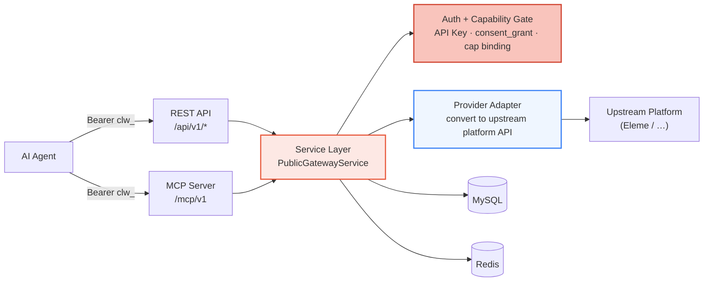
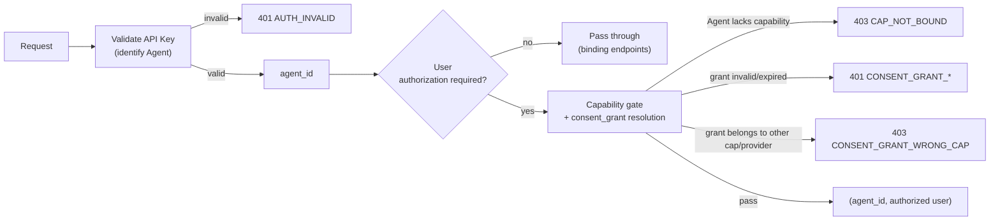
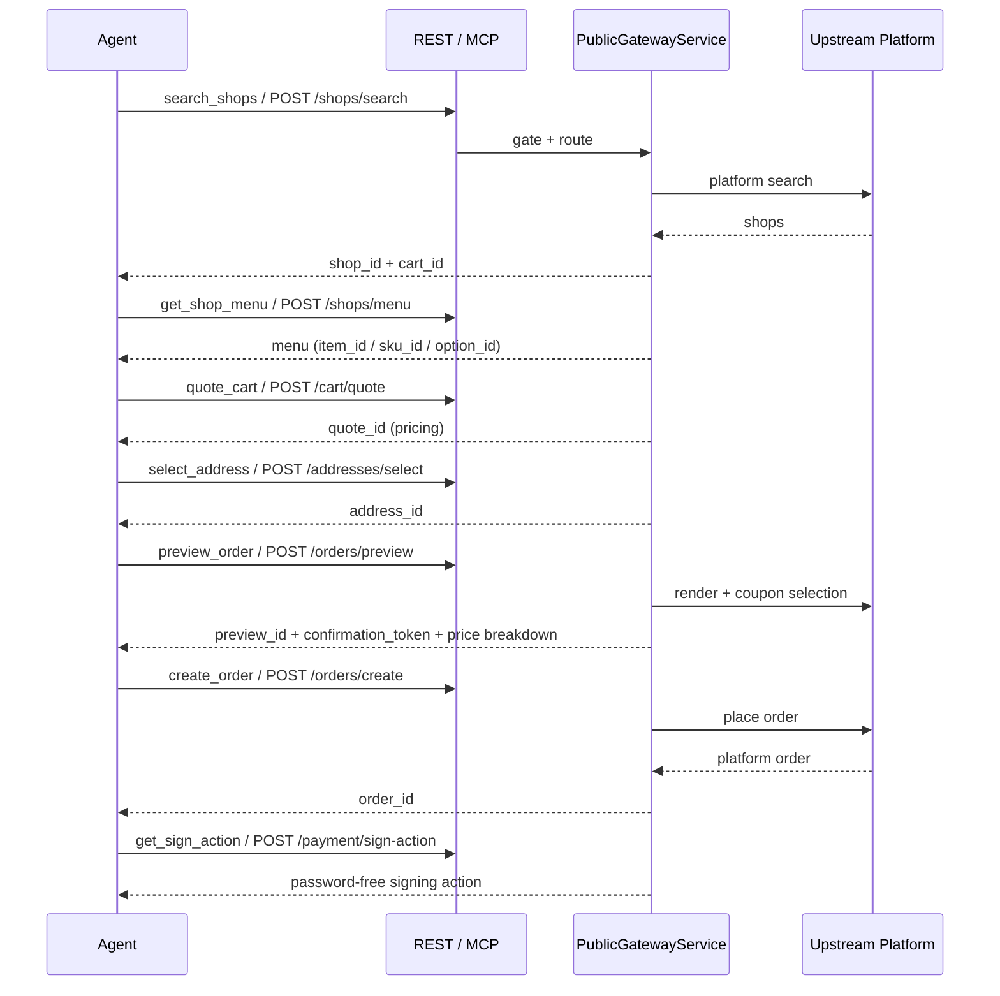

Clawdot Gateway exposes food-delivery capabilities over **standard protocols**. The same service layer is mounted on two entry points at once: a REST API and an MCP Server. An Agent presents its identity with an API Key and asserts "I have been authorized by a given food-delivery user" with a consent_grant. The gateway routes the request to the upstream platform accordingly and converts the response into a unified standard format.

## Overall Architecture



- **Two entry points share one service layer** — REST and MCP expose the same capabilities; they differ only in how parameters are passed: REST uses Header + JSON body, MCP uses tool parameters.
- **Auth + capability gate** — Before execution, every public entry point passes the same gate: validate the API Key (identify the Agent), validate the consent_grant (identify the authorized user), and check whether the Agent has the corresponding capability enabled (cap binding).
- **Provider adapter** — Converts standard-protocol requests into upstream platform API calls, and converts platform responses back into the unified standard format and error codes.
- **State storage** — MySQL holds records for Agents / API Keys / user bindings / orders; Redis carries short-lived state such as pricing context, single-flight locks, and shop-list caches.

<Note>
  This page only covers the **public** contract: the `/api/v1/*` REST endpoints and the `/mcp/v1` MCP tools. Operational actions such as creating an Agent, issuing an API Key, and enabling a capability go through the Portal ([portal.clawdot.ai](http://console.hicaspian.com/agents)) and are not part of the public API.
</Note>

## Two Entry Points

<Tabs>
  <Tab title="REST API">
    Mounted under the `/api/v1` prefix, with 18 endpoints covering the full chain: authorization, addresses, shops, cart, coupons, orders, and payment signing.

    - **Agent identity** — `Authorization: Bearer clw_...` request header.
    - **User authorization** — `X-Consent-Grant-Id: cg_...` request header (except for binding endpoints). `consent_grant_id` travels only in the header, never in the JSON body.
    - **Request/response** — JSON body; all amount fields are in **cents (integers)**.

    See the [API Reference](/en/mcp/user/bind-request).
  </Tab>

  <Tab title="MCP Server">
    Mounted via `app.mount("/mcp", create_mcp_app())`. FastMCP versions its routes, so the public endpoint is **`/mcp/v1`**, and the transport is streamable HTTP. It exposes 18 tools, one-to-one with the 18 REST endpoints.

    - **Agent identity** — Also via `Authorization: Bearer clw_...`, validated by the MCP middleware which injects `agent_id`.
    - **User authorization** — Passed as the **`consent_grant_id` parameter** of each tool (not the `X-Consent-Grant-Id` header — that one is for REST).
    - **Parameters** — Apart from `consent_grant_id`, a tool's parameters match the body fields of its corresponding REST endpoint.

    See [MCP Tools](/en/mcp/overview).
  </Tab>
</Tabs>

### REST Endpoint ↔ MCP Tool Mapping

The 18 MCP tools map one-to-one with the 18 REST endpoints:

| MCP Tool | REST Endpoint |
|---|---|
| `request_user_bind` | `POST /auth/bind/request` |
| `verify_user_bind` | `POST /auth/bind/verify` |
| `get_user_auth_status` | `GET /auth/status` |
| `revoke_user_bind` | `POST /auth/unbind` |
| `get_homepage_url` | `POST /auth/homepage-url` |
| `search_addresses` | `POST /addresses/search` |
| `select_address` | `POST /addresses/select` |
| `update_address` | `POST /addresses/update` |
| `search_shops` | `POST /shops/search` |
| `get_shop_menu` | `POST /shops/menu` |
| `get_shop_share_url` | `POST /shops/share-url` |
| `quote_cart` | `POST /cart/quote` |
| `list_coupons` | `POST /coupons/list` |
| `preview_order` | `POST /orders/preview` |
| `create_order` | `POST /orders/create` |
| `get_order_status` | `GET /orders/{order_id}` |
| `get_sign_action` | `POST /payment/sign-action` |
| `get_sign_status` | `GET /payment/sign-status` |

## Authentication Model

The gateway uses a two-layer identity:

- **API Key identifies the Agent** — `Authorization: Bearer clw_...`, prefix `clw_`. The server stores only the SHA-256 hash, never the plaintext, and compares by hash on every request; a disabled key fails immediately. Issued when an Agent is created in the Portal.
- **consent_grant identifies the authorized user** — prefix `cg_`, representing "a given food-delivery user has authorized a given Agent to use a given capability." Obtained through the binding flow (`request_user_bind` + `verify_user_bind`), and revocable instantly via `revoke_user_bind`.



For the full auth chain, error codes, and how credentials are passed, see [Authentication](/en/gateway/authentication).

### Agent — Capability — Provider

Authorization is not "the Agent directly gets the user"; it is bound to a specific **capability (cap)** and **provider**:

- **Capability binding (cap binding)** — An `(agent_id, cap_code)` record declaring that a given Agent has a given capability enabled (the cap code for the food-delivery chain is `delivery`), carrying the provider coordinate (`provider_code`) on that record. Before any public entry point executes, it must first resolve an `active` capability binding; otherwise it returns `CAP_NOT_BOUND`.
- **User binding (consent_grant)** — When a user authorizes, a user-binding record is written down recording which `agent_id`, which `cap_code`, and which `provider_code` it belongs to. When a request comes in, the gateway hashes `consent_grant_id` to look up this record and verifies that its capability/provider coordinates match the Agent's capability binding — a mismatch yields `CONSENT_GRANT_WRONG_CAP`.

In other words, a successful call must satisfy three things at once: **the API Key is valid** (the Agent is trusted), **the capability is enabled** (the Agent is allowed to use this capability), and **the consent_grant is valid with matching coordinates** (the user did authorize this Agent to use this capability).

## Ordering Flow

In a standard ordering flow, upstream-and-downstream IDs are chained hop by hop, with each step's output feeding the next:



1. `search_shops` → get `shop_id` + `cart_id` (`cart_id` already encapsulates the shop and delivery coordinates)
2. `get_shop_menu` → pick items, get `item_id` / `sku_id` / `option_id`
3. `quote_cart` → get `quote_id` (pricing)
4. `select_address` → get `address_id`
5. `preview_order` → get `preview_id` + `confirmation_token` and the final price breakdown
6. `create_order` → get `order_id`
7. `get_sign_action` → password-free signing action (`get_sign_status` queries the signing status)

<Note>
  All amount fields are in **cents (integers)**; everything exposed externally is an opaque ID issued by the gateway (`shop_id` / `cart_id` / `quote_id` / `address_id` / `preview_id` / `order_id`), and the upstream platform's raw IDs are never leaked.
</Note>

## Error Handling

All errors return a unified structure, with no extra fields like `next_action`:

```json
{
  "error": {
    "code": "CONSENT_GRANT_INVALID",
    "message": "..."
  }
}
```

REST and MCP share the same set of error codes. For the full list, see [Error Handling](/en/gateway/error-handling).

## Security Design

| Mechanism | Implementation |
|------|------|
| API Key storage | SHA-256 hash; no plaintext in the database; disabling takes effect immediately |
| consent_grant storage | Only the SHA-256 hash (`consent_grant_hash`) is stored; the original value is never persisted |
| Phone number storage | Encrypted at rest, with a SHA-256 hash used for deduplication |
| User ID storage | AES-256-GCM encryption |
| External IDs | All are opaque IDs issued by the gateway, decoupled from the upstream platform's raw IDs |
| Public-surface boundary | Externally exposes only `/api/v1/*` and `/mcp/v1`; operational / administrative actions (creating an Agent, enabling a capability, etc.) go through the Portal and are not part of the public API |