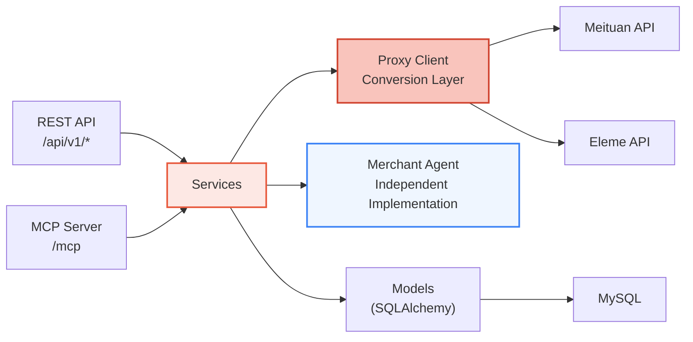
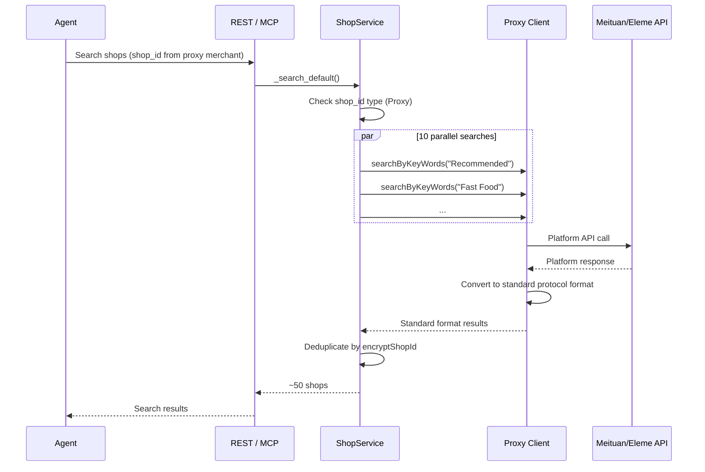
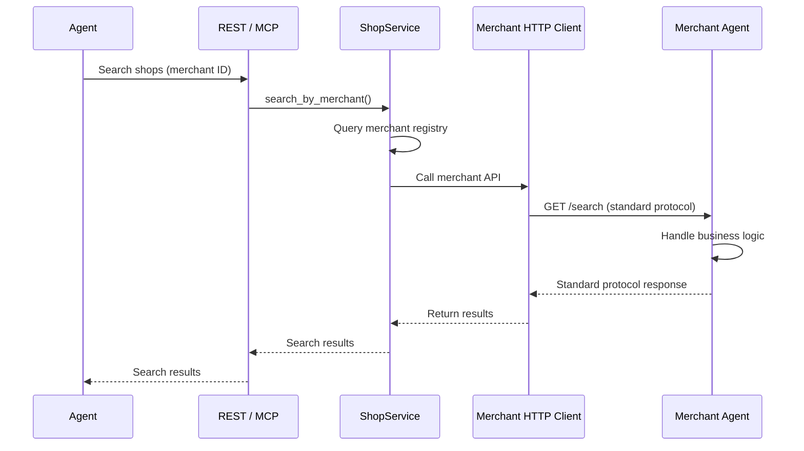
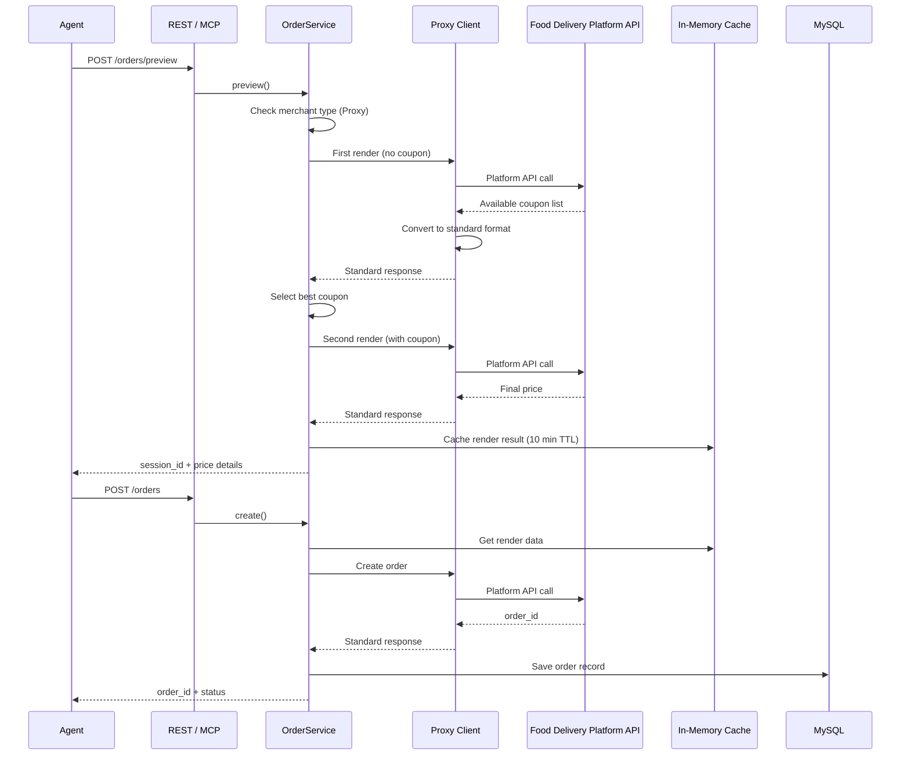
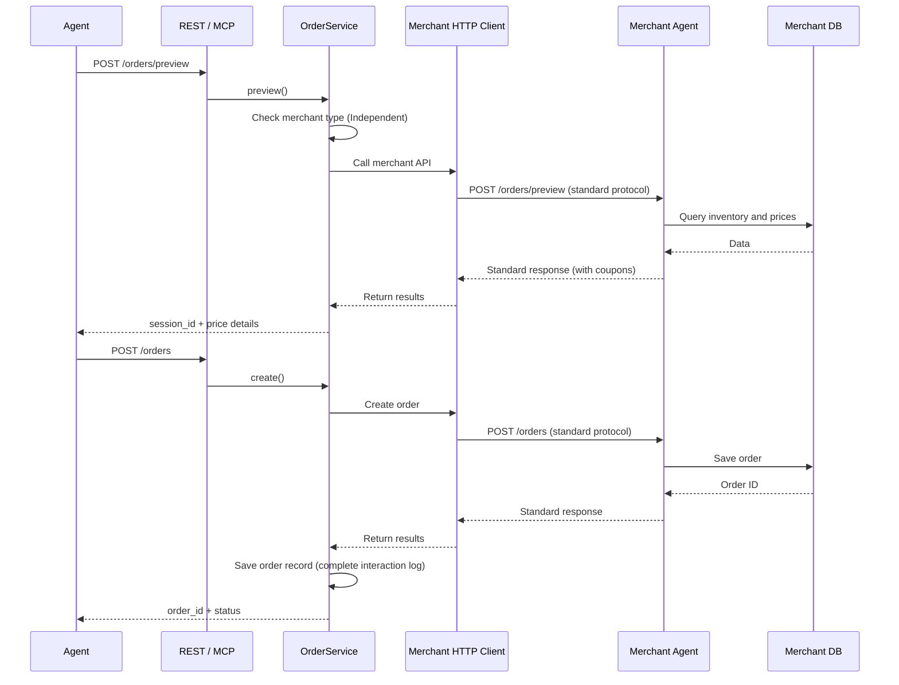

## Gateway's Position in Clawdot

Clawdot adopts a 4-layer architecture, with Gateway at layer 3, serving as **protocol layer + discovery layer**:

```
┌─────────────────────────────────────────────┐
│  Layer 4 - Application Layer                │
│  AI Agent / User Applications / Third-party Integration │
└──────────────┬──────────────────────────────┘
               │ Standard Protocol
┌──────────────▼──────────────────────────────┐
│  Layer 3 - Gateway (Protocol + Discovery)   │
│  ├─ Standard protocol definition (Menu, Orders, Reservations) │
│  ├─ Merchant discovery and routing          │
│  └─ Protocol versioning and evolution       │
└──────────────┬──────────────────────────────┘
               │ Internal REST/MCP
┌──────────────▼──────────────────────────────┐
│  Layer 2 - Gateway Internal Services        │
│  ├─ ShopService / OrderService / etc        │
│  ├─ Protocol adaptation (Proxy conversion logic) │
│  └─ Data and authentication management      │
└──────────────┬──────────────────────────────┘
               │ HTTP / Internal API
┌──────────────▼──────────────────────────────┐
│  Layer 1 - Merchant Layer                   │
│  ├─ Proxy (proxy Eleme/Meituan/Amap)        │
│  └─ Independent Merchant Agent (self-built systems) │
└─────────────────────────────────────────────┘
```

## Overall Architecture



Clawdot Gateway adopts a three-layer internal architecture, with REST and MCP as two entry points sharing the same service layer. Gateway manages two types of merchants through **standard protocol**:
- **Proxy layer** — Proxy merchants from Eleme, Meituan, Amap and other platforms
- **Independent Agent** — Large merchants with independent implementation

## Merchant Onboarding Modes

Before diving into the detailed three-layer architecture, first understand how Gateway manages two merchant types:

<Tabs>
  <Tab title="Proxy Layer (Cold Start)">
    **Goal:** Quick coverage of existing platform merchants

    ```mermaid
    graph TB
      Agent["AI Agent"]
      Gateway["Gateway"]
      Proxy["Proxy Conversion Layer"]
      Platform["Meituan/Eleme"]
      Merchant["Platform Merchant<br/>No Changes Needed"]

      Agent -->|Standard Protocol| Gateway
      Gateway -->|Convert to Platform API| Proxy
      Proxy -->|Meituan API / Eleme API| Platform
      Platform -->|Orders| Merchant

      style Proxy fill:#f9c4bc,stroke:#D14430,stroke-width:2px
    ```

    **Workflow:**
    1. Agent calls Gateway using standard protocol
    2. Gateway's Proxy Client handles request format conversion
    3. Proxy converts request to corresponding platform API call
    4. Platform response converted back to standard protocol format
    5. Return to Agent

    **Advantages:**
    - Merchants require no changes
    - Quick coverage of large merchant base
    - Clawdot maintains complete data control
  </Tab>

  <Tab title="Independent Agent (Ecosystem)">
    **Goal:** Deep integration and autonomy for large merchants

    ```mermaid
    graph TB
      Agent["AI Agent"]
      Gateway["Gateway"]
      Merchant["Merchant Agent<br/>Directly Implements Standard Protocol"]

      Agent -->|Standard Protocol| Gateway
      Gateway -->|Standard Protocol| Merchant
      Merchant -->|Business Logic| MerchantSystem["Merchant Internal Systems"]

      style Merchant fill:#EFF6FF,stroke:#3B82F6,stroke-width:2px
    ```

    **Workflow:**
    1. Agent calls Gateway using standard protocol
    2. Gateway finds corresponding merchant Agent
    3. Directly forward request to merchant implementation
    4. Merchant handles business logic
    5. Return response in standard protocol format

    **Requirements:**
    - Merchant must implement all standard protocol interfaces
    - Must pass Clawdot's review and testing
    - Commit to SLA and security requirements

    **Advantages:**
    - Merchants have complete control over business logic
    - Support for deep customization
    - Enable future ecosystem expansion
  </Tab>
</Tabs>

## Internal Three-Layer Architecture

### Layer Descriptions

<AccordionGroup>
  <Accordion title="Gateway Layer — Entry Point and Routing" icon="door-open">
    **Location:** `src/gateway/`

    Responsible for protocol adaptation, merchant routing, and input validation, without containing business logic.

    - **REST routers** — FastAPI routes, handle HTTP request/response serialization
    - **MCP tools** — 9 MCP tool definitions, convert MCP calls to service layer calls
    - **Merchant router** — Query merchant type by merchant ID or shop_id, decide whether to forward to Proxy or independent Agent
    - **Auth middleware** — `require_agent()` and `require_user()` dependency injection

    The only difference between the two entry points is parameter passing: REST uses Header, MCP uses parameters.
  </Accordion>

  <Accordion title="Service Layer — Business Logic and Routing" icon="gears">
    **Location:** `src/services/`

    Core business logic location, receives dependencies through constructor (DB session, Proxy Client, merchant registry):

    - **AuthService** — Agent registration, API Key generation and validation
    - **UserService** — SMS sending, OTP verification, user binding
    - **ShopService** — Merchant search (including parallel multi-category search), menu retrieval
      - For Proxy merchants — Call via Proxy Client
      - For independent Agent — Direct API call to merchant
    - **AddressService** — POI search, address selection and creation
    - **OrderService** — Order preview, creation and query
      - Support ordering logic for both merchant types
    - **MerchantRegistry** — Merchant registry, records each merchant's type and onboarding approach
  </Accordion>

  <Accordion title="Client Layer — API Encapsulation and Adaptation" icon="cloud">
    **Location:** `src/client/`

    HTTP client encapsulation supporting three types of APIs:

    **Proxy Client (Platform API Encapsulation):**
    - **Token management** — `ensure_token` auto-refreshes expired tokens
    - **Request signing** — Sign according to Meituan/Eleme signing algorithms
    - **UA management** — Different User-Agent for different endpoints (Order uses MTOPSDK format, search uses Rajax format)
    - **Error handling** — Unified conversion of platform API errors to standard protocol error codes

    **Merchant HTTP Client (Independent Merchant Agent Calls):**
    - **API Key management** — Merchant authentication credentials
    - **Request signing** — Sign according to merchant's security requirements (if needed)
    - **Timeout and retry** — Handle merchant API instability
    - **Error handling** — Convert merchant errors to standard protocol format
  </Accordion>
</AccordionGroup>

## Data Flow

### Typical Search Request

#### Scenario 1: Proxy Merchant Search



#### Scenario 2: Independent Merchant Search



### Typical Order Request

#### Scenario 1: Proxy Merchant Ordering



#### Scenario 2: Independent Merchant Ordering



## Database Models

<Tabs>
  <Tab title="merchants">
    | Field | Type | Description |
    |---|---|---|
    | id | int (PK) | Auto-increment primary key |
    | name | varchar(200) | Merchant name |
    | merchant_type | enum | Proxy / Independent |
    | platform | varchar(50) | Platform name (Meituan/Eleme/Amap, Proxy only) |
    | platform_shop_id | varchar(100) | Platform shop_id (Proxy only) |
    | api_endpoint | varchar(500) | API endpoint (Independent only) |
    | api_key | varchar(256) | API Key (encrypted storage, Independent only) |
    | is_active | boolean | Enabled status |
    | verified_at | datetime | Verification timestamp (Independent only) |
    | created_at / updated_at | datetime | Timestamps |
  </Tab>

  <Tab title="agents">
    | Field | Type | Description |
    |---|---|---|
    | id | int (PK) | Auto-increment primary key |
    | name | varchar(100) | Agent name |
    | is_active | boolean | Enabled status |
    | created_at | datetime | Creation timestamp |
  </Tab>
  <Tab title="api_keys">
    | Field | Type | Description |
    |---|---|---|
    | id | int (PK) | Auto-increment primary key |
    | agent_id | int (FK) | Associated Agent |
    | key_hash | varchar(64) | SHA-256 hash |
    | prefix | varchar(8) | Key prefix (e.g., `clw_a1b2`) |
    | is_active | boolean | Enabled status |
    | created_at | datetime | Creation timestamp |
  </Tab>
  <Tab title="user_bindings">
    | Field | Type | Description |
    |---|---|---|
    | id | int (PK) | Auto-increment primary key |
    | agent_id | int (FK) | Associated Agent |
    | phone_hash | varchar(64) | Phone number SHA-256 |
    | encrypted_user_id | varchar(256) | AES-256-GCM encrypted |
    | user_token | varchar(36) | UUID, unique index |
    | token_expires_at | datetime | Token expiration timestamp |
    | created_at / updated_at | datetime | Timestamps |
  </Tab>
  <Tab title="orders">
    | Field | Type | Description |
    |---|---|---|
    | id | int (PK) | Auto-increment primary key |
    | agent_id | int (FK) | Associated Agent |
    | user_binding_id | int (FK) | Associated user binding |
    | merchant_id | int (FK) | Associated merchant (new) |
    | merchant_order_id | varchar(64) | Merchant order ID |
    | shop_name | varchar(200) | Shop name |
    | total_amount | decimal(10,2) | Order total |
    | status | varchar(32) | Order status |
    | merchant_type | enum | Proxy / Independent |
    | raw_request | JSON | Original request (for audit) |
    | raw_response | JSON | Original response |
    | created_at / updated_at | datetime | Timestamps |
  </Tab>
</Tabs>

## Security Design

| Mechanism | Implementation |
|---|---|
| API Key Storage | SHA-256 hash, plaintext not stored in database |
| Phone Storage | SHA-256 hash, used for deduplication |
| User ID Storage | AES-256-GCM encryption (base64-encoded 32-byte key) |
| User Token | UUID v4 (128 bits entropy) |
| Admin Authentication | Single `X-Admin-Secret` request header |
