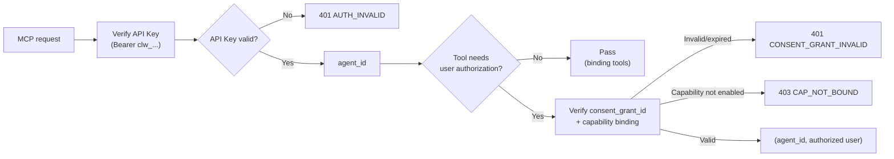

Clawdot Gateway exposes its capabilities over MCP, with two authentication layers:

- **Agent identity** — the connection-layer header `Authorization: Bearer clw_...` identifies the calling Agent. Required on every MCP request.
- **User authorization** — the `consent_grant_id` parameter (`cg_` prefix) on business tools identifies "a food-delivery user has authorized this Agent." It is a **tool parameter**, not a header.

## Authentication chain



Different tools require different authentication levels:

| Tool | API Key | consent_grant_id param |
|---|---|---|
| `request_user_bind` · `verify_user_bind` | Required | Not required (this is how you obtain a grant) |
| `get_user_auth_status` · `revoke_user_bind` · `get_homepage_url` | Required | Required |
| `search_shops` · `get_shop_menu` · `get_shop_share_url` | Required | Required |
| `search_addresses` · `select_address` · `update_address` | Required | Required |
| `quote_cart` · `list_coupons` · `preview_order` · `create_order` · `get_order_status` | Required | Required |
| `get_sign_action` · `get_sign_status` | Required | Required |

<Note>
  The binding tools (`request_user_bind` / `verify_user_bind`) are how you obtain a grant, so they take no `consent_grant_id`. Once authorization succeeds, every other business tool call must include the `consent_grant_id` parameter.
</Note>

## API Key

<AccordionGroup>
  <Accordion title="Format and transport" icon="key">
    A `clw_` prefix followed by random characters, e.g. `clw_a1b2c3d4...`.

    Passed via the connection-layer header `Authorization: Bearer clw_...`, required on every MCP request. Generated when you create an Agent in the console at `http://console.hicaspian.com/agents`.
  </Accordion>

  <Accordion title="Security" icon="shield">
    The API Key is stored only as a hash — the server never keeps plaintext — and each request is matched by hash. Disabled keys stop working immediately.
  </Accordion>
</AccordionGroup>

## User authorization (consent_grant_id)

Represents "a food-delivery user has authorized a specific Agent to use a specific capability." Once authorization succeeds, a `consent_grant_id` is minted, and from then on **every business tool call passes it as a parameter**.

### Binding flow

Run the binding flow to obtain a `consent_grant_id`; SMS code and H5 modes are both supported:

1. `request_user_bind` to start binding (SMS sends a code; H5 returns an authorization link — Agent identity only, no `consent_grant_id`)
2. `verify_user_bind` to confirm — mints the `consent_grant_id` on success

See [Start binding](/mcp/user/bind-request) and [Verify binding](/mcp/user/bind-verify).

```mermaid
sequenceDiagram
    actor U as User
    participant A as Agent (caller)
    participant G as Clawdot Gateway
    Note over A,G: API Key identifies the Agent at the connection layer; binding tools take no consent_grant_id
    alt SMS verification code
        A->>G: request_user_bind(phone, auth_type=sms)
        G-->>A: bind_id, expires_in, masked_phone
        G-->>U: send SMS code
        U->>A: enter code
        A->>G: verify_user_bind(bind_id, code)
        G-->>A: bound=true, consent_grant_id, scopes, expires_at
    else H5 authorization
        A->>G: request_user_bind(phone, auth_type=h5, callback_url?, extra?)
        G-->>A: request_id, h5_url, expires_in=300, callback_registered
        A->>U: show h5_url
        U->>U: open h5_url and authorize
        loop poll until done
            A->>G: verify_user_bind(auth_type=h5, request_id)
            G-->>A: bound / pending (consent_grant_id on success)
        end
        opt callback_url provided
            G-->>A: POST callback_url(event=user_bind){bound, consent_grant_id, scopes}
        end
    end
    Note over A: every business tool call afterwards carries consent_grant_id
```

<AccordionGroup>
  <Accordion title="How to pass" icon="arrow-right">
    Pass `consent_grant_id` as a parameter on each business tool, for example:

    ```json
    {
      "name": "search_shops",
      "arguments": {
        "consent_grant_id": "cg_...",
        "keyword": "coffee"
      }
    }
    ```

    The binding tools `request_user_bind` / `verify_user_bind` are the exception — they take no `consent_grant_id`.
  </Accordion>

  <Accordion title="Scope and expiry" icon="clock">
    `verify_user_bind` returns on success:

    - `consent_grant_id` — the user-authorization record id (`cg_` prefix)
    - `scopes` — granted capability scope, e.g. `["taobao_flash.delivery"]`
    - `expires_at` — expiry time (ISO 8601)

    After expiry, or after `revoke_user_bind`, the `consent_grant_id` stops working immediately; re-run the binding flow to get a new one. The user's saved data (addresses, etc.) is retained and becomes available again after re-authorization.
  </Accordion>
</AccordionGroup>

## Error responses

Authentication / authorization failures return a unified format:

```json
{
  "error": {
    "code": "CONSENT_GRANT_REQUIRED",
    "message": "Consent grant id is required"
  }
}
```

| Error code | HTTP | Description |
|---|---|---|
| `AUTH_REQUIRED` | 401 | Missing API Key |
| `AUTH_INVALID` | 401 | Invalid or disabled API Key |
| `CONSENT_GRANT_REQUIRED` | 401 | Missing consent_grant_id |
| `CONSENT_GRANT_INVALID` | 401 | consent_grant_id is invalid or expired |
| `CONSENT_GRANT_EXPIRED` | 401 | User authorization has expired; re-authorize |
| `CONSENT_GRANT_WRONG_CAP` | 403 | Grant belongs to a different capability / provider |
| `CAP_NOT_BOUND` | 403 | This Agent has not enabled the capability |

See [Error handling](/gateway/error-handling) for the full list.
