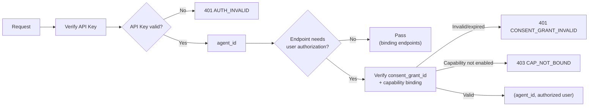

Clawdot Gateway uses dual-layer authentication: an **API Key** identifies the Agent, and a **consent grant** identifies the authorized food-delivery user.

## Authentication chain



Different endpoints require different authentication levels:

| Endpoint | API Key | Consent grant |
|---|---|---|
| `POST /api/v1/auth/bind/request` · `bind/verify` | Required | Not required (this is how you obtain a grant) |
| `GET /api/v1/auth/status` | Required | Required |
| `POST /api/v1/auth/unbind` · `auth/homepage-url` | Required | Required |
| `/api/v1/addresses/*` · `/shops/*` · `/cart/*` | Required | Required |
| `/api/v1/orders/*` · `/payment/*` | Required | Required |

<Note>
  MCP tools do not use the `X-Consent-Grant-Id` header — pass `consent_grant_id` as a parameter in each tool call instead.
</Note>

## API Key

<AccordionGroup>
  <Accordion title="Format and transport" icon="key">
    A `clw_` prefix followed by random characters, e.g. `clw_a1b2c3d4...`.

    Passed via the `Authorization: Bearer clw_...` header; required on every `/api/v1/*` and MCP request. Generated when you create an Agent in the Portal.
  </Accordion>

  <Accordion title="Security" icon="shield">
    The API Key is stored only as a hash — the server never keeps plaintext — and each request is matched by hash. Disabled keys stop working immediately.
  </Accordion>
</AccordionGroup>

## Consent grant

Represents "a food-delivery user has authorized a specific Agent to use a specific capability."

<AccordionGroup>
  <Accordion title="How to obtain" icon="mobile">
    Obtained through the binding flow (SMS code or H5 mode):

    1. `POST /api/v1/auth/bind/request` to start authorization (SMS sends a code; H5 returns an authorization link)
    2. `POST /api/v1/auth/bind/verify` to confirm — returns `consent_grant_id` on success

    See [Start binding](/api-reference/user/bind-request) and [Verify binding](/api-reference/user/bind-verify).
  </Accordion>

  <Accordion title="How to pass" icon="arrow-right">
    - **REST API:** via the `X-Consent-Grant-Id: <consent_grant_id>` header (except binding endpoints). The `consent_grant_id` goes in the header only — never in the JSON body.
    - **MCP:** as the `consent_grant_id` parameter on each tool call.
  </Accordion>

  <Accordion title="Scope and expiry" icon="clock">
    `verify_user_bind` returns on success:

    - `consent_grant_id` — the user-authorization record id (`cg_` prefix)
    - `scopes` — granted capability scope, e.g. `["taobao_flash.delivery"]`
    - `expires_at` — expiry time (ISO 8601)

    After expiry, or after `revoke_user_bind` (`POST /api/v1/auth/unbind`), the `consent_grant_id` stops working on all endpoints immediately; re-run the binding flow to get a new one. The user's saved data (addresses, etc.) is retained and becomes available again after re-authorization.
  </Accordion>
</AccordionGroup>

## Error responses

Authentication / authorization failures return a unified format:

```json
{
  "error": {
    "code": "CONSENT_GRANT_REQUIRED",
    "message": "Consent grant id is required"
  }
}
```

| Error code | HTTP | Description |
|---|---|---|
| `AUTH_REQUIRED` | 401 | Missing API Key |
| `AUTH_INVALID` | 401 | Invalid or disabled API Key |
| `CONSENT_GRANT_REQUIRED` | 401 | Missing consent_grant_id |
| `CONSENT_GRANT_INVALID` | 401 | consent_grant_id is invalid or expired |
| `CONSENT_GRANT_EXPIRED` | 401 | User authorization has expired; re-authorize |
| `CONSENT_GRANT_WRONG_CAP` | 403 | Grant belongs to a different capability / provider |
| `CAP_NOT_BOUND` | 403 | This Agent has not enabled the capability |

See [Error handling](/gateway/error-handling) for the full list.
