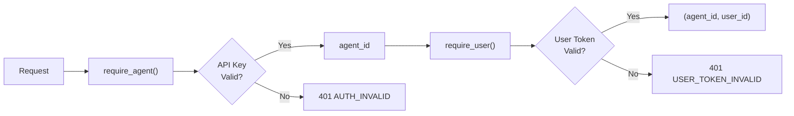

Clawdot Gateway uses dual-layer authentication: **API Key** identifies Agent identity, **User Token** identifies food delivery user identity.

## Authentication Chain



Different endpoints require different authentication levels:

| Endpoint | API Key | User Token |
|---|---|---|
| `POST /auth/agents` | Not required (use Admin Secret) | Not required |
| `POST /user/bind/*` | Required | Not required |
| `GET /shops/*` | Required | Required |
| `*/addresses/*` | Required | Required |
| `*/orders/*` | Required | Required |

## API Key

<AccordionGroup>
  <Accordion title="Format" icon="key">
    ```
    clw_<32 hexadecimal characters>
    ```

    Example: `clw_a1b2c3d4e5f6g7h8i9j0k1l2m3n4o5p6`

    Passed via `Authorization: Bearer clw_...` request header.
  </Accordion>

  <Accordion title="Storage Method" icon="database">
    API Key is stored as **SHA-256 hash** in the database, plaintext is not retained on server. Each request hashes the incoming Key and compares with database.

    Also stores the first 8 characters of the Key as `prefix` for logging and debugging (doesn't expose complete Key).
  </Accordion>

  <Accordion title="Verification Process" icon="check">
    1. Extract Bearer Token from `Authorization` header
    2. Calculate SHA-256 hash
    3. Look up matching `key_hash` in `api_keys` table
    4. Verify `is_active = true`
    5. Return associated `agent_id`
  </Accordion>
</AccordionGroup>

## User Token

<AccordionGroup>
  <Accordion title="Acquisition" icon="mobile">
    Obtained through SMS verification binding process:

    1. Call `POST /user/bind/request` to send OTP
    2. Call `POST /user/bind/verify` to get Token after verification

    Token is UUID v4 format, valid for 90 days by default.
  </Accordion>

  <Accordion title="Passing Method" icon="arrow-right">
    - **REST API:** Passed via `X-User-Token` request header
    - **MCP:** Passed as `user_token` parameter for each tool
  </Accordion>

  <Accordion title="Security Design" icon="shield">
    Food delivery user ID associated with Token is stored with **AES-256-GCM** encryption:

    - Encryption key: Environment variable `ENCRYPTION_KEY` (base64-encoded 32-byte key)
    - Phone number: Stored as SHA-256 hash (used for deduplication under same Agent)
    - Only one binding per Agent + phone combination
  </Accordion>
</AccordionGroup>

## Error Responses

Authentication failure returns unified format:

```json
{
  "error": {
    "code": "AUTH_REQUIRED",
    "message": "Authorization header is required"
  }
}
```

| Error Code | HTTP Status | Description |
|---|---|---|
| `AUTH_REQUIRED` | 401 | Missing API Key |
| `AUTH_INVALID` | 401 | Invalid or disabled API Key |
| `USER_TOKEN_REQUIRED` | 401 | Missing User Token |
| `USER_TOKEN_INVALID` | 401 | Invalid or expired User Token |
