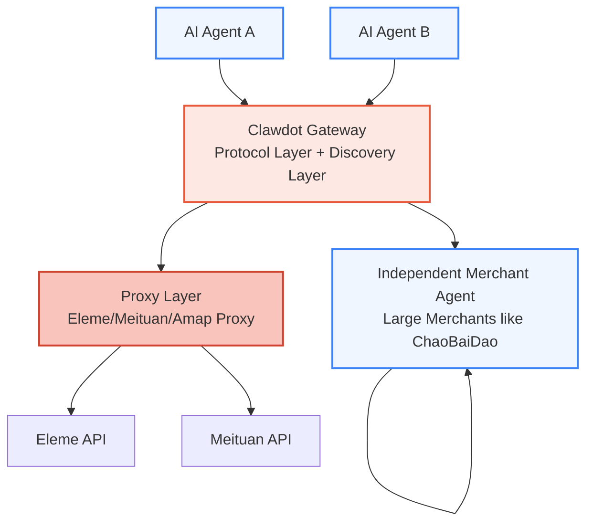

## What is Gateway

Clawdot Gateway is Clawdot's **protocol layer + discovery layer**, positioned at layer 3 of the 4-layer architecture. Its core responsibilities are:

1. **Define standard protocol** — Establish unified merchant interface specifications (menu queries, order fulfillment, etc.)
2. **Connect merchants** — Support two types of merchant onboarding:
   - **Proxy layer** — Proxy merchants from Eleme/Meituan/Amap and other platforms (cold start phase)
   - **Independent Agent** — Large merchants build their own Agent, directly implementing standard protocol (long-term ecosystem)
3. **Unified interface** — Provide a unified MCP interface for AI Agents, hiding merchant differences

## What Gateway Handles for You

| You Need to Do | Gateway Does for You |
|---|---|
| Pass `shop_id` | Auto-convert multiple ID formats |
| Pass item list | Parse specs/attributes/ingredients + calculate exclusion rules |
| Call preview once | Two renders + auto-select best coupon |
| Pass API Key | Token management, signing, UA adaptation |
| Receive standard error codes | Categorize platform errors into unified format |

## MCP Access

<Card title="MCP Protocol" icon="plug" href="/gateway/mcp-overview">
  `/mcp/v1` endpoint, 18 tools, directly connectable by MCP clients like Claude Desktop.
</Card>

## Core Features

<Columns cols={3}>
  <Card title="Shop Search" icon="magnifying-glass">
    Search by keyword or default 10 categories in parallel, auto-dedup. Via Proxy or direct Agent calls.
  </Card>
  <Card title="Menu Parsing" icon="utensils">
    Complete specs/attributes/ingredients system, pre-computed defaults. Standardized handling for all merchant menu formats.
  </Card>
  <Card title="Smart Ordering" icon="cart-shopping">
    Two-step ordering (preview + confirm), auto-select best coupon. Supports both Proxy and independent merchant modes.
  </Card>
</Columns>

## Merchant Onboarding Modes

Gateway supports two merchant onboarding approaches, flexibly meeting the needs of merchants of different scales:

<Tabs>
  <Tab title="Proxy Layer (Cold Start)">
    **Purpose:** Quickly cover existing platform merchants without requiring merchant changes

    - Clawdot provides unified proxy for Eleme, Meituan, Amap and other platform merchants
    - Agent uses standard protocol, Proxy handles conversion to platform APIs
    - Percentage gradually decreases, serving as transitional solution

    → [Learn how Proxy works](/gateway/merchant-onboarding)
  </Tab>

  <Tab title="Independent Agent (Ecosystem)">
    **Purpose:** Deep integration for large merchants, completely autonomous

    - Large chain brands (like ChaoBaiDao) build their own merchant Agent
    - Directly implement Gateway standard protocol
    - Eventually become the main body of the ecosystem

    → [Start independent onboarding](/gateway/merchant-onboarding)
  </Tab>
</Tabs>

## Next Steps

<Columns cols={2}>
  <Card title="Standard Protocol" icon="handshake" href="/gateway/standard-protocol">
    Learn Gateway's five standard protocol categories and implementation.
  </Card>
  <Card title="Merchant Onboarding" icon="user-plus" href="/gateway/merchant-onboarding">
    Detailed merchant onboarding process and best practices guide.
  </Card>
  <Card title="Architecture Details" icon="sitemap" href="/gateway/architecture">
    Three-layer architecture design, data flow, and database models.
  </Card>
  <Card title="Authentication Mechanism" icon="lock" href="/gateway/authentication">
    Dual-layer authentication system: API Key + consent grant.
  </Card>
</Columns>
