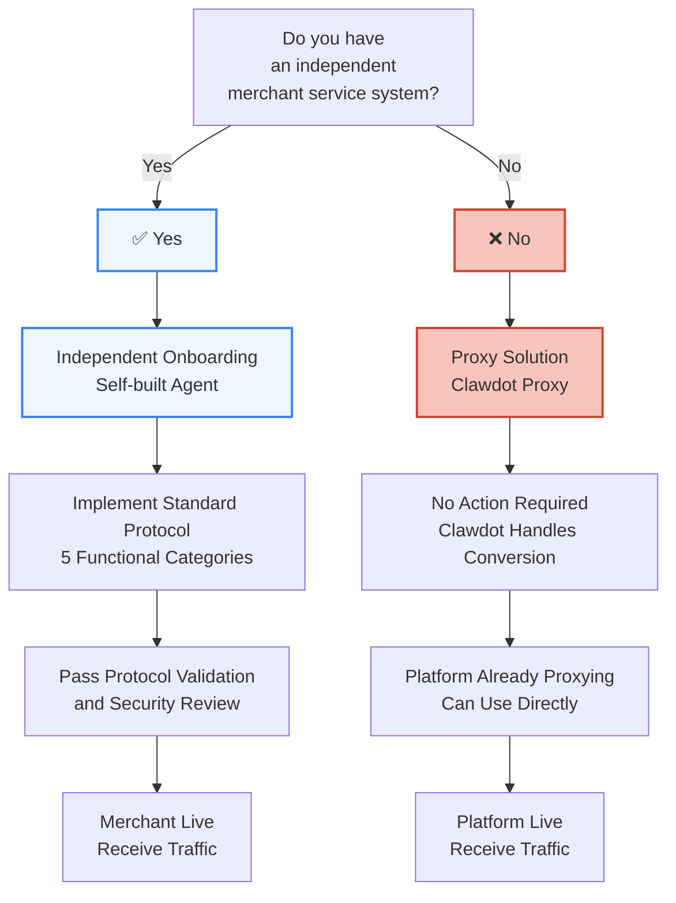

## Onboarding Methods Overview

Clawdot Gateway provides two onboarding paths for merchants. Choose the plan that suits you and quickly join the AI Agent ecosystem.



<Tabs>
  <Tab title="Proxy Solution (Recommended for Initial Use)">
    ## What is Proxy Solution

    **For:** Merchants from Eleme, Meituan, Amap and other food delivery platforms

    Clawdot automatically proxies your merchant, requiring no development work. We handle converting AI Agent's standard protocol requests to corresponding platform API calls.

    ## Merchants Don't Need to Do Anything

    If you're a merchant on Eleme/Meituan/Amap, Clawdot has already automatically created a proxy for you. You can directly:

    1. **View Merchant Info** — Log in to Clawdot merchant dashboard, confirm your merchant is being proxied
    2. **Monitor Data** — View order data and statistics through AI Agent
    3. **Receive Orders** — When Agent places orders via Gateway, they're forwarded to your platform account
    4. **No-code Integration** — Completely codeless, Clawdot handles all adaptation

    ## How Proxy Works

    ```mermaid
    sequenceDiagram
      participant Agent as AI Agent
      participant Gateway as Clawdot Gateway
      participant Proxy as Proxy Layer<br/>Conversion Engine
      participant Platform as Food Delivery Platform<br/>Meituan/Eleme/Amap
      participant Merchant as Your Merchant Account

      Agent->>Gateway: Search shops
      Gateway->>Proxy: Standard protocol request
      Proxy->>Platform: Convert to platform API
      Platform-->>Proxy: Platform response
      Proxy-->>Gateway: Standard protocol format
      Gateway-->>Agent: Return search results

      Agent->>Gateway: Create order
      Gateway->>Proxy: Standard protocol request
      Proxy->>Platform: Convert to platform API
      Platform-->>Merchant: Push order
      Merchant-->>Platform: Accept order
      Platform-->>Proxy: Order status
      Proxy-->>Gateway: Standard protocol response
      Gateway-->>Agent: Order confirmation
    ```

    ## Advantages

    | Advantage | Description |
    |---|---|
    | **Zero Development Cost** | No modifications to existing systems |
    | **Quick Launch** | Immediately gain AI Agent capabilities |
    | **Multi-Platform Coverage** | Auto-cover Meituan, Eleme, Amap and more |
    | **Data Accumulation** | All interaction data stored in Clawdot for analytics |
    | **Auto-Optimization** | Clawdot continuously optimizes Proxy conversion |

    ## Future Upgrade

    When your merchant scales, needing deeper AI integration, can upgrade to **independent onboarding solution**.
  </Tab>

  <Tab title="Independent Onboarding (Deep Integration)">
    ## What is Independent Onboarding

    **For:** Large merchants with independent merchant systems (like ChaoBaiDao, chain brands, etc.)

    Your merchant team builds an Agent, directly implementing Clawdot's standard protocol. This gives complete control and maximum flexibility.

    ## Onboarding Process

    <Steps>
      <Step title="Understand Standard Protocol">
        Study Clawdot's 5 standard protocol categories in detail:
        - Menu Query (implemented)
        - Order Fulfillment (implemented)
        - Booking & Scheduling (planning)
        - Ratings & Reviews (planning)
        - Delivery Tracking (planning)

        → [View Standard Protocol Details](/gateway/standard-protocol)
      </Step>

      <Step title="Implement Standard Protocol Interfaces">
        Implement the following interfaces in your system:

        ```bash
        GET    /menu
        GET    /menu/search
        GET    /menu/item/{item_id}

        POST   /orders/preview
        POST   /orders
        GET    /orders/{order_id}
        PATCH  /orders/{order_id}
        ```

        Use standard REST API, support JSON request/response format.
      </Step>

      <Step title="Local Testing">
        Use Clawdot's provided testing toolkit:

        ```bash
        # Validate endpoint accessibility
        clawdot validate-api https://your-merchant.com

        # Run protocol compatibility tests
        clawdot test-protocol --endpoint https://your-merchant.com

        # View detailed test report
        clawdot test-report
        ```
      </Step>

      <Step title="Submit Verification Request">
        Prepare and submit the following information to Clawdot:

        - Merchant basic info (name, contact, business license)
        - API endpoint address and documentation
        - Test account (for Clawdot functional testing)
        - Data protection and privacy policy statement
        - Service Level Agreement (SLA) commitment

        → [Submit Verification Request](https://portal.clawdot.com/merchant/onboard)
      </Step>

      <Step title="Pass Review and Security Testing">
        Clawdot team will conduct:

        - **Functional Validation** — Test all API endpoint functionality
        - **Security Review** — Review authentication mechanisms and data protection
        - **Performance Assessment** — Test API response time and reliability
        - **Compatibility Check** — Ensure full compatibility with standard protocol

        Expected review cycle: 5-10 business days
      </Step>

      <Step title="Go Live and Receive Traffic">
        After passing review:

        1. **Get Merchant ID** — Clawdot assigns unique merchant ID
        2. **Generate API Key** — For Gateway to call your interfaces
        3. **Configure Launch** — Add merchant info to Gateway's merchant registry
        4. **Start Receiving Orders** — AI Agent can call your interfaces
        5. **Monitor Dashboard** — Real-time view orders, traffic, performance metrics
      </Step>
    </Steps>

    ## Implementation Requirements

    ### Functional Requirements

    | Function | Required | Description |
    |---|---|---|
    | Menu Query | ✅ | Must fully implement items, specs, attributes, ingredients |
    | Order Fulfillment | ✅ | Must support preview, creation, query, cancellation |
    | Booking & Scheduling | ⏳ | Implement if applicable; planned feature |
    | Ratings & Reviews | ⏳ | Planning phase; future requirement |
    | Delivery Tracking | ⏳ | Planning phase; future requirement |

    ### Performance Requirements

    | Metric | Requirement |
    |---|---|
    | **Response Time** | P99 < 2s (menu query), P99 < 3s (ordering) |
    | **Availability** | >= 99.5% monthly availability |
    | **Concurrency** | Support at least 100 concurrent requests |
    | **Data Consistency** | Critical data like orders must be consistent |

    ### Security Requirements

    | Requirement | Description |
    |---|---|
    | **Authentication** | Use API Key + Signature or OAuth 2.0 |
    | **Encryption** | Sensitive data (user ID, phone) must be encrypted |
    | **Audit Logging** | Record all API calls, support tracing |
    | **Rate Limiting** | Implement reasonable rate limiting to prevent abuse |

    ### Data Requirements

    | Requirement | Description |
    |---|---|
    | **Standard Format** | Use standard JSON format defined by Clawdot |
    | **Completeness** | All required fields must be returned |
    | **Accuracy** | Critical data like prices, inventory must be real-time accurate |
    | **Privacy Compliance** | Comply with GDPR, CCPA and other privacy regulations |

    ## Best Practices

    ### 1. API Design

    ```typescript
    // ✅ Good implementation
    interface MenuItem {
      id: string;
      name: string;
      price: number;
      description: string;
      specs: MenuSpec[];
      attributes: MenuAttribute[];
      addons: MenuAddon[];
    }

    // ❌ Avoid
    interface MenuItem {
      id: string;
      name: string;
      raw_data: string; // Avoid returning raw data
    }
    ```

    ### 2. Error Handling

    ```typescript
    // ✅ Standard error response
    {
      "error_code": "ITEM_OUT_OF_STOCK",
      "error_message": "Item sold out",
      "request_id": "req_123abc"
    }

    // ❌ Avoid
    {
      "status": "error",
      "message": "something went wrong"
    }
    ```

    ### 3. Version Management

    - API version indicated through URL path: `/v1/`, `/v2/`
    - Backward compatible for at least 1 year (recommend 2+ years)
    - Notify deprecation 3 months in advance

    ### 4. Documentation and Support

    - Provide detailed API documentation and code examples
    - Establish technical support channels (email, Slack, etc.)
    - Publish SDKs (optional, but recommended)
    - Regular technical training

    ## Frequently Asked Questions

    <AccordionGroup>
      <Accordion title="How to handle menu updates?">
        Menu should be returned real-time. When merchant modifies menu in backend, `GET /menu` should immediately return latest data.

        If you need caching, set a short TTL (recommend 5-10 minutes).
      </Accordion>

      <Accordion title="How to preserve order data?">
        Clawdot Gateway automatically preserves all order data (including raw responses). You don't need additional storage, but recommend keeping backups.
      </Accordion>

      <Accordion title="How to handle multiple merchants?">
        If you have multiple locations or merchants, each needs separate registration to Gateway. Provide different API endpoints or distinguish through parameters.
      </Accordion>

      <Accordion title="How to support multiple languages?">
        Clawdot currently primarily supports Chinese. If multilingual support needed, can include multilingual content in item names and descriptions.
      </Accordion>

      <Accordion title="Can certain features be disabled?">
        During early phase, must implement Menu Query and Order Fulfillment core functions. Other functions can temporarily return "not supported" response.
      </Accordion>
    </AccordionGroup>
  </Tab>
</Tabs>

## Onboarding Process Comparison

| Aspect | Proxy Solution | Independent Onboarding |
|---|---|---|
| **Development Work** | None | Need to implement protocol interfaces |
| **Launch Time** | Immediate | 5-10 business days (review) |
| **Cost** | None | API development, testing required |
| **Flexibility** | Fixed proxy conversion logic | Complete autonomy |
| **Data Control** | Clawdot centralized | Merchant self-managed |
| **Deep Integration** | Limited | Deep integration, support customization |
| **Use Case** | Cold start, small merchants | Large merchants, need customization |

## Get Help

<Columns cols={2}>
  <Card title="Standard Protocol Docs" icon="book" href="/gateway/standard-protocol">
    Detailed interface specifications of five protocol categories.
  </Card>
  <Card title="Technical Support" icon="headset">
    Email: [support@clawdot.com](mailto:support@clawdot.com)
    Slack: [Join our community](https://clawdot.slack.com)
  </Card>
  <Card title="Submit Application" icon="arrow-right">
    [Start Onboarding Process](https://portal.clawdot.com/merchant/onboard)
  </Card>
</Columns>
