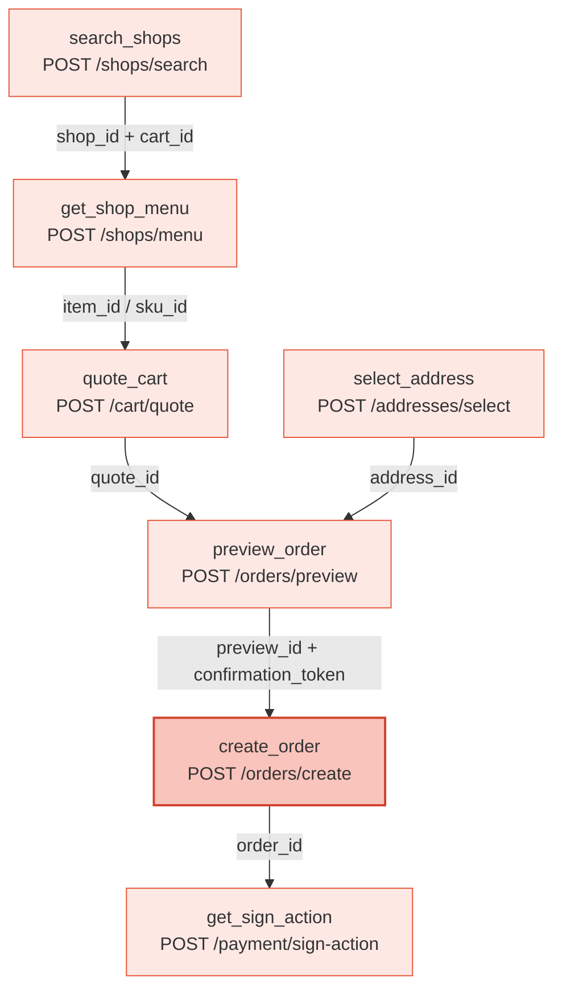

Completing an order is a **stateful chain**: every ID returned by one step must be passed verbatim to the next, never fabricated or mixed across chains. This page threads the whole chain together; the full field table for each endpoint lives in the corresponding [API reference](/en/api-reference/shops/search).

<Note>
  Examples below use **MCP tools** (tool arguments are identical to the REST body except for `consent_grant_id`). Each tool maps one-to-one to a REST endpoint with the same arguments; for the REST form, see the links at the end of each step and the "Authentication" section below.
</Note>

## Overview



How IDs flow through the chain:

| Step | Produces | Consumed by |
|---|---|---|
| `search_shops` | `shop_id` + `cart_id` | `get_shop_menu` / `quote_cart` / `preview_order` |
| `get_shop_menu` | `item_id` / `sku_id` / `ingredient_option_ids` | the `items` of `quote_cart` / `preview_order` |
| `quote_cart` | `quote_id` | `preview_order` (optional; if passed, validates the quote context) |
| `select_address` | `address_id` | `quote_cart` / `preview_order` |
| `preview_order` | `preview_id` + `confirmation_token` | `create_order` |
| `create_order` | `order_id` + `payment_action` | `get_order_status` |
| `get_sign_action` | a signing `action` (H5 link) | user completes passwordless signing in the browser |

<Warning>
  All amount fields are in **cents (integers)**, not yuan. For example, `payable_price: 1500` means ¥15.00.
</Warning>

## The Full Chain

<Steps>

### Search / browse shops

```python
search_shops(
    consent_grant_id="cg_...",
    keyword="生椰拿铁",   # omit to browse nearby shops (≤20)
    address_id="addr_...",  # or pass lat/lng (GCJ-02) directly
)
```

Without `keyword` it is **browse mode**, returning up to 20 nearby shops (with decision fields like distance, rating, delivery fee, minimum order). With `keyword` it is **precise search** (~5 shops), accepting a shop name, a category, or a concrete item name; matched shops carry `matched_items` previews.

Every result carries a `shop_id` and a `cart_id`: the `cart_id` already encapsulates that shop and this delivery location, and is the entry point for the downstream `get_shop_menu` / `quote_cart` / `preview_order`. Pass it **verbatim** — downstream calls then need no lat/lng.

<Note>
  Full fields: [Search Shops](/en/api-reference/shops/search). `matched_items` are display-only and carry no IDs; to order you must use the `item_id` / `sku_id` returned by `get_shop_menu`.
</Note>

### View the shop menu

```python
get_shop_menu(
    consent_grant_id="cg_...",
    shop_id="shop_...",   # verbatim from search_shops
    cart_id="cart_...",   # verbatim from search_shops
    keyword="拿铁",        # optional: only items matching name/category/description
    limit=20, offset=0,    # optional: page via next_offset until has_more=false
)
```

Returns menu items, each carrying an orderable `item_id` / `sku_id` plus the `ingredient_option_ids` for specs / attributes / extra ingredients. Menus can be large (100+ items), so disclose progressively with `keyword` or `limit`/`offset`. IDs fetched earlier on the same `cart_id` remain valid for ordering.

<Note>
  For the specs / attributes / ingredients model, see [Item Specifications](/en/gateway/item-specs); full fields: [Shop Menu](/en/api-reference/shops/detail).
</Note>

### Prepare the delivery address

```python
search_addresses(consent_grant_id="cg_...", keyword="光谷世界城", lat=30.5, lng=114.4)
# → suggestions[].token (single-use, for select_address) + saved_addresses

select_address(
    consent_grant_id="cg_...",
    contact_name="张三",
    contact_phone="13800138000",
    suggestion_token="...",     # from one of search_addresses' suggestions
    address_detail="3 号楼 101",
)
```

`select_address` returns the `address_id` for that address, passed to `quote_cart` / `preview_order`. For an existing address, `search_addresses` returns `saved_addresses` (plus `nearest_address_id` when `lat`/`lng` are given), whose `address_id` you can reuse directly.

<Note>
  Address trio: [Search Addresses](/en/api-reference/addresses/search) · [Select / register address](/en/api-reference/addresses/select) · [Update address](/en/api-reference/addresses/update).
</Note>

### Quote the cart

```python
quote_cart(
    consent_grant_id="cg_...",
    shop_id="shop_...",
    cart_id="cart_...",
    address_id="addr_...",
    items=[{"item_id": "...", "sku_id": "...", "quantity": 1, "ingredient_option_ids": []}],
)
```

Prices the chosen items and returns a `quote_id` (quote context) plus the price breakdown. The `quote_id` can be passed to `preview_order` to validate the quote context.

<Note>
  Full fields: [Quote Cart](/en/api-reference/cart/quote).
</Note>

### Preview the order

```python
preview_order(
    consent_grant_id="cg_...",
    shop_id="shop_...",
    cart_id="cart_...",
    address_id="addr_...",
    items=[{"item_id": "...", "sku_id": "...", "quantity": 1}],
    quote_id="...",          # optional; if passed, validates the quote context
    coupon_ids=None,         # tri-state: omit=auto-pick best; []=no coupon; ["cpn_..."]=specific
    order_remark="放门口",
)
```

Validates the shop / address / items, applies coupons, and returns the final price (`price.payable_price` etc., in cents) plus the `preview_id` + `confirmation_token` used to order (produced by the same preview, must be used as a pair, valid ~10 minutes).

<Note>
  Full fields and the `coupon_ids` tri-state: [Preview Order](/en/api-reference/orders/preview).
</Note>

### Create the order

```python
create_order(
    consent_grant_id="cg_...",
    preview_id="prv_...",            # from the same preview_order
    confirmation_token="cf_...",     # from the same preview_order
    payment_method=None,
    callback_url="https://your-app.example.com/clawdot/callback",  # optional: payment-status callback
)
```

Places the order with the `preview_id` + `confirmation_token` from the same preview, returning the platform `order_id`, `status`, and (when payment is required) `payment_action`.

<Note>
  This endpoint is idempotent on `confirmation_token`; a given token can place only one order — to order again, re-run the preview for a fresh token. You may pass `callback_url`: the gateway polls order status and POSTs a callback once it leaves the unpaid state; otherwise poll `get_order_status` (`GET /orders/{order_id}`) yourself. Full fields and the `status` / callback `ispay` enums: [Create Order](/en/api-reference/orders/create).
</Note>

### Passwordless signing

```python
get_sign_action(
    consent_grant_id="cg_...",
    return_url="https://your-app.example.com/sign/callback",
)
```

Initiates passwordless-payment signing for the user and returns an `action`: when `action_type` is `open_h5`, send the user to `action.action_url` (the H5 signing page) to complete signing, after which the browser returns to `return_url`; when it is `none`, the user is already signed. Then poll the result with `get_sign_status` (`GET /payment/sign-status`). Passwordless signing is a prerequisite for passwordless-payment orders.

<Note>
  Full fields: [Initiate Passwordless Signing](/en/api-reference/payment/sign-action).
</Note>

</Steps>

## Query an order

```python
get_order_status(consent_grant_id="cg_...", order_id="ord_...")
```

Maps to `GET /orders/{order_id}`, returning the order status and details. See [Get Order](/en/api-reference/orders/get).

## Authentication

Every step requires two-layer authentication:

- **API Key** (identifies the Agent): passed via the `Authorization: Bearer clw_...` header, the same for MCP and REST.
- **User consent grant** (identifies the authorized user, `cg_` prefix):
  - **MCP:** passed as each tool's `consent_grant_id` argument (not a header).
  - **REST:** passed via the `X-Consent-Grant-Id` header.

See [Authentication](/en/gateway/authentication). Errors are returned in the uniform shape `{"error": {"code", "message"}}`; see [Error Handling](/en/gateway/error-handling).
