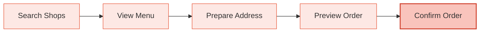

## Overview

Completing an order requires the following steps:



<Steps>

### Search Nearby Shops

```bash
GET /api/v1/shops/search?lat=39.9&lng=116.4&keyword=coffee
```

When `keyword` is not passed, the system performs parallel searches across 10 default categories (Recommended, Fast Food, Stir-fry, Western, Light, Dessert, Milk Tea, Coffee, Congee, Barbecue), auto-deduplicates and returns approximately 50 shops.

<Tip>
  When passing `keyword`, it's an exact search, returning at most 5 shops.
</Tip>

### View Shop Menu

```bash
GET /api/v1/shops/E1234567890?lat=39.9&lng=116.4
```

Returns complete menu, each item includes:
- **specs** — Specification options (e.g., large/medium cup)
- **attrs** — Attribute options (e.g., iced/hot)
- **ingredients** — Extra ingredient options (with exclusion rules)
- **default_ingredients** — Pre-computed defaults (for quick ordering)

<Note>
  For detailed explanation of specs/attributes/ingredients system, see [Item Specifications](/gateway/item-specs).
</Note>

### Prepare Delivery Address

If the user doesn't have an address yet, create one first:

```bash
# 1. Search POI
POST /api/v1/addresses/search
{"lat": 39.9, "lng": 116.4, "keyword": "Trade Tower"}

# 2. Select POI (required! Otherwise address creation will fail)
POST /api/v1/addresses/select
{"poi_data": {"id": "poi_123", "name": "Trade Tower", ...}}

# 3. Create address
POST /api/v1/addresses
{"poi_id": "poi_123", "name": "Zhang San", "phone": "13800138000", "detail": "3rd Floor Room 301"}
```

<Warning>
  Must call `/addresses/select` before `/addresses`. Otherwise the food delivery platform will return "address not selected" error.
</Warning>

If address already exists, query directly:

```bash
GET /api/v1/addresses
```

### Preview Order

```bash
POST /api/v1/orders/preview
{
  "shop_id": "E1234567890",
  "address_id": "addr_123",
  "items": [
    {
      "item_id": "123456789",
      "sku_id": "987654321",
      "quantity": 1,
      "ingredients": [...]
    }
  ],
  "lat": 39.9,
  "lng": 116.4
}
```

The system will:
1. Render order first (without coupon)
2. Select the best coupon from available options
3. Re-render (with coupon) to get final price

The returned `session_id` is **one-time only**, valid for 10 minutes.

<Tip>
  When AI Agent places orders quickly, can directly use the `default_ingredients` field from the menu without manual ingredient selection.
</Tip>

### Confirm Order

```bash
POST /api/v1/orders
{"session_id": "abc-def-ghi"}
```

Use the `session_id` returned from preview to confirm order. Returns `order_id` on success.

</Steps>

## Query Order

```bash
GET /api/v1/orders/1234567890
```

Returns order status and details.

## Rate Limiting

| Operation | Limit |
|---|---|
| Ordering (`POST /orders`) | 10 times/minute/Agent |
| Other endpoints | 60 times/minute/Agent |
| SMS sending | 60 second cooldown/phone number |
