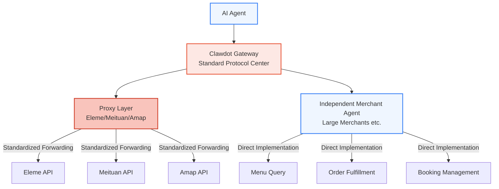
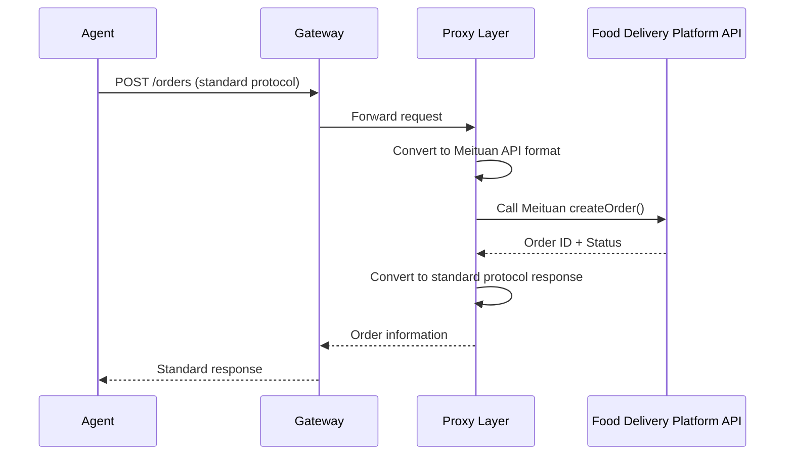
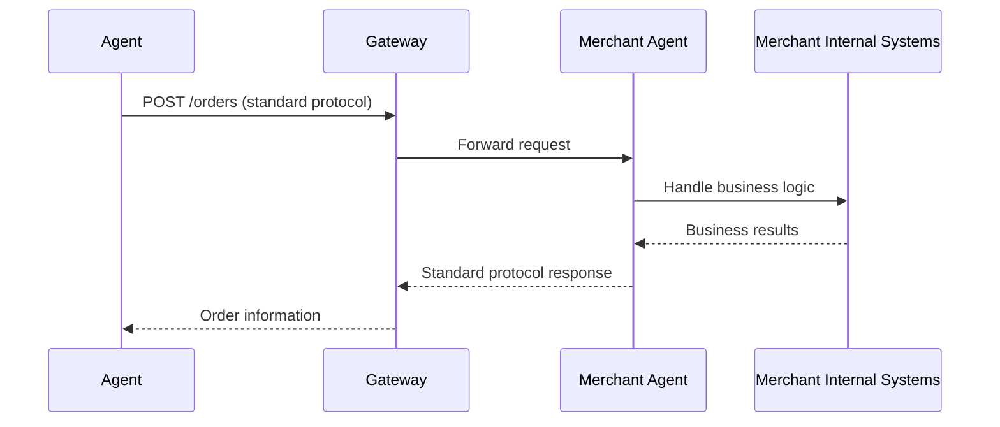
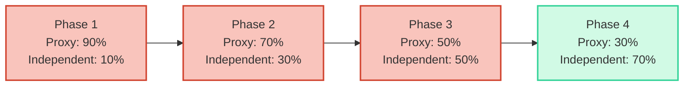

## What is Standard Protocol

Clawdot Gateway defines a set of standardized protocol that all integrated merchant services must follow. Whether proxied Eleme/Meituan merchants through Clawdot Proxy or self-built large merchant Agents, all need to use this unified interface specification. This ensures AI Agent can interact with all merchants using one set of logic.



## Five Protocol Categories

Gateway standard protocol includes 5 core functional categories. Menu Query and Order Fulfillment are currently implemented, other categories are in planning phase.

<Tabs>
  <Tab title="Menu Query">
    **Status:** ✅ Implemented

    Merchant menu browsing, search, and query interfaces. Agent learns complete information about merchant items, specs, attributes, ingredients through this protocol.

    **Standard Interfaces:**
    - `GET /menu` — Get complete menu (categories, items, specs, attributes, ingredients)
    - `GET /menu/search` — Search items (keyword, category, price range)
    - `GET /menu/item/{item_id}` — Get single item details

    **Standard Response Format:**
    ```json
    {
      "categories": [
        {
          "id": "cat_001",
          "name": "Hot Beverages",
          "items": [
            {
              "id": "item_001",
              "name": "Americano",
              "price": 12.00,
              "description": "...",
              "specs": [
                {
                  "id": "spec_001",
                  "name": "Temperature",
                  "type": "single",
                  "required": true,
                  "options": ["Hot", "Iced"]
                }
              ],
              "attributes": [...],
              "addons": [...]
            }
          ]
        }
      ]
    }
    ```
  </Tab>

  <Tab title="Order Fulfillment">
    **Status:** ✅ Implemented

    Order preview, creation, and fulfillment tracking interfaces. Agent completes user ordering needs through this protocol.

    **Standard Interfaces:**
    - `POST /orders/preview` — Order preview (price calculation, coupon application)
    - `POST /orders` — Create order
    - `GET /orders/{order_id}` — Query order status
    - `PATCH /orders/{order_id}` — Cancel order

    **Standard Response Format:**
    ```json
    {
      "order_id": "ord_12345",
      "status": "created",
      "items": [
        {
          "item_id": "item_001",
          "quantity": 2,
          "selected_specs": {...}
        }
      ],
      "subtotal": 24.00,
      "discounts": 2.00,
      "delivery_fee": 5.00,
      "total": 27.00,
      "estimated_delivery_time": "30-40min"
    }
    ```
  </Tab>

  <Tab title="Booking & Scheduling">
    **Status:** 📅 Planning

    Support merchant booking, queue management, time slot reservation features. Applicable to service merchants needing advance booking (like restaurants, salons, etc.).

    **Planned Interfaces:**
    - `GET /availability` — Query available time slots
    - `POST /bookings` — Create booking
    - `GET /bookings/{booking_id}` — Query booking details
    - `PATCH /bookings/{booking_id}` — Modify booking

    **Use Cases:**
    - Restaurant seating reservations
    - Salon service time booking
    - Wellness center course reservations
  </Tab>

  <Tab title="Ratings & Reviews">
    **Status:** 📅 Planning

    User ratings and feedback interfaces for shops, items, services. Support merchants getting user satisfaction feedback.

    **Planned Interfaces:**
    - `POST /reviews` — Submit rating
    - `GET /reviews/{order_id}` — Query order rating
    - `PATCH /reviews/{review_id}` — Edit rating
    - `POST /complaints` — File complaint

    **Rating Dimensions:**
    - Item satisfaction
    - Delivery experience
    - Merchant service
    - Issue handling feedback
  </Tab>

  <Tab title="Delivery Tracking">
    **Status:** 📅 Planning

    Real-time tracking interfaces during order delivery. Support getting delivery person information, location updates, estimated arrival time.

    **Planned Interfaces:**
    - `GET /deliveries/{order_id}` — Get delivery information
    - `GET /deliveries/{order_id}/tracking` — Real-time location tracking
    - `POST /deliveries/{order_id}/contact` — Contact delivery person

    **Use Cases:**
    - User check delivery progress
    - Agent update delivery status for user
    - Exception order handling
  </Tab>
</Tabs>

## Two Protocol Implementation Approaches

### 1. Proxy Layer (Cold Start Phase)

**Role:** Clawdot provides proxy service for merchants from Eleme/Meituan/Amap and other platforms.

**Characteristics:**
- Merchants require no changes, Clawdot Proxy handles converting Agent's standard protocol requests to platform API calls
- Complete data retention, all interaction data stored in Gateway database
- Proxy gradually learns and optimizes conversion strategies

**Process:**


### 2. Independent Merchant Agent (Independent Onboarding)

**Role:** Large merchants (like ChaoBaiDao, other chains) build their own Agent, directly implementing standard protocol.

**Characteristics:**
- Merchants have complete control over their business logic
- Directly implement each protocol interface
- Deep integration with AI Agent

**Requirements:**
- Implement all 5 functional categories of standard protocol
- Pass Gateway's protocol validation and security review
- Provide stable reliable service (SLA commitment)

**Process:**


## Evolution Strategy for Proportion

Gateway's merchant composition will gradually change as platform develops:



**Strategy Explanation:**
- **Cold Start Phase (Phase 1-2)** — Proxy dominates, quickly cover large merchant base, validate Agent model viability
- **Growth Phase (Phase 3)** — Proxy and independent Agent each 50%, focus on attracting large chains to build independently
- **Mature Phase (Phase 4)** — Independent Agent becomes main body, form open ecosystem, Proxy as supplement

## Core Value of Standard Protocol

| Value | Description |
|---|---|
| **Unified Agent Logic** | Regardless of merchant platform, Agent only needs to call one protocol |
| **Lower Onboarding Cost** | New merchants only need to implement standard protocol instead of adapting multiple platform APIs |
| **Data Completeness** | Gateway completely records all interaction data, enabling analysis and optimization |
| **Ecosystem Openness** | Foundation for future ecosystem expansion (like third-party service providers) |
| **Risk Management** | Centralized protocol validation, reduce non-standard risk of merchant onboarding |

## Next Steps

<Columns cols={2}>
  <Card title="Merchant Onboarding" icon="handshake" href="/gateway/merchant-onboarding">
    Learn how to onboard to Gateway and implement standard protocol.
  </Card>
  <Card title="API Reference" icon="code" href="/api-reference/introduction">
    View detailed API documentation and code examples.
  </Card>
</Columns>
