Alongside the REST API, Clawdot Gateway also exposes an MCP (Model Context Protocol) interface over the **Streamable HTTP** transport, reusing the same service layer as the REST API underneath. MCP exposes **18 tools**, each mapping to one REST endpoint.

## Connecting

**Endpoint:**

```
https://api.clawdot.ai/mcp/v1
```

<Note>
  The gateway mounts the MCP app under `/mcp` (`app.mount("/mcp", create_mcp_app())`), and FastMCP's inner route is versioned (`streamable_http_path="/v1"`), so the public endpoint is `/mcp/v1` — **not** `/mcp/mcp`.
</Note>

## Authentication

The two layers match the REST API — **Agent identity** at the connection layer, **user authorization** via a tool parameter:

<Tabs>
  <Tab title="Agent identity (API Key)">
    Passed at the **connection layer** via the `Authorization: Bearer clw_...` header, validated by `MCPAuthMiddleware`; required on every MCP request.

    ```
    Authorization: Bearer clw_<32-hex>
    ```

    Generated when you create an Agent in the Portal ([portal.clawdot.ai](https://portal.clawdot.ai)).
  </Tab>
  <Tab title="User authorization (consent grant)">
    Passed as the **`consent_grant_id` parameter on each tool** (`cg_` prefix), not as a header.

    ```json
    {
      "consent_grant_id": "cg_...",
      "shop_id": "...",
      "...": "..."
    }
    ```

    The binding tools (`request_user_bind` / `verify_user_bind`) are the exception — they are how you obtain a grant, so they need only Agent identity and take no `consent_grant_id`.
  </Tab>
</Tabs>

<Warning>
  `consent_grant_id` is a **parameter** on MCP tools, not a header. The `X-Consent-Grant-Id` header is for the REST API only. See [Authentication](/en/gateway/authentication).
</Warning>

## Relationship to the REST API

MCP tools map one-to-one to REST endpoints and share the same service layer and contract:

- **Parameters:** apart from `consent_grant_id`, a tool's parameters match the body fields of its REST endpoint (same names, same types).
- **Responses:** identical structure to the corresponding REST endpoint.
- **Amount units:** cents (integers). For example, `1500` means ¥15.00.
- **Errors:** the unified `{"error": {"code", "message"}}` format. See [Error handling](/en/gateway/error-handling).

## Tool list

The MCP Server exposes **18 tools**, grouped below by function. Each tool links to its tool page and shows the corresponding REST endpoint.

### Authorization

| MCP tool | REST endpoint | Description |
|----------|---------------|-------------|
| [`request_user_bind`](/en/mcp/user/bind-request) | `POST /auth/bind/request` | Start binding (Agent identity only) |
| [`verify_user_bind`](/en/mcp/user/bind-verify) | `POST /auth/bind/verify` | Verify binding (Agent identity only) |
| [`get_user_auth_status`](/en/mcp/user/auth-status) | `GET /auth/status` | Get auth status |
| [`revoke_user_bind`](/en/mcp/user/unbind) | `POST /auth/unbind` | Unbind |
| [`get_homepage_url`](/en/mcp/user/homepage-url) | `POST /auth/homepage-url` | Get homepage URL |

### Shops

| MCP tool | REST endpoint | Description |
|----------|---------------|-------------|
| [`search_shops`](/en/mcp/shops/search) | `POST /shops/search` | Search / browse shops |
| [`get_shop_menu`](/en/mcp/shops/detail) | `POST /shops/menu` | Shop menu |
| [`get_shop_share_url`](/en/mcp/shops/share-url) | `POST /shops/share-url` | Shop share URL |

### Addresses

| MCP tool | REST endpoint | Description |
|----------|---------------|-------------|
| [`search_addresses`](/en/mcp/addresses/search) | `POST /addresses/search` | Search / list addresses |
| [`select_address`](/en/mcp/addresses/select) | `POST /addresses/select` | Select / save address |
| [`update_address`](/en/mcp/addresses/update) | `POST /addresses/update` | Edit address |

### Ordering

| MCP tool | REST endpoint | Description |
|----------|---------------|-------------|
| [`quote_cart`](/en/mcp/cart/quote) | `POST /cart/quote` | Price the cart |
| [`list_coupons`](/en/mcp/coupons/list) | `POST /coupons/list` | List coupons |
| [`preview_order`](/en/mcp/orders/preview) | `POST /orders/preview` | Preview order |
| [`create_order`](/en/mcp/orders/create) | `POST /orders/create` | Create order |
| [`get_order_status`](/en/mcp/orders/get) | `GET /orders/{order_id}` | Get order |

### Payment

| MCP tool | REST endpoint | Description |
|----------|---------------|-------------|
| [`get_sign_action`](/en/mcp/payment/sign-action) | `POST /payment/sign-action` | Get sign action |
| [`get_sign_status`](/en/mcp/payment/sign-status) | `GET /payment/sign-status` | Get sign status |

## Ordering flow

The tool-call order from search to checkout — each step's output feeds the next:

```mermaid
flowchart LR
  A["search_shops"] -->|"shop_id + cart_id"| B["get_shop_menu"]
  B -->|"pick items"| C["quote_cart"]
  C -->|"quote_id"| D["select_address"]
  D -->|"address_id"| E["preview_order"]
  E -->|"preview_id +<br/>confirmation_token"| F["create_order"]
  F -->|"order_id"| G["get_sign_action"]
  G -->|"password-free<br/>signing"| H["Payment done"]
```



1. `search_shops` → returns `shop_id` + `cart_id` (`cart_id` already encapsulates the delivery coordinates)
2. `get_shop_menu` → pick items, get `item_id` / `sku_id`
3. `quote_cart` → price the cart, get `quote_id`
4. `select_address` → get `address_id`
5. `preview_order` → get `preview_id` + `confirmation_token`
6. `create_order` → get `order_id`
7. `get_sign_action` → complete payment via password-free signing

See each tool page for full parameters and responses.
