Clawdot Gateway exposes its Agent interface via **MCP (Model Context Protocol)** over the **Streamable HTTP** transport. The MCP Server exposes **18 tools** covering the full takeout flow: binding a user and obtaining consent, searching shops, adding items and pricing the cart, previewing and placing an order, and password-free payment. This page covers how to connect, how to authenticate, what tools exist, and how to chain them into a single order.

## Connecting

**Endpoint:**

```
https://eleme-gateway.hicaspian.com/mcp/v1
```

<Note>
  The gateway mounts the MCP app under `/mcp` (`app.mount("/mcp", create_mcp_app())`), and FastMCP's inner route is versioned (`streamable_http_path="/v1"`), so the public endpoint is `/mcp/v1` — **not** `/mcp/mcp`.
</Note>

## Authentication

Two layers — **Agent identity** at the connection layer, **user authorization** via a tool parameter:

<Tabs>
  <Tab title="Agent identity (API Key)">
    Passed at the **connection layer** via the `Authorization: Bearer clw_...` header, validated by `MCPAuthMiddleware`; required on every MCP request.

    ```
    Authorization: Bearer clw_<32-hex>
    ```

    Generated when you create an Agent in the console ([console.hicaspian.com/agents](https://console.hicaspian.com/agents)).
  </Tab>
  <Tab title="User authorization (consent grant)">
    Passed as the **`consent_grant_id` parameter on each tool** (`cg_` prefix), not as a header.

    ```json
    {
      "consent_grant_id": "cg_...",
      "shop_id": "...",
      "...": "..."
    }
    ```

    The binding tools (`request_user_bind` / `verify_user_bind`) are the exception — they are how you obtain a grant, so they need only Agent identity and take no `consent_grant_id`.
  </Tab>
</Tabs>

<Warning>
  `consent_grant_id` is a **parameter** on business tools, passed in the JSON arguments, not a header. See [Authentication](/en/gateway/authentication).
</Warning>

## Tool contract

All tools follow the same calling convention:

- **Parameters:** passed as a JSON object. Every business tool carries `consent_grant_id` (the binding tools are the exception); cross-step IDs (`cart_id` / `quote_id` / `preview_id` / `confirmation_token`, etc.) are issued by the gateway and must be **passed back verbatim** — never fabricated or reused across flows.
- **Responses:** structured JSON; see each tool page for its full fields.
- **Errors:** the unified `{"error": {"code", "message"}}` format. See [Error handling](/en/gateway/error-handling).

<Warning>
  All amount fields are in **cents (integers)**, not yuan. For example, `1500` means ¥15.00.
</Warning>

## Multilingual

Responses can be returned in the language you choose: shop names, item names, specs and add-ons, labels, order status and error messages are all localized. One of `zh` (Chinese, default) / `en` / `ja` / `ko` / `ru` / `ms` / `es`; any other value returns 400. To also keep the Chinese original, see “Bilingual responses” below.

Two ways to set it — pick one:

- **At binding time:** pass `lang` to `request_user_bind`. Every later call for that user uses this language, so you don't pass it again.
- **Per call:** pass `lang` on a supporting tool; it affects only that call.

Tools that accept `lang`: `search_addresses`, `search_shops`, `get_shop_info`, `get_shop_menu`, `get_item_options`, `get_item_description`, `quote_cart`, `list_coupons`, `preview_order`, `create_order`, `get_order_status`, `list_orders`.

In the `create_order` `callback_url` payload, `status_text` also follows the language set at binding time.

<Note>
  **Three things to know before you integrate**

  1. **Description-type content may still be Chinese on first read.** Item descriptions, recommendation blurbs, and address results from the 11th onward may come back in Chinese the first time; query again shortly and they are in your language. Display whatever you receive.
  2. **When a response carries `localization: "degraded"`**, translation is temporarily unavailable and the payload may contain Chinese. This is transient — retry and it recovers. The field is absent under normal operation.
  3. **These pages are always Chinese, regardless of `lang`:** the payment page, the order detail page (opened via `detail_url` or the payment link), and the courier app. Tell your users when you hand them these links.
</Note>

The recipient name (`contact_name`) is never translated — it is stored and shown exactly as entered so it matches the delivery details. Names are capped at 12 characters; longer values return 400. For non-Chinese names we suggest "given name + last-name initial", e.g. Alexander Petrov → Alexander P.

## Bilingual responses

To keep the Chinese original alongside the translation (for example, so staff can verify an item name), pass `include_chinese=true` (boolean, defaults to `false`):

- **Off by default**: without `include_chinese`, or with it set to `false`, the response never has `<key>_zh`. Only an explicit `true` returns the Chinese original.
- **Pass it together with `lang`**: set `lang` to the target language (e.g. `en`) and `include_chinese` to `true` at the same time.
- **When `lang` is Chinese (`zh`) or not passed at all, `include_chinese` has no effect** and never errors — a Chinese response is already Chinese, so there's nothing to attach.
- Scope matches single-language `lang`: set it at binding time via `request_user_bind`, or per call on any tool that accepts `lang`. **The binding-time `include_chinese` only applies when this call passes neither `lang` nor `include_chinese`.** As soon as a call passes `lang`, `include_chinese` for that call falls back to its default (`false`) instead of inheriting the binding-time setting — pass both together whenever a single call needs bilingual output.

When `include_chinese=true`, every field that was **translated successfully** gets a sibling `<key>_zh` next to it, holding the Chinese original:

```json
{
  "shop": {
    "shop_id": "shop_xxx",
    "name": "Zhang Liang Malatang (Xixi Beiyuan)",
    "name_zh": "张亮麻辣烫(西溪北苑店)",
    "available": true
  },
  "items": [{
    "item_id": "item_xxx",
    "name": "Deluxe Single Meat Roll Set",
    "name_zh": "豪华单人肉卷套餐",
    "category_name": "Value Sets",
    "category_name_zh": "特惠套餐",
    "price": 5588,
    "image_url": "https://cube.elemecdn.com/...",
    "sku_options": [{
      "sku_id": "sku_xxx",
      "name": "Beef Roll Set",
      "name_zh": "肥牛卷套餐",
      "price": 5588
    }],
    "tags": ["Milk Tea", "Dessert"],
    "tags_zh": ["奶茶", "甜品"]
  }]
}
```

Rules for `<key>_zh`:

- **Same type as the original field, no exceptions.** A string field pairs with a string; a string-array field pairs with a string array of the same order and length (see `tags` / `tags_zh` above).
- **Only appears when that field was translated successfully this time.** No `_zh` means this field wasn't translated this time, and the field itself is Chinese — you can check translation success field by field, with no need to check any other status field in the response.
- **Only covers merchant data** — shop names, item names, specs, add-ons, labels, and the like. Prompts generated by the platform itself (opening-hours notices, minimum-order-gap notices, etc.) are single-language only and never get a `_zh`.
- `item_id` / `sku_id` / `price` / `image_url`, coordinates, and timestamps aren't language-specific and never get a `_zh`.
- `delivery_fee_text` (the delivery-fee display text, e.g. "Delivery ¥2") is an exception: it never gets a `delivery_fee_text_zh`, even when translation succeeds. The delivery fee amount itself is in the `delivery_fee` field (a number) and isn't language-specific.

To collapse a bilingual response back into a single language, use this generic function — it doesn't need to know any field names:

```javascript
// Target language only: drop every _zh
function stripZh(node) {
  if (Array.isArray(node)) return node.map(stripZh);
  if (node && typeof node === "object") {
    const out = {};
    for (const k of Object.keys(node)) {
      if (k.endsWith("_zh")) continue;
      out[k] = stripZh(node[k]);
    }
    return out;
  }
  return node;
}

// Chinese only: use _zh where present; no _zh means the field is already Chinese
function preferZh(node) {
  if (Array.isArray(node)) return node.map(preferZh);
  if (node && typeof node === "object") {
    const out = {};
    for (const k of Object.keys(node)) {
      if (k.endsWith("_zh")) continue;
      const zhKey = k + "_zh";
      out[k] = preferZh(zhKey in node ? node[zhKey] : node[k]);
    }
    return out;
  }
  return node;
}
```

## Tool list

The MCP Server exposes **18 tools**, grouped below by function. Each tool links to its tool page (with full parameters and response fields).

### Authorization

| MCP tool | Description |
|----------|-------------|
| [`request_user_bind`](/en/mcp/user/bind-request) | Start binding (SMS / H5, Agent identity only) |
| [`verify_user_bind`](/en/mcp/user/bind-verify) | Verify binding; mints `consent_grant_id` on success (Agent identity only) |
| [`get_user_auth_status`](/en/mcp/user/auth-status) | Get auth status |
| [`revoke_user_bind`](/en/mcp/user/unbind) | Unbind (the old `consent_grant_id` is revoked immediately) |
| [`get_homepage_url`](/en/mcp/user/homepage-url) | Get the Taoshan homepage URL |

### Shops

| MCP tool | Description |
|----------|-------------|
| [`search_shops`](/en/mcp/shops/search) | Search / browse shops |
| [`get_shop_menu`](/en/mcp/shops/detail) | Shop menu |
| [`get_shop_share_url`](/en/mcp/shops/share-url) | Shop share URL |

### Addresses

| MCP tool | Description |
|----------|-------------|
| [`search_addresses`](/en/mcp/addresses/search) | Search / list addresses |
| [`select_address`](/en/mcp/addresses/select) | Select / save address |
| [`update_address`](/en/mcp/addresses/update) | Edit address |

### Ordering

| MCP tool | Description |
|----------|-------------|
| [`quote_cart`](/en/mcp/cart/quote) | Price the cart |
| [`list_coupons`](/en/mcp/coupons/list) | List coupons |
| [`preview_order`](/en/mcp/orders/preview) | Preview order |
| [`create_order`](/en/mcp/orders/create) | Create order |
| [`get_order_status`](/en/mcp/orders/get) | Get order |

### Payment

| MCP tool | Description |
|----------|-------------|
| [`get_sign_action`](/en/mcp/payment/sign-action) | Get sign action |
| [`get_sign_status`](/en/mcp/payment/sign-status) | Get sign status |

## Ordering flow

The tool-call order from search to checkout — each step's output feeds the next:

```mermaid
flowchart LR
  A["search_shops"] -->|"shop_id + cart_id"| B["get_shop_menu"]
  B -->|"pick items"| C["quote_cart"]
  C -->|"quote_id"| D["select_address"]
  D -->|"address_id"| E["preview_order"]
  E -->|"preview_id +<br/>confirmation_token"| F["create_order"]
  F -->|"order_id"| G["get_sign_action"]
  G -->|"password-free<br/>signing"| H["Payment done"]
```



1. `search_shops` → returns `shop_id` + `cart_id` (`cart_id` already encapsulates the delivery coordinates)
2. `get_shop_menu` → pick items, get `item_id` / `sku_id`
3. `quote_cart` → price the cart, get `quote_id`
4. `select_address` → get `address_id`
5. `preview_order` → get `preview_id` + `confirmation_token`
6. `create_order` → get `order_id`
7. `get_sign_action` → complete payment via password-free signing

See each tool page for full parameters and responses.
