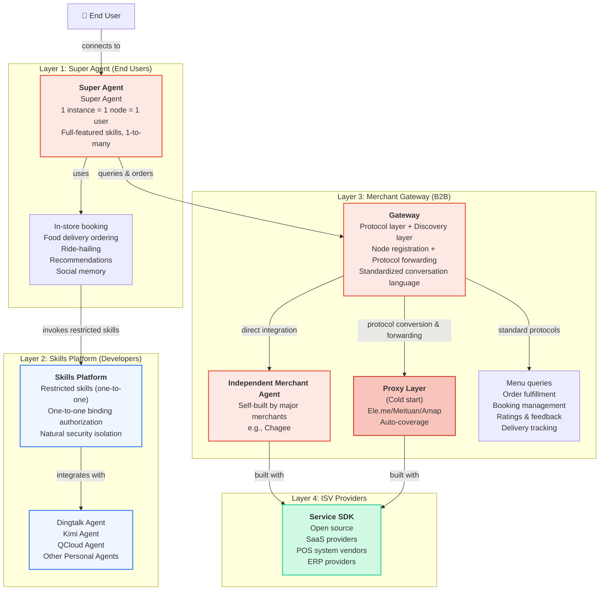

import { Card, CardGroup } from '/components/Card';
import { Accordion, AccordionGroup } from '/components/Accordion';
import { Tabs, Tab } from '/components/Tabs';

## Architecture Overview

Clawdot adopts a four-layer architecture design. From top to bottom: Super Agent, Skills Platform, Merchant Gateway, and Service SDK. Each layer has independent responsibilities, and layers interact through protocols and standard interfaces to form a complete local life service ecosystem.



## Four Layers Explained

<AccordionGroup>
  <Accordion title="Layer 1: Super Agent (End Users)" defaultOpen>

    **One user = One dedicated Agent = One network node**

    Super Agent is the core concept of Clawdot. Each user has a dedicated AI Agent called a "Super Agent". This Agent:

    - **Full-featured skills**: Complete local life service capabilities
      - In-store booking: Search, compare, and book restaurants, beauty salons, etc.
      - Food delivery ordering: Search merchants, browse menus, smart ordering, track fulfillment
      - Ride-hailing: Check vehicle types, reserve, pay, get route information
      - Recommendations: Intelligently recommend new shops and activities based on preferences
      - Social memory: Remember user preferences, order history, and favorite addresses

    - **1-to-Many service**: One Agent serves multiple merchants and SKUs without individual training

    - **Network node value**: Each Agent is both a user proxy and a node in the local life network

  </Accordion>

  <Accordion title="Layer 2: Skills Platform (Developers)">

    **A restricted skills ecosystem for Personal Agent integration**

    The Skills Platform is Clawdot's entry point for opening up to the developer ecosystem. Key features:

    - **Restricted skills supply**: Unlike Layer 1's "full-featured" skills, developer-integrated skills are restricted (one-to-one binding)

    - **One-to-one binding authorization**:
      - Each developer's agent (e.g., Dingtalk agent, Kimi agent) can only bind to a specific skill set
      - Natural security isolation, different agents' permissions don't affect each other

    - **Supported Personal Agents**:
      - Dingtalk Agent (enterprise scenarios)
      - Kimi Agent (knowledge assistant scenarios)
      - QCloud Agent (Tencent Cloud ecosystem)
      - Other third-party Personal Agents

    - **Security mode**: Authorization, metering, and auditing are completely independent with risk isolation

  </Accordion>

  <Accordion title="Layer 3: Merchant Gateway (B2B)">

    **Protocol and discovery layer connecting local merchants**

    The Merchant Gateway is a critical hub for Clawdot to onboard local merchants. It contains two core modules:

    **Gateway Responsibilities:**
    - **Protocol layer**: Unified protocol forwarding, converting user requests to merchant API calls
    - **Discovery layer**: Merchant node registration, indexing, search, and ranking
    - **Standardized conversation**: Defining unified business language for ordering, booking, ratings, etc.

    **Proxy Layer (Cold start):**
    - Automatically proxies major platforms like "Ele.me", "Meituan", and "Amap"
    - No need to wait for merchant self-integration, instantly cover millions of merchants
    - Automatically converts these platforms' APIs to Clawdot's standard protocol

    **Independent Merchant Agent (Self-built by major merchants):**
    - Top merchants (e.g., Chagee, HeyTea) can build their own dedicated Agent
    - Integrate SDK for quick implementation, connect with Clawdot protocol
    - Gain more customization capabilities and data control

    **Standard Protocol Stack:**
    ```
    - Menu queries: Get merchant menus, inventory, pricing
    - Order fulfillment: Create orders, pay, ship, receive
    - Booking management: Query available slots, create and cancel bookings
    - Ratings & feedback: Submit ratings, get rating summaries
    - Delivery tracking: Real-time order logistics tracking
    ```

  </Accordion>

  <Accordion title="Layer 4: ISV Providers">

    **Open source Service SDK, empowering SaaS/ERP/POS systems**

    The fourth layer provides ISVs (Independent Software Vendors) with a standardized Service SDK, lowering integration barriers.

    - **Open source SDK**: Published as open source, reducing costs and integration difficulty

    - **Supported ISV types**:
      - SaaS providers (CRM, marketing automation, etc.)
      - POS system vendors (primarily for restaurants/retail)
      - ERP providers (inventory, supply chain management)

    - **Ecosystem role**:
      - Accelerate merchant onboarding, expand network node quantity
      - Provide standardized onboarding paths, reduce merchant learning costs
      - ISVs can gain new business opportunities through the Clawdot ecosystem

  </Accordion>
</AccordionGroup>

## Inter-Layer Relationships and Data Flow

### Skill Abstraction Propagation

The Super Agent's full-featured skills are progressively abstracted and combined from lower layers:

1. **Layer 1 → Layer 2**: Platform extracts restricted, reusable skill units from Layer 1's "full-featured skills"
2. **Layer 2 → Layer 3**: These skills invoke Layer 3's various merchant agents through Gateway
3. **Layer 3 → Layer 4**: Merchant agents and Proxy use Layer 4's SDK to implement concrete services

### Skill Sources

```
User request
    ↓
Super Agent (Layer 1) understands intent
    ↓
Invokes restricted skills (Layer 2) to execute
    ↓
Gateway (Layer 3) protocol conversion
    ↓
Merchant Agent or Proxy (Layer 3) calls API
    ↓
SDK (Layer 4) implements concrete functionality
```

### Three Ways to Onboard Merchant Nodes

| Method | Merchant Scale | Integration Difficulty | Customization | Examples |
|--------|--------|--------|--------|------|
| **Proxy Cold Start** | Ultra-large | Zero | None | Ele.me, Meituan, Amap |
| **Gateway Direct** | Small-to-medium | Low | Standard protocol | Regular restaurant merchants |
| **Independent Agent** | Top merchants | Medium | Highly customized | Chagee, HeyTea, Haidilao |

## Core Flywheel: Network Effects

Clawdot's true value lies in network effects. As participating merchants and developers increase, the platform's bargaining power and appeal grow exponentially:

```
More nodes
    ↓
Greater network value
    ↓
Stronger protocol voice
    ↓
More nodes proactively join
    ↓
[Loop]
```

**Key drivers of this flywheel**:
- Layer 1 user count is Layer 3's network scale
- Layer 3 merchant count is Layer 2 developers' market opportunity
- Layer 2 applications count is Layer 4 ISVs' business value

## Phased Development Strategy

Clawdot's development is divided into three phases, each with clear objectives:

<CardGroup cols={3}>
  <Card title="Phase 1: Now" icon="🚀">
    **Proxy Cold Start**

    - Rapidly cover Ele.me, Meituan, Amap merchants
    - Prove the feasibility of Super Agent model
    - Accumulate first batch of core users
  </Card>
  <Card title="Phase 2: This Year" icon="⚙️">
    **SDK + Skills Ecosystem Expansion**

    - Release open source SDK, attract ISVs
    - Open Skills Platform, support more Personal Agents
    - Expand to at-home scenarios (fresh groceries, errand services, etc.)
  </Card>
  <Card title="Phase 3: Next Year" icon="🌟">
    **Protocol Standardization + Network Release**

    - Define industry standard protocols, become the de facto local life API layer
    - Network reaches critical mass, flywheel self-starts
    - Ecosystem participants autonomously expand
  </Card>
</CardGroup>

## Benchmarking and Innovation Points

| Dimension | Clawdot | Traditional Platforms |
|--------|--------|--------|
| **User Agent** | Super Agent (full-featured) | Manual user operations |
| **Developer Ecosystem** | Restricted skills + one-to-one authorization | Unlimited APIs |
| **Merchant Onboarding** | Proxy cold start + Gateway | Merchant-by-merchant listing |
| **Security Model** | Natural isolation | Single point of failure |
| **Network Value** | Exponential growth | Linear growth |

---

**Ready to join the Clawdot ecosystem?**

- I'm a user: [Learn about Super Agent](/super-agent)
- I'm a developer: [Integrate Skills Platform](/skills-platform)
- I'm a merchant: [Integrate Gateway](/gateway)
- I'm an ISV: [Use Service SDK](/sdk)
