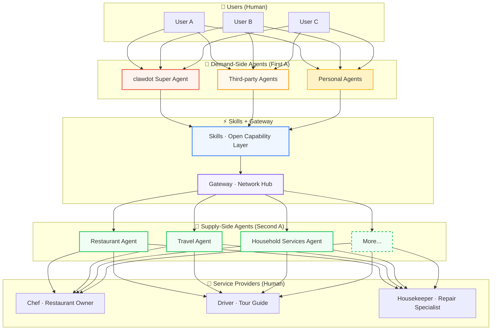

## One Network, Not a Pipeline

H2A2A2H stands for **Human → Agent → Agent → Human**.

This is clawdot's core vision for the future of local life services: people no longer need to personally "search" for services; they express their needs through Agents. Service providers no longer need to master "traffic generation"; their Agents deliver their excellent services to the people who need them. All negotiation, matching, and connection in between happens Agent-to-Agent.

This isn't a one-way assembly line. It's an open network—any Agent can join, any service provider can be connected.

---

## Four Roles in the Network

### The First H — You (Consumer)

You simply say what you want.

"Something light to eat tonight for two, under 150 yuan budget." "Help me arrange my business trip tomorrow." "Find a fun place to take the kids this weekend."

You don't need to scroll through apps, read dozens of reviews, or agonize over choices. You just need to express your needs naturally, like talking to a friend who understands you.

### The First A — Demand-Side Agent

Your Agent understands you, remembers you, and takes action for you.

It knows you don't eat cilantro, prefer window seats, and prefer Japanese food on Friday nights. It's not a cold search engine—it's a life manager that knows you.

And this isn't just clawdot's own Super Agent. It's an open network—third-party Agents and your own Personal Agent can tap into clawdot's Skills to serve you.

<Columns cols={3}>
  <Card title="clawdot Super Agent" icon="sparkles">
    clawdot's own Agent with full capabilities, handling all aspects of eating, travel, entertainment, and life.
  </Card>
  <Card title="Third-party Agents" icon="blocks">
    Other platforms' Agents can also use clawdot's Skills, joining the same service network.
  </Card>
  <Card title="Personal Agent" icon="user">
    Your own Agent can equally use clawdot's capabilities to access local life services.
  </Card>
</Columns>

### A ↔ A — Agent Negotiation Layer

This is the truly revolutionary part.

The consumer's Agent and the service provider's Agent talk directly. No centralized platform intermediating, no bidding wars, no traffic taxes. Supply and demand match based on real capability and real reputation.

At this layer, **Skills** are the source of Agent capabilities—every service category from eating to travel to entertainment to daily life is a Skill, with infinitely expandable capabilities. **Gateway** is the network's central hub; supply-side Agents register to Gateway through the SDK, demand-side Agents invoke Gateway through Skills, and both sides connect here.

### The Second A — Supply-Side Agent

Every service provider has their own Agent.

The Restaurant Agent helps the owner manage reservations, take orders, and respond to customers. The Household Services Agent helps the housekeeper schedule shifts, provide quotes, and coordinate timing. The Travel Agent helps the driver with dispatch and order matching.

Artisans can focus on their craft—their Agents handle connecting their services with the people who need them. Zero friction to join through the SDK; no need to understand AI or rebuild systems.

### The Second H — Service Providers (People)

Technology's endpoint is warm human connection.

Agents help you find good services faster, but the actual service experience is between people. The chef's Hunanese cuisine hand-cooked after twenty years, the devoted housekeeper's meticulous cleaning, the skilled repair specialist's well-fixed pipes—this warmth is something AI can't replace.

---

## Why a Network, Not a Platform

Traditional local life services operate through centralized platforms: the platform sets rules, merchants buy traffic, consumers get algorithm recommendations. The bigger the platform, the higher the commissions, and both service providers and consumers pay the cost of connection.

clawdot is not a platform. clawdot is a network.

In this network, every person and every Agent is a node, connecting and enabling each other. No one "owns" this network—**clawdot belongs to everyone in their everyday life.**

| | Network (clawdot) | Traditional Platform |
|---|---|---|
| **Connection Method** | Agent-to-Agent direct negotiation | Platform intermediation, algorithm recommendations |
| **Entry Barrier** | Any Agent can join | Must operate within the platform |
| **Service Provider Customer Acquisition** | Great services naturally reach the right people | Buy traffic, do operations |
| **Cost Structure** | Decentralized, transparent, reasonable | High commissions and traffic taxes |
| **Network Ownership** | Belongs to every participant | Belongs to the platform company |

---

## Care: Flowing Through Every Connection

Care isn't a specific layer of this network—it's a value embedded throughout.

AI Agents are naturally suited to serve those who need help most. Elderly people living alone need someone to pick up medicines, people with mobility challenges need more attentive home services, grandparents unfamiliar with smartphones need patient agents.

On traditional platforms, these groups are often overlooked because they're not "high-value users." But in clawdot's network, everyone who needs help can be seen through their Agent, matched with services, and treated with care.

<Columns cols={3}>
  <Card title="Agents Supporting the Elderly" icon="heart-handshake">
    Help seniors access local life services through simple voice interaction. One phrase handles groceries, medicine, or calling services.
  </Card>
  <Card title="Agents Supporting the Disabled" icon="accessibility">
    Provide more attentive service matching and home service coordination for people with mobility challenges.
  </Card>
  <Card title="Community Care" icon="users">
    A community mutual aid network based on Agents, letting kindness between neighbors flow naturally.
  </Card>
</Columns>
