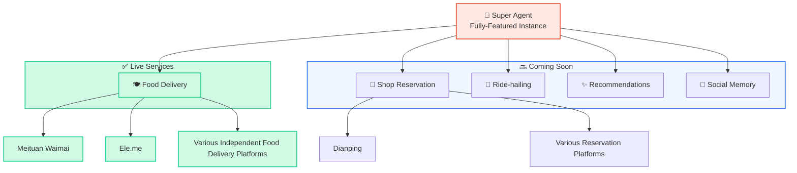
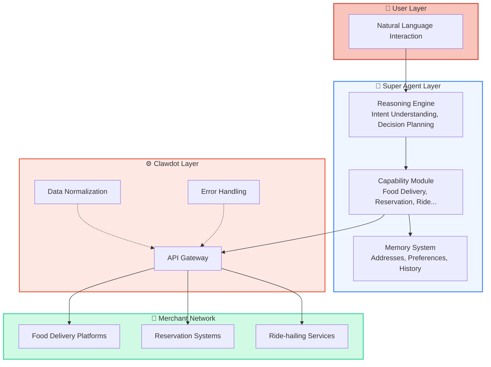
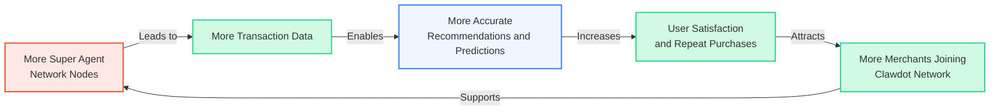
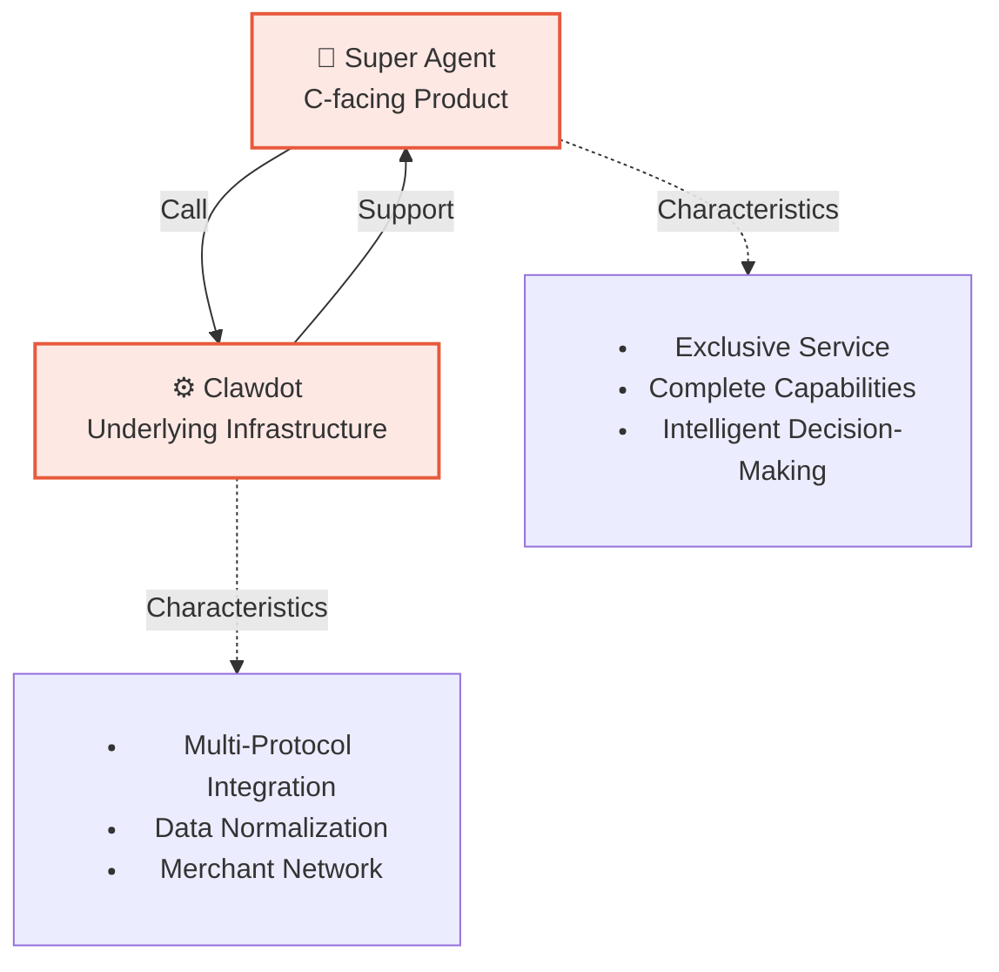

## Full Landscape Overview

Super Agent is a fully-featured intelligent assistant equipped with a complete local life service capability matrix. Each instance possesses all the following capabilities, connecting one-to-many with various merchants and services:



## Capability Details

<CardGroup cols={2}>
  <Card title="🍽️ Food Delivery" icon="utensils">
    **Status**: ✅ Live

    Make Super Agent your food delivery assistant. Search merchants, browse menu, smart ordering, track orders.

    **Core Features**:
    - Search merchants by keyword/location
    - Complete menu browsing (with specs, attrs, ingredients)
    - Smart default specs selection
    - Preview price → Confirm order
    - Real-time order tracking

    **Supported Platforms**: Meituan, Ele.me, various independent food delivery platforms

    [Learn More →](/super-agent/food-delivery)
  </Card>

  <Card title="📅 Shop Reservation" icon="calendar">
    **Status**: 🔜 Coming Soon

    Help you reserve restaurants, hotels, salons, beauty services, and more. Agent understands your needs and automatically selects time and party size.

    **Planned Features**:
    - Search reservation merchants
    - View schedules and reviews
    - Smart optimal time selection
    - Confirm reservations and reminders
    - Reservation change management

    **Supported Platforms**: Dianping, various reservation systems
  </Card>

  <Card title="🚗 Ride-hailing" icon="car">
    **Status**: 🔜 Coming Soon

    One command to hail a ride. Super Agent helps you complete the entire process from location identification to boarding.

    **Planned Features**:
    - Location identification ("my home", "office", "airport")
    - Route planning and fare estimation
    - One-tap ride
    - Real-time vehicle tracking
    - Arrival reminder

    **Supported Platforms**: Didi, Amap, various ride-hailing services
  </Card>

  <Card title="✨ Recommendations" icon="sparkles">
    **Status**: 🔜 Coming Soon

    Super Agent remembers your taste, proactively discovering merchants and dishes you're interested in. No need to search—direct recommendations.

    **Planned Features**:
    - Learn your preferences (cuisine, price, rating)
    - Regular merchant recommendations
    - Dish combination recommendations
    - Activity reminders (coupons, new dishes)
    - Friend recommendations (social recommendations)

    **Integration**: Deep integration with food delivery, reservations, and more
  </Card>

  <Card title="💬 Social Memory" icon="comments">
    **Status**: 🔜 Coming Soon

    Super Agent is your private assistant, remembering your habits, preferences, common addresses, and transaction history.

    **Planned Features**:
    - Remember common addresses (home, office, frequent restaurants)
    - Taste preference learning (favorite cuisines, dislikes)
    - Consumption habit analysis
    - Friend information memory (who likes what)
    - Transaction history query

    **Integration**: Provides context for all other capabilities
  </Card>
</CardGroup>

## Capability Progress Table

| Capability | Current Status | Launch Date | Supported Platforms | Related Docs |
|------|--------|--------|--------|--------|
| Food Delivery | ✅ Live | 2026-Q1 | Meituan, Ele.me, etc. | [View](/super-agent/food-delivery) |
| Shop Reservation | 🔜 In Development | 2026-Q2 | Dianping, etc. | — |
| Ride-hailing | 🔜 Planning | 2026-Q3 | Didi, Amap, etc. | — |
| Recommendations | 🔜 Planning | 2026-Q3 | All platforms | — |
| Social Memory | 🔜 Planning | 2026-Q4 | Built-in | — |

## Three-Layer Architecture of Capabilities



## Flywheel Effect

Super Agent's capability growth follows a flywheel effect:



**The Four Stages of the Flywheel**:

1. **Node Growth** → More users own Super Agent instances
2. **Data Accumulation** → Transaction, preference, and address data continuously accumulate
3. **Intelligence Enhancement** → AI makes smarter recommendations and decisions based on data
4. **Ecosystem Prosperity** → Better user experience → Merchants willing to join → More capabilities

## Relationship with Clawdot



## Quick Comparison

| Feature | Super Agent | Clawdot |
|------|-----------|---------|
| **Users** | C-facing (Consumers) | B-facing (Developers, Merchants) |
| **Core Value** | Intelligent assistant, one-to-one exclusive service | API gateway, connect AI and merchant network |
| **Capabilities** | Complete business workflows (search, order, track, etc.) | Underlying API atomic capabilities |
| **Interaction** | Natural language conversation | API / MCP calls |
| **Memory** | Remember user preferences, history, addresses | Stateless service |
| **Personalization** | High (independent instance per user) | Low (common API) |

## How to Use Each Capability

<Tabs>
  <Tab title="Food Delivery" icon="utensils">
    **Currently Available**

    The simplest way to get started:
    ```
    User: Help me order food
    Super Agent: Recommending popular food delivery shops for you...
    ```

    Details in [Food Delivery Documentation](/super-agent/food-delivery)
  </Tab>

  <Tab title="Other Capabilities" icon="lock">
    **Coming Soon**

    Other capabilities are in development with expected launch dates:
    - **Q2 2026**: Shop Reservation
    - **Q3 2026**: Ride-hailing, Recommendations
    - **Q4 2026**: Social Memory

    Stay tuned!
  </Tab>
</Tabs>

## Frequently Asked Questions

<AccordionGroup>
  <Accordion title="What is the difference between Super Agent and regular chatbots?" icon="question">
    Regular chatbots can only **talk** but not **act**, while Super Agent can both talk and act:

    - **Can talk**: Understand natural language, provide friendly responses
    - **Can act**: Call Clawdot APIs to truly complete ordering, reservations, and more
    - **Has memory**: Remember user preferences, addresses, history to provide personalized service

    So Super Agent is a true personal assistant, not just a chatbot.
  </Accordion>

  <Accordion title="How does Super Agent ensure transaction safety?" icon="shield">
    Super Agent is built on Clawdot's underlying infrastructure with multiple security guarantees:

    1. **Identity Authentication**: Each Super Agent instance has unique identity
    2. **Operation Confirmation**: Must display price to user and get confirmation before ordering
    3. **Link Encryption**: All API calls are encrypted
    4. **Transaction Tracking**: Every transaction can be tracked, audited, and held accountable
    5. **Third-party Compliance**: Direct connection with merchant platforms, complying with platform standards

    Users can use with complete confidence.
  </Accordion>

  <Accordion title="What will Super Agent's data be used for?" icon="database">
    Data collected by Super Agent (addresses, preferences, transaction history) is used for:

    1. **Service Improvement**: More accurate recommendations and predictions
    2. **Personalized Experience**: Remember your habits, provide quick actions
    3. **Aggregate Analysis**: (Data aggregation only, no personal privacy involved)

    All data is **privately owned by users** and will not be shared with third parties. See privacy policy for details.
  </Accordion>

  <Accordion title="How does Super Agent make money?" icon="coins">
    Super Agent's business model:

    - **Transaction Commissions**: Small commission from merchants on each transaction
    - **Premium Services**: Premium features (e.g., exclusive discounts, priority delivery)
    - **Advertising**: Merchants can pay for recommended ranking (transparent)
    - **Data Services**: (Aggregate data only, protecting user privacy)

    Goal is to build a win-win-win ecosystem: user convenience, merchant customer acquisition, platform sustainability.
  </Accordion>

  <Accordion title="How to add new capabilities or merchants?" icon="plus">
    Super Agent's capability expansion is very flexible:

    **New Capabilities**: Through Clawdot Gateway's capability framework, quickly integrate new service categories (e.g., errand service, repair service, etc.).

    **New Merchants**: Merchants can join through Clawdot network and automatically get Super Agent support without separate integration.

    This is Clawdot's core value —— one integration, full network coverage.
  </Accordion>
</AccordionGroup>

## Next Steps

<CardGroup cols={2}>
  <Card title="Learn How It Works" icon="gears" href="/super-agent/how-it-works">
    Understand how Super Agent calls Clawdot APIs to complete transactions
  </Card>

  <Card title="Try Food Delivery" icon="utensils" href="/super-agent/food-delivery">
    Most detailed food delivery ordering guide
  </Card>

  <Card title="View Product Roadmap" icon="map" href="/clawdot/roadmap">
    Learn about Super Agent's future plans
  </Card>

  <Card title="Contact Us" icon="envelope">
    Have suggestions or questions? We welcome your feedback
  </Card>
</CardGroup>
