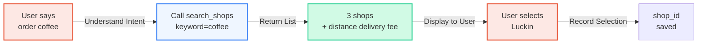
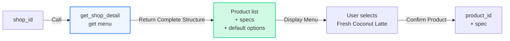
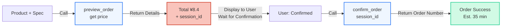

## Overview

Food delivery ordering is the first deployed scenario for Super Agent and the most typical demonstration of its capabilities. Super Agent connects to food delivery platforms through Clawdot Gateway, enabling AI to complete the entire workflow from searching merchants to confirming orders, providing users with one-tap ordering experience.

## Capability Matrix

Super Agent's core capabilities in food delivery scenarios:

| Capability | Description | API Tool |
|------|------|--------|
| Merchant Search | Search by keyword or location, support 10 categories in parallel | `search_shops` |
| Menu Browsing | Complete menu with specs, attrs, ingredients, and default options | `get_shop_detail` |
| Address Management | POI search, address creation and list management | `search_pois` / `create_address` / `list_addresses` |
| Smart Ordering | Two-step preview + confirm workflow, auto-select optimal coupon | `preview_order` / `confirm_order` |
| Order Tracking | Query order status | `get_order` |

## Typical Dialogue Scenario

Below is an example of a complete food delivery ordering dialogue workflow:

```
User: Help me order a coffee

Agent: Let me search nearby coffee shops for you.
      → Calls search_shops(keyword="coffee")

      Found 3 shops:
      1. Luckin Coffee (CBD Store) - Delivery fee ¥0, ~35 minutes
      2. Starbucks (CBD) - Delivery fee ¥5, ~40 minutes
      3. Manner Coffee - Delivery fee ¥0, ~30 minutes

      Which shop's menu would you like to see?

User: Luckin Coffee

Agent: → Calls get_shop_detail(shop_id="luckin_001")

      Luckin Coffee bestsellers:
      1. Fresh Coconut Latte ¥9.9 (Original price ¥19)
      2. Iced Americano ¥9.9
      3. Creamy Latte ¥13.9

      What would you like to order?

User: One Fresh Coconut Latte, iced

Agent: → Calls preview_order(
        shop_id="luckin_001",
        items=[{
          product_id="coconut_latte",
          sku_specs=default_ingredients,
          quantity=1
        }]
      )

      Order confirmation:
      - Fresh Coconut Latte × 1 (Large, Iced)
      - Delivery fee ¥0
      - Coupon discount -¥1.5
      - Total ¥8.4

      Confirm order?

User: Confirmed

Agent: → Calls confirm_order(session_id="sess_abc123...")

      Order placed! Estimated delivery in 35 minutes.
      Order number: 1234567890
```

## Agent Design Recommendations

<AccordionGroup>
  <Accordion title="Use Default Specs" icon="bolt">
    Each product in the menu has a `default_ingredients` field containing merchant-recommended spec combinations. Unless the user explicitly requests customization ("large to medium", "add extra shot", "no sugar"), use the default values directly.

    Benefits:
    - Avoid handling complex spec mutual exclusion logic (some spec combinations are not allowed)
    - Speed up ordering workflow
    - Select the most popular configuration

    **Example**:
    ```
    {
      "product_id": "coconut_latte",
      "name": "Fresh Coconut Latte",
      "default_ingredients": {
        "size": "large",      // Large
        "temperature": "iced", // Iced
        "sugar_level": "standard"
      }
    }
    ```
  </Accordion>

  <Accordion title="Must Confirm After Preview" icon="circle-check">
    Ordering is a strict two-step process:

    1. **preview_order** → Get final price and `session_id`
    2. **confirm_order** → Use `session_id` to confirm order

    Always display the details (products, delivery fee, coupon, final price) to the user after the first step and get explicit confirmation before calling confirm. This prevents errors from incorrect ordering.

    **Wrong approach** ❌:
    ```
    Agent: "Order placed for you"
    User: "What? I didn't agree!"
    ```

    **Correct approach** ✅:
    ```
    Agent: "Luckin latte ¥8.4, confirm order?"
    User: "Confirmed"
    Agent: "Order placed, order number 12345"
    ```
  </Accordion>

  <Accordion title="Address Management Strategy" icon="location-dot">
    Address management is key to improving user experience:

    **First use**:
    1. Call `search_pois(keyword="my home", city="Beijing")` to search POI
    2. Display search results for user to select
    3. Call `create_address(poi_id, name="My Home")` to save as common address

    **Subsequent uses**:
    1. Call `list_addresses()` to get saved addresses
    2. Use directly, or prompt user to select
    3. No need to search again each time

    This greatly reduces repeated interactions, especially for frequent ordering users.
  </Accordion>

  <Accordion title="Error Handling" icon="triangle-exclamation">
    Common errors in food delivery scenarios and handling approaches:

    | Error | Cause | Solution |
    |------|------|--------|
    | `session_id` expired | Over 10 minutes | Call `preview_order` again to get new session_id |
    | Shop closed | Shop is closing or running consolidated delivery | Prompt user to select other shops, search again |
    | Rate limit error | User operation too frequent | Wait and retry, prompt user to avoid frequent orders |
    | Insufficient inventory | Product sold out | Prompt user to select other products |
    | Address not deliverable | Outside delivery range | Prompt user to confirm address or select other shops |

    **General principles**:
    - Always show friendly error messages to users, not technical error codes
    - Provide solutions or alternatives
    - If necessary, proactively end the flow and wait for new user instructions
  </Accordion>
</AccordionGroup>

## Core Workflow Deep Dive

### 1. Search Merchants



**Key points**:
- Search supports keyword and location modes
- Results are already sorted (by distance, rating, etc.)
- Merchant information includes real-time delivery fees and estimated time

### 2. Get Menu and Specs



**Key points**:
- Menu is already normalized, spec mutual exclusion handled
- `default_ingredients` is merchant-recommended spec combination
- Agent merges with user input (e.g., "iced") and defaults

### 3. Preview + Confirm



**Key points**:
- `preview_order` automatically selects optimal coupon
- `session_id` is only valid for 10 minutes
- User must confirm before `confirm_order`
- After ordering, returns order number and estimated delivery time

## Best Practices Summary

<CardGroup cols={2}>
  <Card title="✅ Recommended" icon="circle-check" color="green">
    - Use `default_ingredients` to speed up workflow
    - Display price after preview, wait for confirmation
    - Save common addresses to avoid re-entry
    - Proactively update order status
    - Provide friendly error messages
  </Card>

  <Card title="❌ Avoid" icon="circle-xmark" color="red">
    - Confirm without previewing
    - Let users handle spec mutual exclusion
    - Search addresses again each time
    - Return technical error codes to users
    - Ignore `session_id` expiration
  </Card>
</CardGroup>
