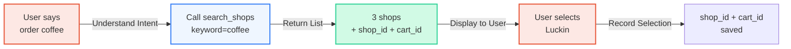
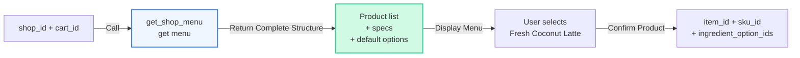
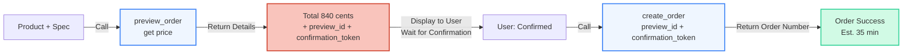

## Overview

Food delivery ordering is the first deployed scenario for Super Agent and the most typical demonstration of its capabilities. Super Agent connects to food delivery platforms through Clawdot Gateway, enabling AI to complete the entire workflow from searching merchants to creating orders, providing users with one-tap ordering experience.

## Capability Matrix

Super Agent's core capabilities in food delivery scenarios (each capability maps one-to-one to an MCP tool / REST endpoint — 18 tools and 18 endpoints in total):

| Capability | Description | MCP Tool |
|------|------|--------|
| Merchant Search | Search by keyword or location / browse nearby | `search_shops` |
| Menu Browsing | Complete menu with specs, attrs, ingredients, and default options | `get_shop_menu` |
| Address Management | Keyword POI search, register / reuse delivery address | `search_addresses` / `select_address` |
| Cart Quote | Price the selected items and get the quote context | `quote_cart` |
| Smart Ordering | Two-step preview + create workflow, auto-select optimal coupon | `preview_order` / `create_order` |
| Order Tracking | Query order status | `get_order_status` |

<Note>
  Ordering is a **stateful chain**: every id returned by one step must be passed verbatim to the next — never fabricate ids or mix them across chains. See [Order Flow](/en/gateway/order-flow) for the full chain and field tables.
</Note>

## Typical Dialogue Scenario

Below is an example of a complete food delivery ordering dialogue workflow:

```
User: Help me order a coffee

Agent: Let me search nearby coffee shops for you.
      → Calls search_shops(keyword="coffee")

      Found 3 shops:
      1. Luckin Coffee (CBD Store) - Delivery fee ¥0, ~35 minutes
      2. Starbucks (CBD) - Delivery fee ¥5, ~40 minutes
      3. Manner Coffee - Delivery fee ¥0, ~30 minutes

      Which shop's menu would you like to see?

User: Luckin Coffee

Agent: → Calls get_shop_menu(shop_id="shop_...", cart_id="cart_...")

      Luckin Coffee bestsellers:
      1. Fresh Coconut Latte ¥9.9 (Original price ¥19)
      2. Iced Americano ¥9.9
      3. Creamy Latte ¥13.9

      What would you like to order?

User: One Fresh Coconut Latte, iced

Agent: → Calls preview_order(
        shop_id="shop_...",
        cart_id="cart_...",
        address_id="addr_...",
        items=[{
          item_id="...",
          sku_id="...",
          quantity=1
        }]
      )

      Order confirmation:
      - Fresh Coconut Latte × 1 (Large, Iced)
      - Delivery fee ¥0
      - Coupon discount -¥1.5
      - Total ¥8.4
      (amount fields are in cents; payable_price=840 means ¥8.40)

      Confirm order?

User: Confirmed

Agent: → Calls create_order(
        preview_id="prv_...",
        confirmation_token="cf_..."
      )

      Order placed! Estimated delivery in 35 minutes.
      Order number: 1234567890
```

<Note>
  Searching merchants and viewing menus both require a delivery location first. The address flow is `search_addresses` to get candidates → `select_address` to register and obtain an `address_id`, which is then used for search, quote, and preview. The dialogue above omits this step, assuming the user already has a saved address.
</Note>

## Agent Design Recommendations

<AccordionGroup>
  <Accordion title="Use Default Specs" icon="bolt">
    Each product returned by `get_shop_menu` carries `ingredient_option_ids` (the available spec / attribute / ingredient options) and marks the merchant-recommended default combination. Unless the user explicitly requests customization ("large to medium", "add extra shot", "no sugar"), use the default values directly.

    Benefits:
    - Avoid handling complex spec mutual exclusion logic (some spec combinations are not allowed)
    - Speed up ordering workflow
    - Select the most popular configuration

    **Example** (at order time, `items` is a list; each entry gives `item_id` / `sku_id` and the chosen `ingredient_option_ids`):
    ```
    items=[
      {
        "item_id": "...",
        "sku_id": "...",          // the sku for "Large"
        "quantity": 1,
        "ingredient_option_ids": ["...", "..."]  // iced, standard sugar, etc.
      }
    ]
    ```
  </Accordion>

  <Accordion title="Must Create After Preview" icon="circle-check">
    Ordering is a strict two-step process:

    1. **preview_order** → Get the final price plus a paired `preview_id` + `confirmation_token`
    2. **create_order** → Use the `preview_id` + `confirmation_token` from the same preview to place the order

    Always display the details (products, delivery fee, coupon, final price) to the user after the first step and get explicit confirmation before calling `create_order`. This prevents errors from incorrect ordering. The `confirmation_token` is the idempotency key — one token can place only one order.

    **Wrong approach** ❌:
    ```
    Agent: "Order placed for you"
    User: "What? I didn't agree!"
    ```

    **Correct approach** ✅:
    ```
    Agent: "Luckin latte ¥8.4, confirm order?"
    User: "Confirmed"
    Agent: "Order placed, order number 12345"
    ```
  </Accordion>

  <Accordion title="Address Management Strategy" icon="location-dot">
    Address management is key to improving user experience:

    **First use**:
    1. Call `search_addresses(keyword="Optics Valley", lat=..., lng=...)` to search POI
    2. Display the returned `suggestions` for the user to select
    3. Call `select_address(...)` with the chosen entry's `suggestion_token` to register and obtain an `address_id`

    **Subsequent uses**:
    1. `search_addresses` also returns `saved_addresses[]` (most-recently-used first)
    2. Reuse its `address_id` directly, or prompt the user to select
    3. When `lat`/`lng` are passed, it also returns `nearest_address_id` — you can pick the closest one
    4. No need to search again each time

    This greatly reduces repeated interactions, especially for frequent ordering users.
  </Accordion>

  <Accordion title="Error Handling" icon="triangle-exclamation">
    Common errors in food delivery scenarios and handling approaches:

    | Error | Cause | Solution |
    |------|------|--------|
    | `preview_id` / `confirmation_token` expired | Over ~10 minutes | Call `preview_order` again to get a new token pair |
    | Shop closed | Shop is closing or running consolidated delivery | Prompt user to select other shops, search again |
    | Rate limit error | User operation too frequent | Wait and retry, prompt user to avoid frequent orders |
    | Insufficient inventory | Product sold out | Prompt user to select other products |
    | Address not deliverable | Outside delivery range | Prompt user to confirm address or select other shops |

    **General principles**:
    - Always show friendly error messages to users, not technical error codes
    - Provide solutions or alternatives
    - If necessary, proactively end the flow and wait for new user instructions

    See [Error Handling](/en/gateway/error-handling) for the full error code list.
  </Accordion>
</AccordionGroup>

## Core Workflow Deep Dive

Full chain: `search_shops` → `get_shop_menu` → `quote_cart` → `select_address` → `preview_order` → `create_order` → `get_sign_action`. The key segments are broken down below.

### 1. Search Merchants



**Key points**:
- Without `keyword` it is browse mode (up to 20 nearby shops with distance / rating / delivery fee); with `keyword` it is precise search
- Every result carries a `shop_id` and a `cart_id`; the `cart_id` encapsulates the shop and delivery location — pass it verbatim to downstream calls
- Amount fields (e.g. `min_order_amount`) are in cents

### 2. Get Menu and Specs



**Key points**:
- Menus can be large (100+ items); use `keyword` or `limit`/`offset` for progressive disclosure
- Each item carries an orderable `item_id` / `sku_id` plus the available `ingredient_option_ids`
- Agent merges user input (e.g., "iced") with defaults to build the `items` for ordering

### 3. Preview + Create



**Key points**:
- `preview_order` automatically selects the optimal coupon (`coupon_ids` is tri-state: omit = auto-select best; `[]` = no coupon; an explicit list = use those coupons)
- `preview_id` + `confirmation_token` must be used as a pair and are valid for ~10 minutes
- The user must confirm before `create_order`; `confirmation_token` is the idempotency key
- After ordering it returns `order_id` and (when payment is needed) `payment_action`; passwordless-payment orders must first complete signing via `get_sign_action`

## Best Practices Summary

<CardGroup cols={2}>
  <Card title="✅ Recommended" icon="circle-check" color="green">
    - Use the menu's default specs to speed up workflow
    - Display price after preview, wait for confirmation before `create_order`
    - Reuse `saved_addresses` to avoid re-entry
    - Proactively update order status
    - Provide friendly error messages
  </Card>

  <Card title="❌ Avoid" icon="circle-xmark" color="red">
    - Create without previewing
    - Let users handle spec mutual exclusion
    - Search addresses again each time
    - Return technical error codes to users
    - Ignore `confirmation_token` expiration
  </Card>
</CardGroup>

## Related Reading

- [Order Flow](/en/gateway/order-flow) — full end-to-end chain and per-step fields
- [Authentication](/en/gateway/authentication) — API Key identifies the Agent, consent grant identifies the authorized user
- [Item Specs](/en/gateway/item-specs) — spec / attribute / ingredient system
- [MCP Tools Overview](/en/mcp/overview) — the 18-tool contract

<Note>
  Authentication is two-layered: `Authorization: Bearer clw_...` identifies the Agent; the user authorization (a `cg_`-prefixed consent grant) is passed as the `consent_grant_id` argument in MCP tools, and via the `X-Consent-Grant-Id` header in REST. The public MCP endpoint is `/mcp/v1`. Creating an Agent and issuing API Keys is done in the [Portal](http://console.hicaspian.com/agents).
</Note>
