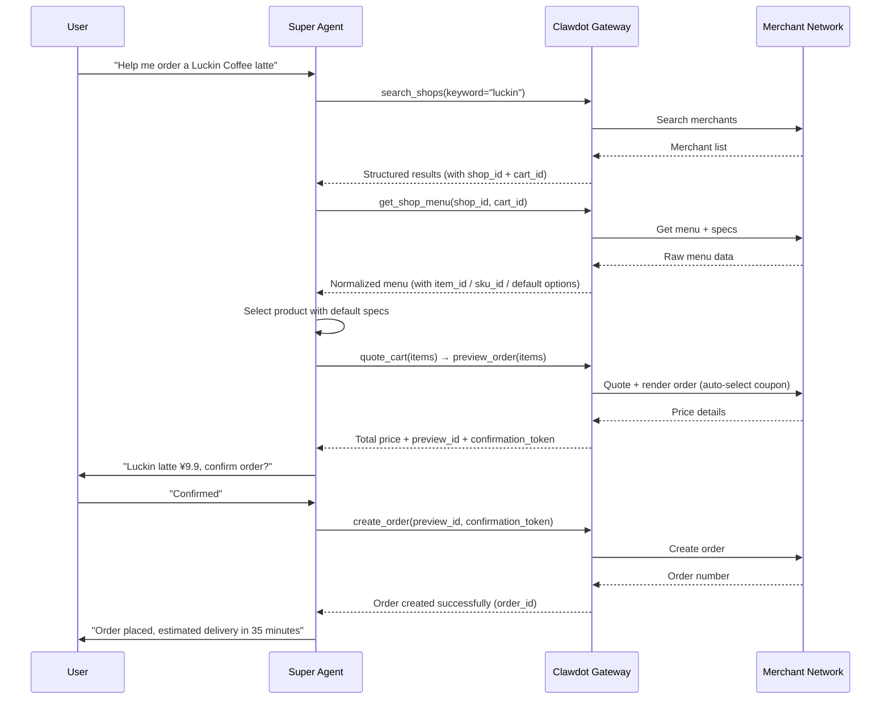
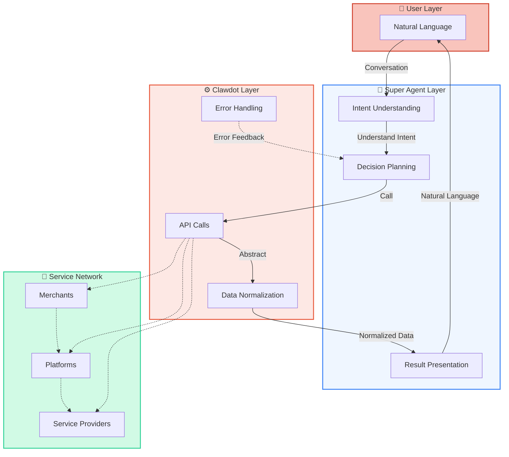

## End-to-End Workflow

Super Agent connects users, AI, and the merchant network through Clawdot Gateway to complete a full transaction workflow:



<Note>
  All amount fields are in **cents (integer)**. For example, `payable_price: 990` means ¥9.90.
</Note>

## Clawdot's Abstraction Layer

When AI Agents directly connect to merchant platforms, complexity arises. Clawdot Gateway provides a unified abstraction in the middle, making Agent work simple:

| What Agent Sees | What Gateway Handles |
|-------------|-------------------|
| Simple `shop_id` + `cart_id` | Multiple ID format conversion (encrypted ID, internal ID, third-party ID); coordinates packed into `cart_id` |
| Standardized menu structure | Specs/attrs/ingredients parsing, mutual exclusion rule calculation |
| `ingredient_option_ids` one-tap ordering | Traverse all spec groups, exclude mutually exclusive items, select defaults |
| One final price | Two renders: first get coupon list, then re-render with optimal coupon |
| Unified authentication method | API Key and consent grant validation, request signing, User-Agent adaptation |
| Unified error codes | Categorize various platform errors into standard error codes |

## Super Agent's Role



## MCP Access

Clawdot Gateway exposes its capabilities over **MCP (Model Context Protocol)** — the AI-native calling method designed for AI models like Claude. Super Agent connects with an MCP client (Streamable HTTP) to the public endpoint `https://eleme-gateway.hicaspian.com/mcp/v1`. Each request carries `Authorization: Bearer clw_...` in the HTTP header to identify the Agent, while user authorization is passed as the `consent_grant_id` argument on each business tool:

```
# Merchant search / browse
search_shops(consent_grant_id, keyword, address_id, lat, lng)

# Shop menu
get_shop_menu(consent_grant_id, shop_id, cart_id)

# Address management
search_addresses(consent_grant_id, keyword, lat, lng)   # returns saved_addresses + suggestions[].token
select_address(consent_grant_id, suggestion_token, contact_name, contact_phone)

# Quote and order
quote_cart(consent_grant_id, shop_id, cart_id, address_id, items)
preview_order(consent_grant_id, shop_id, cart_id, address_id, items)
create_order(consent_grant_id, preview_id, confirmation_token)
get_order_status(consent_grant_id, order_id)
```

Tool parameters and return values are optimized for how AI models call them. For the full tool list, see [MCP Overview](/en/mcp/overview).

<Note>
  MCP tools run on the same underlying gateway service layer, exposed externally only through the MCP interface.
</Note>

## Workflow Details

The full ordering flow is a **stateful chain** — each step's returned ID must be passed verbatim to the next: `search_addresses` → `select_address` → `search_shops` → `get_shop_menu` → `quote_cart` → `preview_order` → `create_order`. Fix the address first, then search deliverable shops by that address, so downstream tools all have the delivery coordinates. For full field tables, see [Order Flow](/en/gateway/order-flow).

<AccordionGroup>
  <Accordion title="Address Management Phase" icon="location-dot">
    Fix "where to deliver" first; downstream shop search and quote / preview all rely on this address. First use:
    1. Call `search_addresses` to search the address the user mentioned; it returns `suggestions[].token`
    2. User selects from the suggestion list
    3. Call `select_address` (with `suggestion_token` + contact) to register the delivery address, which returns an `address_id`

    Subsequent uses: `search_addresses` also returns `saved_addresses[]` (plus `nearest_address_id` when `lat`/`lng` are given), so you can reuse an existing `address_id` and reduce interaction steps.
  </Accordion>

  <Accordion title="Search Phase" icon="magnifying-glass">
    Agent calls `search_shops` (with the `address_id` from the previous step) to search deliverable merchants by the delivery address. Without `keyword` it browses (returns up to 20 nearby shops with decision fields like distance, rating, delivery fee); with `keyword` it does a precise search (~5 shops, accepts a shop name, category, or concrete item name). Each result carries a `shop_id` and a `cart_id`; the `cart_id` packs the shop and delivery coordinates and is the entry point for later steps.
  </Accordion>

  <Accordion title="Menu Browsing Phase" icon="list">
    Agent calls `get_shop_menu` (with `shop_id` + `cart_id`) to get the complete menu for a merchant. The return includes:
    - Product list and prices (in cents)
    - Orderable `item_id` / `sku_id`
    - Product specs (size, temperature, sweetness, etc.) and add-ons via `ingredient_option_ids`
    - **Default options** —— contain merchant-recommended spec combinations

    Menus can be large (100+ items); use `keyword` or `limit`/`offset` for progressive disclosure.
  </Accordion>

  <Accordion title="Quote + Preview + Order Phase" icon="clipboard-check">
    This is the core stateful chain:

    **Quote** → `quote_cart`
    - Input: `shop_id` + `cart_id` + `address_id` + `items` (list)
    - Output: `quote_id` + price details

    **Preview** → `preview_order`
    - Input: `shop_id` + `cart_id` + `address_id` + `items` (optionally pass `quote_id` to validate the quote context)
    - Output: final price (in cents) + `preview_id` + `confirmation_token` (must be used together, valid for about 10 minutes)

    **Order** → `create_order`
    - Input: the `preview_id` + `confirmation_token` from the same preview
    - Output: `order_id`, `status`, and (when payment is needed) `payment_action`

    You must display the price to the user and get explicit confirmation before calling `create_order`. The `confirmation_token` is the idempotency key — one token can place only one order.
  </Accordion>

  <Accordion title="Order Tracking Phase" icon="truck">
    After placing an order, Agent can call `get_order_status` to query order status:
    - Waiting for merchant to accept
    - Merchant is preparing order
    - Rider has picked up food
    - Rider is delivering
    - Delivered

    Can be used to proactively update users on order progress. You can also pass `callback_url` to `create_order`, and the gateway will poll and POST a callback once the order leaves the unpaid state.
  </Accordion>

  <Accordion title="Passwordless Signing Phase" icon="credit-card">
    Passwordless signing is an **account-level, one-time prerequisite**: sign once, and later passwordless-payment orders can be charged automatically — it is **not bound to any single order and is not done per order**, so it stands outside the ordering chain above (do not treat it as the last step of placing an order). Check with `get_sign_status` whether already signed first, and only if not, call `get_sign_action` (with `return_url`, no `order_id`) to get a signing `action`. When `action_type` is `open_h5`, direct the user to `action.action_url` to complete signing; the browser then returns to `return_url`. When it is `none`, signing is already done. Then poll the result with `get_sign_status`.
  </Accordion>
</AccordionGroup>

<Note>
  Create an Agent in the [Portal](https://console.hicaspian.com/agents) to get an API Key; obtain a user consent grant via the binding flow (SMS code or H5). For the full chain and fields, see [Order Flow](/en/gateway/order-flow) and [Authentication](/en/gateway/authentication).
</Note>
