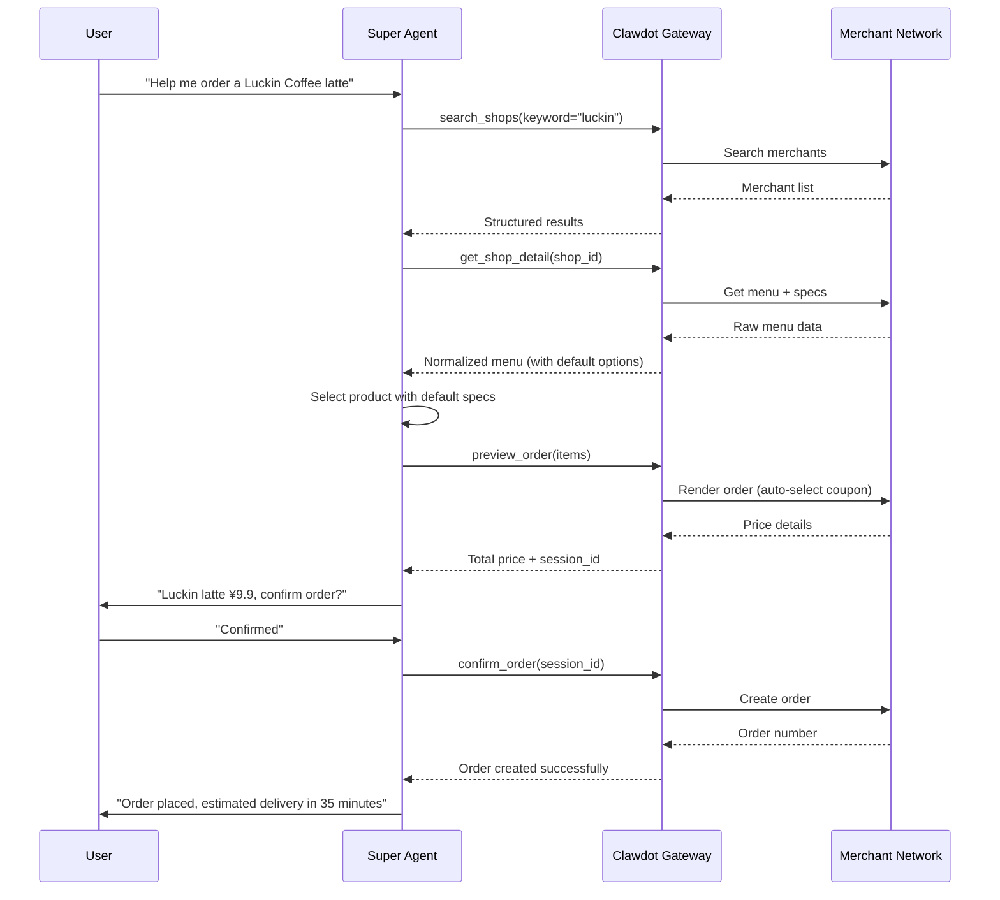
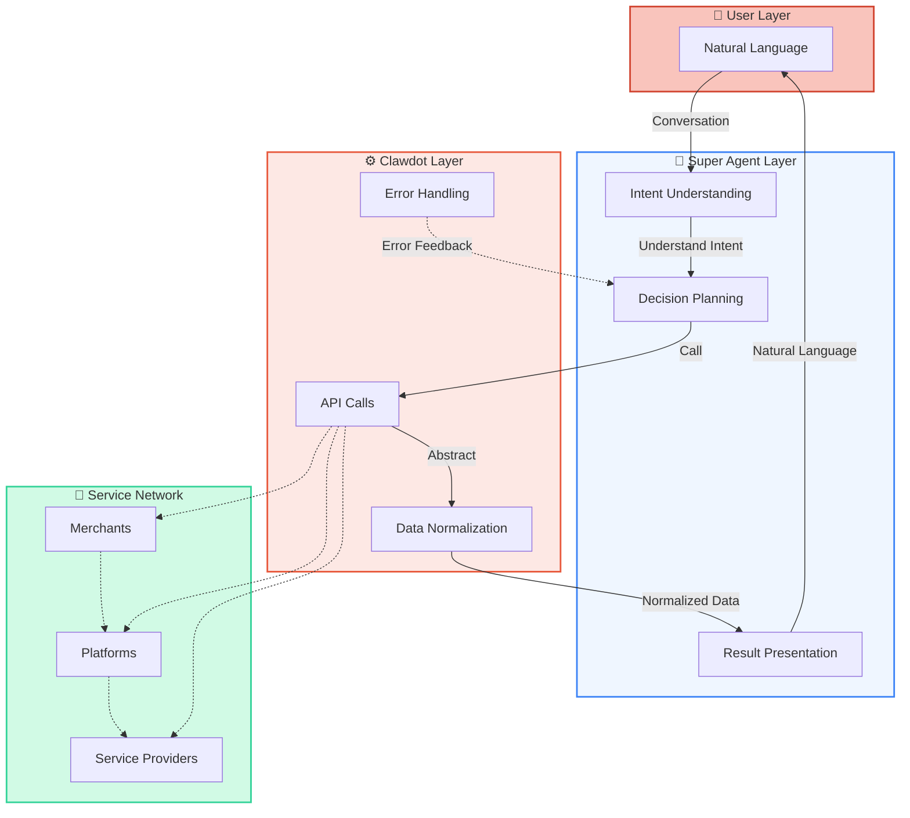

## End-to-End Workflow

Super Agent connects users, AI, and the merchant network through Clawdot Gateway to complete a full transaction workflow:



## Clawdot's Abstraction Layer

When AI Agents directly connect to merchant platforms, complexity arises. Clawdot Gateway provides a unified abstraction in the middle, making Agent work simple:

| What Agent Sees | What Gateway Handles |
|-------------|-------------------|
| Simple `shop_id` | Multiple ID format conversion (encrypted ID, internal ID, third-party ID) |
| Standardized menu structure | Specs/attrs/ingredients parsing, mutual exclusion rule calculation |
| `default_ingredients` one-tap ordering | Traverse all spec groups, exclude mutually exclusive items, select defaults |
| One final price | Two renders: first get coupon list, then re-render with optimal coupon |
| Unified authentication method | Automatic token refresh, request signing, User-Agent adaptation |
| Unified error codes | Categorize various platform errors into standard error codes |

## Super Agent's Role



## Dual Protocol Entry

The same Clawdot Gateway instance exposes two protocols simultaneously, meeting different integration needs:

<Tabs>
  <Tab title="REST API">
    Standard HTTP interface, suitable for any programming language and framework. Agents communicate with Gateway via HTTP requests:

    ```bash
    # Search merchants
    GET /api/v1/shops/search?keyword=luckin \
      -H "Authorization: Bearer {token}"

    # Get merchant details (with menu)
    GET /api/v1/shops/{shop_id} \
      -H "Authorization: Bearer {token}"

    # Preview order
    POST /api/v1/orders/preview \
      -H "Authorization: Bearer {token}" \
      -d '{"shop_id": "...", "items": [...]}'

    # Confirm order
    POST /api/v1/orders \
      -H "Authorization: Bearer {token}" \
      -d '{"session_id": "..."}'

    # Query order
    GET /api/v1/orders/{order_id} \
      -H "Authorization: Bearer {token}"
    ```

    Authentication is passed via HTTP Header (Bearer Token).
  </Tab>

  <Tab title="MCP Protocol">
    Model Context Protocol is an AI-native calling method, designed specifically for AI models like Claude. Super Agent calls directly through MCP tools:

    ```
    # Merchant search
    search_shops(keyword, city, limit)

    # Merchant details
    get_shop_detail(shop_id)

    # Address management
    search_pois(keyword, city)
    list_addresses()
    create_address(poi_id, name)
    select_address(address_id)

    # Order operations
    preview_order(items)
    confirm_order(session_id)
    get_order(order_id)
    ```

    MCP tools align better with AI thinking, with parameters and return values optimized for a smoother user experience.
  </Tab>
</Tabs>

## Workflow Details

<AccordionGroup>
  <Accordion title="Search Phase" icon="magnifying-glass">
    Agent calls `search_shops` to search merchants. Gateway supports searching by keyword, location, category, and other dimensions, and can search 10 categories in parallel. Results return merchant ID, name, distance, delivery fee, and other key information.
  </Accordion>

  <Accordion title="Menu Browsing Phase" icon="list">
    Agent calls `get_shop_detail` to get the complete menu for a merchant. The return includes:
    - Product list and prices
    - Product specs (size, temperature, sweetness, etc.)
    - Ingredients and charges
    - **Default options** —— contain merchant-recommended spec combinations
  </Accordion>

  <Accordion title="Address Management Phase" icon="location-dot">
    First use:
    1. Call `search_pois` to search the address user mentioned
    2. User selects from the POI list
    3. Call `create_address` to save as a common address

    Subsequent uses: Call `list_addresses` to reuse saved addresses, reducing interaction steps.
  </Accordion>

  <Accordion title="Preview + Confirm Phase" icon="clipboard-check">
    This is the core two-step workflow:

    **Step One: Preview** → `preview_order`
    - Input: Merchant ID + product list
    - Output: Total price, coupons, delivery fee, `session_id`

    **Step Two: Confirm** → `confirm_order`
    - Input: `session_id`
    - Output: Order number, estimated delivery time

    You must display the price to the user and get explicit confirmation before placing the order.
  </Accordion>

  <Accordion title="Order Tracking Phase" icon="truck">
    After placing an order, Agent can call `get_order` to query order status:
    - Waiting for merchant to accept
    - Merchant is preparing order
    - Rider has picked up food
    - Rider is delivering
    - Delivered

    Can be used to proactively update users on order progress.
  </Accordion>
</AccordionGroup>
