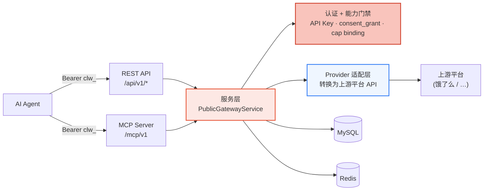
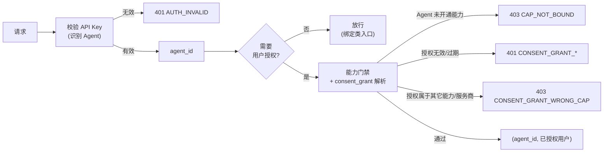
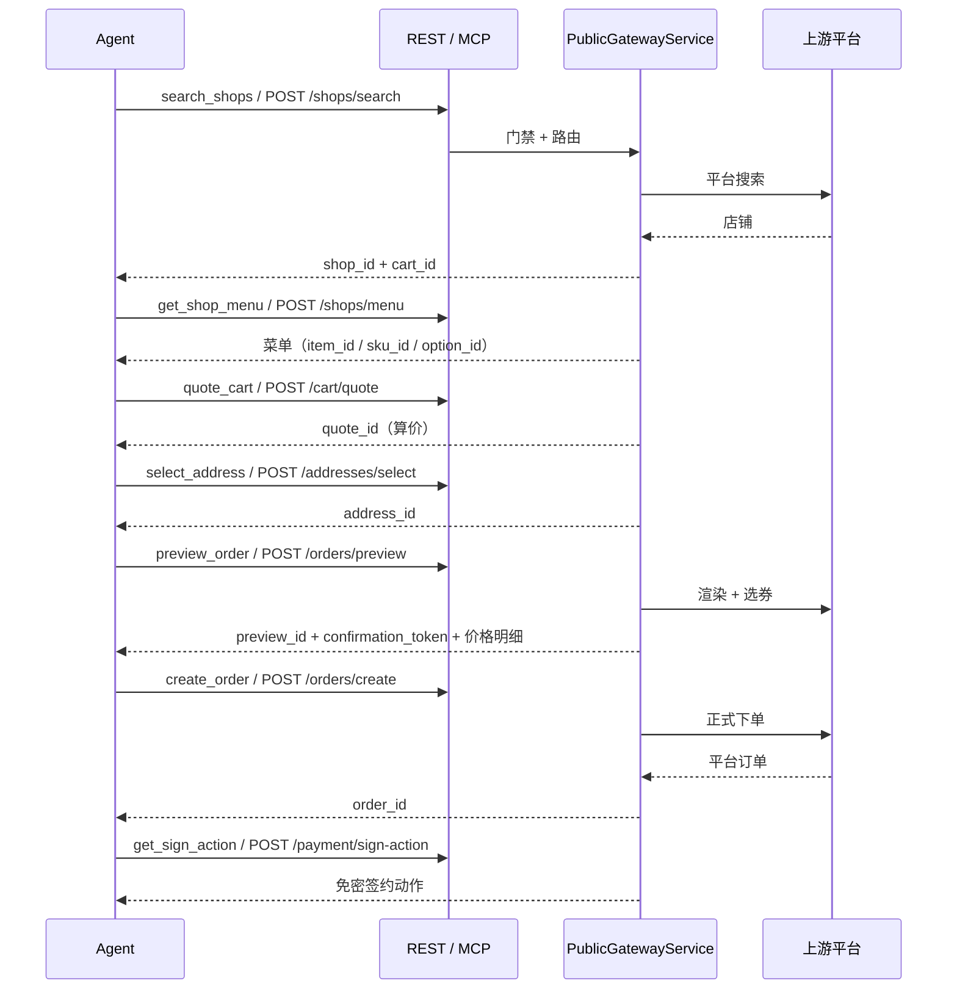

Clawdot Gateway 把外卖能力以**标准协议**对外开放，同一套服务层同时挂在两个入口上：REST API 与 MCP Server。Agent 用 API Key 表明自己的身份，用 consent_grant 表明"已获得某个外卖用户的授权"，网关据此把请求路由到上游平台并把响应转换成统一的标准格式。

## 整体架构



- **两个入口共享一套服务层** — REST 和 MCP 暴露相同的能力，差别只在参数传递方式：REST 走 Header + JSON body，MCP 走工具参数。
- **认证 + 能力门禁** — 每个公开入口在执行前都要过同一道门禁：校验 API Key（识别 Agent）、校验 consent_grant（识别已授权用户）、校验 Agent 是否已开通对应能力（cap binding）。
- **Provider 适配层** — 把标准协议请求转换成上游平台的 API 调用，并把平台响应转换回统一的标准格式与错误码。
- **状态存储** — MySQL 保存 Agent / API Key / 用户绑定 / 订单等记录；Redis 承载算价上下文、单飞锁、店铺列表缓存等短时态。

<Note>
  本页只覆盖**对外公开**的契约：`/api/v1/*` REST 端点与 `/mcp/v1` MCP 工具。创建 Agent、签发 API Key、开通能力等运营动作走 Portal（[Clawdot Portal](http://console.hicaspian.com/agents)），不属于公开 API。
</Note>

## 两个入口

<Tabs>
  <Tab title="REST API">
    挂载在 `/api/v1` 前缀下，共 18 个端点，覆盖授权、地址、店铺、购物车、优惠券、订单、支付签约整条链路。

    - **Agent 身份** — `Authorization: Bearer clw_...` 请求头。
    - **用户授权** — `X-Consent-Grant-Id: cg_...` 请求头（绑定类入口除外）。`consent_grant_id` 只走请求头，不放进 JSON body。
    - **请求/响应** — JSON body；金额字段统一为**分（整数）**。

    详见 [API 参考](/api-reference/user/bind-request)。
  </Tab>

  <Tab title="MCP Server">
    通过 `app.mount("/mcp", create_mcp_app())` 挂载，FastMCP 路由版本化，公开端点是 **`/mcp/v1`**，传输为 streamable HTTP。共 18 个工具，与 18 个 REST 端点一一对应。

    - **Agent 身份** — 同样走 `Authorization: Bearer clw_...`，由 MCP 中间件校验后注入 `agent_id`。
    - **用户授权** — 作为每个工具的 **`consent_grant_id` 参数**传入（不是 `X-Consent-Grant-Id` 请求头，那是 REST 用的）。
    - **参数** — 除 `consent_grant_id` 外，工具参数与对应 REST 端点的 body 字段一致。

    详见 [MCP 工具](/mcp/overview)。
  </Tab>
</Tabs>

### REST 端点 ↔ MCP 工具对照

18 个 MCP 工具与 18 个 REST 端点一一对应：

| MCP 工具 | REST 端点 |
|---|---|
| `request_user_bind` | `POST /auth/bind/request` |
| `verify_user_bind` | `POST /auth/bind/verify` |
| `get_user_auth_status` | `GET /auth/status` |
| `revoke_user_bind` | `POST /auth/unbind` |
| `get_homepage_url` | `POST /auth/homepage-url` |
| `search_addresses` | `POST /addresses/search` |
| `select_address` | `POST /addresses/select` |
| `update_address` | `POST /addresses/update` |
| `search_shops` | `POST /shops/search` |
| `get_shop_menu` | `POST /shops/menu` |
| `get_shop_share_url` | `POST /shops/share-url` |
| `quote_cart` | `POST /cart/quote` |
| `list_coupons` | `POST /coupons/list` |
| `preview_order` | `POST /orders/preview` |
| `create_order` | `POST /orders/create` |
| `get_order_status` | `GET /orders/{order_id}` |
| `get_sign_action` | `POST /payment/sign-action` |
| `get_sign_status` | `GET /payment/sign-status` |

## 认证模型

网关使用双层身份：

- **API Key 标识 Agent** — `Authorization: Bearer clw_...`，前缀 `clw_`。服务端只存 SHA-256 哈希、不留明文，每次请求按哈希比对；被禁用的 Key 立即失效。在 Portal 创建 Agent 时签发。
- **consent_grant 标识已授权用户** — 前缀 `cg_`，代表"某个外卖用户已授权某个 Agent 使用某项能力"。走绑定流程（`request_user_bind` + `verify_user_bind`）获取，可被 `revoke_user_bind` 即时撤销。



完整的认证链、错误码与传递方式见 [认证机制](/gateway/authentication)。

### Agent — 能力 — 服务商

授权不是"Agent 直接拿到用户"，而是绑定到一个具体的**能力（cap）**与**服务商（provider）**上：

- **能力绑定（cap binding）** — 一条 `(agent_id, cap_code)` 记录，声明某个 Agent 开通了某项能力（外卖链路的能力码为 `delivery`），并在该记录上携带服务商坐标（`provider_code`）。所有公开入口执行前都要先解析出一条 `active` 的能力绑定，否则返回 `CAP_NOT_BOUND`。
- **用户绑定（consent_grant）** — 用户授权时落一条用户绑定记录，记下它属于哪个 `agent_id`、哪个 `cap_code`、哪个 `provider_code`。请求进来时，网关把 `consent_grant_id` 哈希后查到这条记录，并校验它的能力/服务商坐标与 Agent 的能力绑定一致——不一致即 `CONSENT_GRANT_WRONG_CAP`。

也就是说，一次成功的调用要同时满足三件事：**API Key 有效**（Agent 可信）、**能力已开通**（Agent 有权用这项能力）、**consent_grant 有效且坐标匹配**（用户确实授权了这个 Agent 用这项能力）。

## 下单链路

一条标准下单链路上下游 ID 逐跳串联，每一步的产物喂给下一步：



1. `search_shops` → 得 `shop_id` + `cart_id`（`cart_id` 已封装店铺与配送坐标）
2. `get_shop_menu` → 选品，拿到 `item_id` / `sku_id` / `option_id`
3. `quote_cart` → 得 `quote_id`（算价）
4. `select_address` → 得 `address_id`
5. `preview_order` → 得 `preview_id` + `confirmation_token` 与最终价格明细
6. `create_order` → 得 `order_id`
7. `get_sign_action` → 免密签约动作（`get_sign_status` 查询签约状态）

<Note>
  所有金额字段单位为**分（整数）**；对外暴露的全部是网关签发的不透明 ID（`shop_id` / `cart_id` / `quote_id` / `address_id` / `preview_id` / `order_id`），上游平台的原始 ID 不外泄。
</Note>

## 错误处理

所有错误返回统一结构，没有 `next_action` 之类的附加字段：

```json
{
  "error": {
    "code": "CONSENT_GRANT_INVALID",
    "message": "..."
  }
}
```

REST 与 MCP 共用同一套错误码。完整清单见 [错误处理](/gateway/error-handling)。

## 安全设计

| 机制 | 实现 |
|------|------|
| API Key 存储 | SHA-256 哈希，数据库不存明文，禁用即时失效 |
| consent_grant 存储 | 只存 SHA-256 哈希（`consent_grant_hash`），原值不落库 |
| 手机号存储 | 加密存储，并以 SHA-256 哈希用于去重 |
| 用户 ID 存储 | AES-256-GCM 加密 |
| 对外 ID | 全部为网关签发的不透明 ID，与上游平台原始 ID 解耦 |
| 公开面边界 | 对外只暴露 `/api/v1/*` 与 `/mcp/v1`；运营 / 管理动作（创建 Agent、开通能力等）走 Portal，不属于公开 API |
