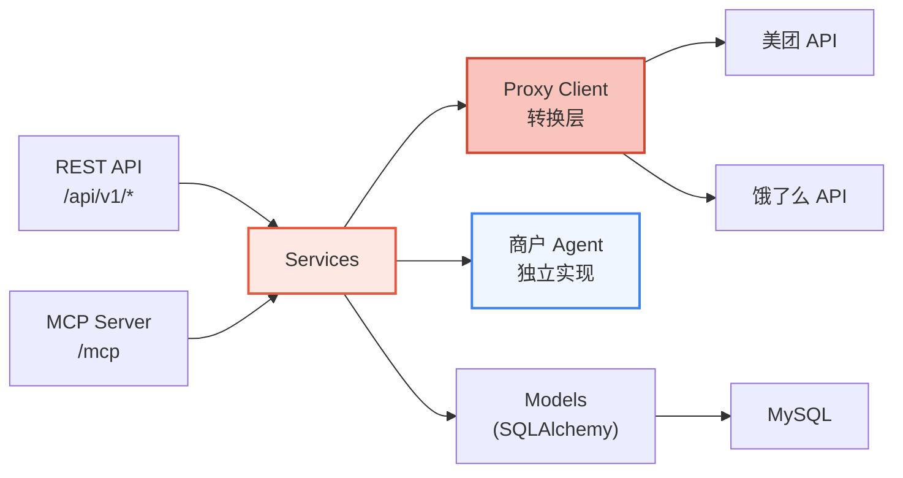
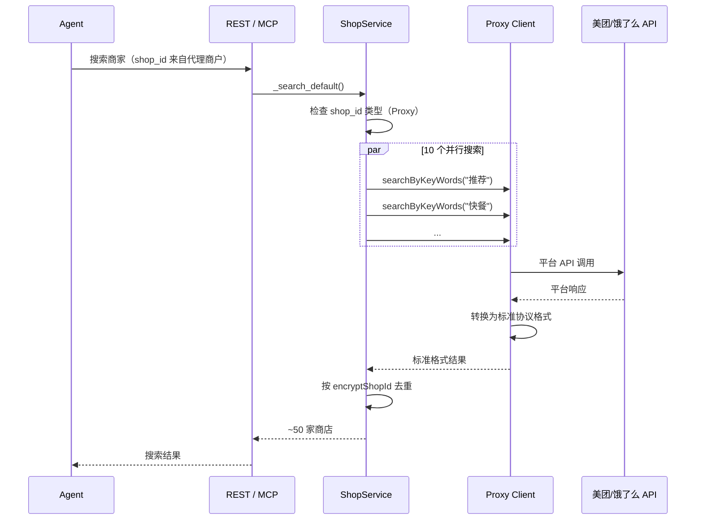
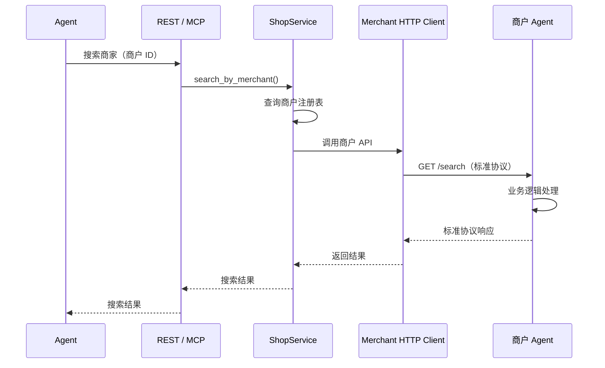
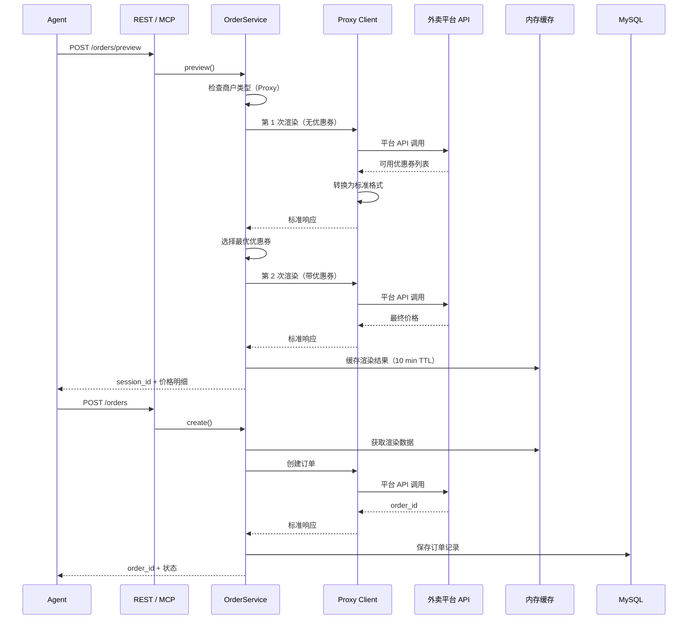
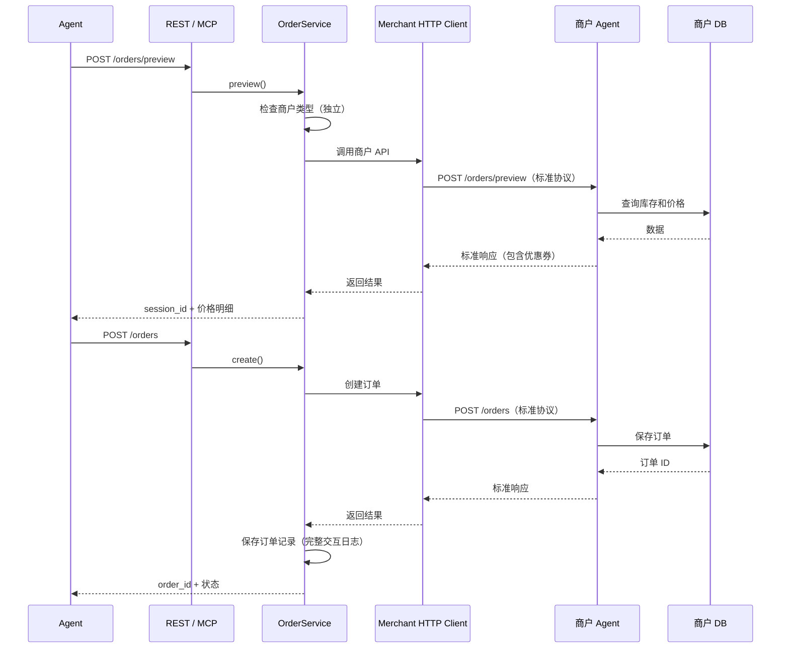

## Gateway 在 Clawdot 中的位置

Clawdot 采用 4 层架构，Gateway 位于第 3 层，是**协议层 + 发现层**：

```
┌─────────────────────────────────────────────┐
│  第 4 层 - 应用层                            │
│  AI Agent / 用户应用 / 第三方集成             │
└──────────────┬──────────────────────────────┘
               │ 标准协议
┌──────────────▼──────────────────────────────┐
│  第 3 层 - Gateway（协议层 + 发现层）        │
│  ├─ 标准协议定义（菜单、订单、预约等）       │
│  ├─ 商户发现和路由                          │
│  └─ 协议版本管理和演进                      │
└──────────────┬──────────────────────────────┘
               │ 内部 REST/MCP
┌──────────────▼──────────────────────────────┐
│  第 2 层 - Gateway 内部服务                  │
│  ├─ ShopService / OrderService / 等         │
│  ├─ 协议适配（Proxy 转换逻辑）               │
│  └─ 数据和认证管理                          │
└──────────────┬──────────────────────────────┘
               │ HTTP / 内部 API
┌──────────────▼──────────────────────────────┐
│  第 1 层 - 商户层                            │
│  ├─ Proxy（代理饿了么/美团/高德）            │
│  └─ 独立商户 Agent（自建系统）               │
└─────────────────────────────────────────────┘
```

## 整体架构



Clawdot Gateway 采用三层内部架构，REST 和 MCP 两个入口共享同一套服务层。Gateway 通过**标准协议**统一管理两种商户类型：
- **Proxy 层** — 代理饿了么、美团、高德等平台商户
- **独立 Agent** — 大型商户自建实现

## 商户接入模式

在详细介绍内部三层架构之前，先理解 Gateway 如何管理两种商户类型：

<Tabs>
  <Tab title="Proxy 层（冷启动）">
    **目标：** 快速覆盖已有平台商户

    ```mermaid
    graph TB
      Agent["AI Agent"]
      Gateway["Gateway"]
      Proxy["Proxy 转换层"]
      Platform["美团/饿了么"]
      Merchant["平台商户<br/>无需改动"]

      Agent -->|标准协议| Gateway
      Gateway -->|转换为平台 API| Proxy
      Proxy -->|美团 API / 饿了么 API| Platform
      Platform -->|订单| Merchant

      style Proxy fill:#f9c4bc,stroke:#D14430,stroke-width:2px
    ```

    **工作流程：**
    1. Agent 使用标准协议调用 Gateway
    2. Gateway 的 Proxy Client 负责转换请求格式
    3. Proxy 将请求转换为相应平台的 API 调用
    4. 平台响应被转换回标准协议格式
    5. 返回给 Agent

    **优势：**
    - 商户无需做任何改动
    - 快速覆盖大量商户
    - Clawdot 完整掌握数据
  </Tab>

  <Tab title="独立 Agent（生态）">
    **目标：** 大型商户深度集成和自主

    ```mermaid
    graph TB
      Agent["AI Agent"]
      Gateway["Gateway"]
      Merchant["商户 Agent<br/>直接实现标准协议"]

      Agent -->|标准协议| Gateway
      Gateway -->|标准协议| Merchant
      Merchant -->|业务处理| MerchantSystem["商户内部系统"]

      style Merchant fill:#EFF6FF,stroke:#3B82F6,stroke-width:2px
    ```

    **工作流程：**
    1. Agent 使用标准协议调用 Gateway
    2. Gateway 查找对应的商户 Agent
    3. 直接转发请求到商户的实现
    4. 商户处理业务逻辑
    5. 返回标准协议格式的响应

    **要求：**
    - 商户必须实现标准协议所有接口
    - 需要通过 Clawdot 的审核和测试
    - 承诺 SLA 和安全要求

    **优势：**
    - 商户完全控制业务逻辑
    - 可以实现深度定制
    - 支持未来的生态扩展
  </Tab>
</Tabs>

## 内部三层架构

### 层级说明

<AccordionGroup>
  <Accordion title="Gateway 层 — 入口与路由" icon="door-open">
    **位置：** `src/gateway/`

    负责协议适配、商户路由和输入验证，不包含业务逻辑。

    - **REST routers** — FastAPI 路由，处理 HTTP 请求/响应序列化
    - **MCP tools** — 9 个 MCP 工具定义，将 MCP 调用转换为服务层调用
    - **Merchant router** — 根据商户 ID 或 shop_id 查询商户类型，决定转发到 Proxy 或独立 Agent
    - **Auth middleware** — `require_agent()` 和 `require_user()` 依赖注入

    两个入口的区别仅在参数传递方式：REST 使用 Header，MCP 使用参数。
  </Accordion>

  <Accordion title="Service 层 — 业务逻辑与路由" icon="gears">
    **位置：** `src/services/`

    核心业务逻辑所在，通过构造函数接收依赖（DB session, Proxy Client, 商户注册表）：

    - **AuthService** — Agent 注册、API Key 生成与验证
    - **UserService** — SMS 发送、验证码校验、用户绑定
    - **ShopService** — 商家搜索（含并行多品类搜索）、菜单获取
      - 对于 Proxy 商户 — 通过 Proxy Client 调用
      - 对于独立 Agent — 直接调用商户的 API
    - **AddressService** — POI 搜索、地址选择与创建
    - **OrderService** — 订单预览、创建与查询
      - 支持两种商户的下单逻辑
    - **MerchantRegistry** — 商户注册表，记录每个商户的类型和接入方式
  </Accordion>

  <Accordion title="Client 层 — API 封装与适配" icon="cloud">
    **位置：** `src/client/`

    支持三类 API 的 HTTP 客户端封装：

    **Proxy Client（平台 API 封装）：**
    - **Token 管理** — `ensure_token` 自动刷新过期 Token
    - **请求签名** — 按美团/饿了么的签名算法
    - **UA 管理** — 不同端点使用不同 User-Agent（订单用 MTOPSDK 格式，搜索用 Rajax 格式）
    - **错误处理** — 统一的平台 API 错误转换为标准协议错误码

    **Merchant HTTP Client（独立商户 Agent 调用）：**
    - **API Key 管理** — 商户的 API 认证凭证
    - **请求签名** — 按商户的安全要求签名（如果需要）
    - **超时和重试** — 处理商户 API 的不稳定性
    - **错误处理** — 将商户错误转换为标准协议格式
  </Accordion>
</AccordionGroup>

## 数据流

### 典型搜索请求

#### 场景 1：Proxy 商户搜索



#### 场景 2：独立商户搜索



### 典型下单请求

#### 场景 1：Proxy 商户下单



#### 场景 2：独立商户下单



## 数据库模型

<Tabs>
  <Tab title="merchants">
    | 字段 | 类型 | 说明 |
    |------|------|------|
    | id | int (PK) | 自增主键 |
    | name | varchar(200) | 商户名称 |
    | merchant_type | enum | Proxy / Independent |
    | platform | varchar(50) | 所属平台（美团/饿了么/高德，仅限 Proxy） |
    | platform_shop_id | varchar(100) | 平台的 shop_id（仅限 Proxy） |
    | api_endpoint | varchar(500) | API 端点（仅限 Independent） |
    | api_key | varchar(256) | API Key（加密存储，仅限 Independent） |
    | is_active | boolean | 是否启用 |
    | verified_at | datetime | 验证通过时间（仅限 Independent） |
    | created_at / updated_at | datetime | 时间戳 |
  </Tab>

  <Tab title="agents">
    | 字段 | 类型 | 说明 |
    |------|------|------|
    | id | int (PK) | 自增主键 |
    | name | varchar(100) | Agent 名称 |
    | is_active | boolean | 是否启用 |
    | created_at | datetime | 创建时间 |
  </Tab>
  <Tab title="api_keys">
    | 字段 | 类型 | 说明 |
    |------|------|------|
    | id | int (PK) | 自增主键 |
    | agent_id | int (FK) | 关联 Agent |
    | key_hash | varchar(64) | SHA-256 哈希 |
    | prefix | varchar(8) | Key 前缀（如 `clw_a1b2`）|
    | is_active | boolean | 是否启用 |
    | created_at | datetime | 创建时间 |
  </Tab>
  <Tab title="user_bindings">
    | 字段 | 类型 | 说明 |
    |------|------|------|
    | id | int (PK) | 自增主键 |
    | agent_id | int (FK) | 关联 Agent |
    | phone_hash | varchar(64) | 手机号 SHA-256 |
    | encrypted_user_id | varchar(256) | AES-256-GCM 加密 |
    | user_token | varchar(36) | UUID，唯一索引 |
    | token_expires_at | datetime | Token 过期时间 |
    | created_at / updated_at | datetime | 时间戳 |
  </Tab>
  <Tab title="orders">
    | 字段 | 类型 | 说明 |
    |------|------|------|
    | id | int (PK) | 自增主键 |
    | agent_id | int (FK) | 关联 Agent |
    | user_binding_id | int (FK) | 关联用户绑定 |
    | merchant_id | int (FK) | 关联商户（新增） |
    | merchant_order_id | varchar(64) | 商户订单 ID |
    | shop_name | varchar(200) | 商家名称 |
    | total_amount | decimal(10,2) | 订单总额 |
    | status | varchar(32) | 订单状态 |
    | merchant_type | enum | Proxy / Independent |
    | raw_request | JSON | 原始请求（用于审计） |
    | raw_response | JSON | 原始响应 |
    | created_at / updated_at | datetime | 时间戳 |
  </Tab>
</Tabs>

## 安全设计

| 机制 | 实现 |
|------|------|
| API Key 存储 | SHA-256 哈希，数据库不存明文 |
| 手机号存储 | SHA-256 哈希，用于去重 |
| 用户 ID 存储 | AES-256-GCM 加密（base64 编码的 32 字节密钥）|
| User Token | UUID v4（128 位熵）|
| 管理员认证 | 单一 `X-Admin-Secret` 请求头 |
