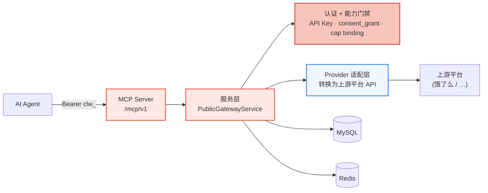
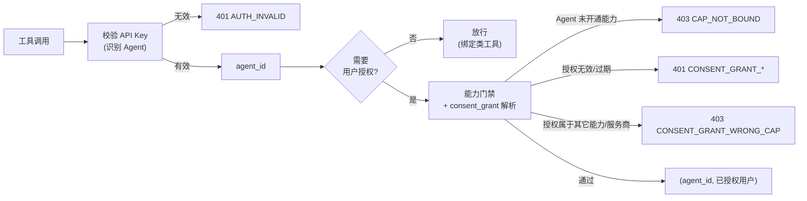
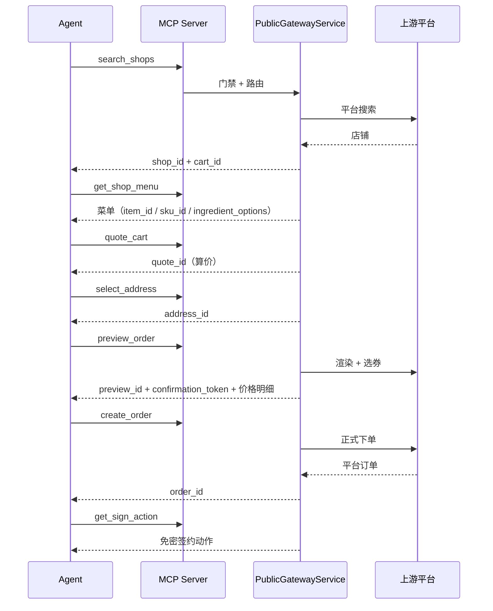

Clawdot Gateway 把外卖能力以 **MCP（Model Context Protocol）** 对外开放：Agent 通过 MCP Server（`/mcp/v1`）调用网关工具，用 API Key 表明自己的身份，用 `consent_grant` 表明"已获得某个外卖用户的授权"，网关据此把请求路由到上游平台并把响应转换成统一的标准格式。

## 整体架构



- **MCP 是唯一对外入口** — Agent 以 Streamable HTTP 连接 `/mcp/v1`，把外卖能力当作一组标准工具调用。底层是同一套服务层 `PublicGatewayService`，对外只暴露 MCP 这一种协议。
- **认证 + 能力门禁** — 每个工具调用在执行前都要过同一道门禁：校验 API Key（识别 Agent）、校验 consent_grant（识别已授权用户）、校验 Agent 是否已开通对应能力（cap binding）。
- **Provider 适配层** — 把标准工具调用转换成上游平台的 API 调用，并把平台响应转换回统一的标准格式与错误码。
- **状态存储** — MySQL 保存 Agent / API Key / 用户绑定 / 订单等记录；Redis 承载算价上下文、单飞锁、店铺列表缓存等短时态。

<Note>
  本页只覆盖**对外公开**的契约：`/mcp/v1` 上的 MCP 工具。创建 Agent、签发 API Key、开通能力等运营动作走控制台（[console.hicaspian.com/agents](http://console.hicaspian.com/agents)），不属于公开 API。
</Note>

## 连接与认证

MCP Server 挂在 `/mcp/v1`，传输为 Streamable HTTP（FastMCP），对外主机为 `eleme-gateway.hicaspian.com`。认证分两层：

- **Agent 身份** — 连接层请求头 `Authorization: Bearer clw_...`（每个 MCP 请求都要带）。在控制台创建 Agent 时签发。
- **用户授权** — 作为每个业务工具的 **`consent_grant_id` 参数**传入（不走请求头）。绑定类工具 `request_user_bind` / `verify_user_bind` 例外——它们是拿授权的入口，本身不传 `consent_grant_id`。

完整连接示例与认证链见 [认证机制](/gateway/authentication)。

## MCP 工具清单

网关对外暴露 18 个工具，覆盖授权、地址、店铺、购物车、优惠券、订单、支付签约整条链路：

| 分组 | 工具 | 用途 |
|---|---|---|
| 授权 | `request_user_bind` | 发起绑定（SMS 验证码或 H5；仅需 Agent 身份） |
| 授权 | `verify_user_bind` | 确认绑定，成功铸造 `consent_grant_id` |
| 授权 | `get_user_auth_status` | 查询授权状态 |
| 授权 | `revoke_user_bind` | 解除绑定（旧 `consent_grant_id` 即时失效） |
| 授权 | `get_homepage_url` | 获取淘闪主页链接 |
| 地址 | `search_addresses` | 搜索 / 列出地址 |
| 地址 | `select_address` | 选择 / 保存地址，得 `address_id` |
| 地址 | `update_address` | 编辑地址（门牌 / 标签；`address_id` 不变） |
| 店铺 | `search_shops` | 搜索 / 浏览商家，得 `shop_id` + `cart_id` |
| 店铺 | `get_shop_menu` | 商家菜单，得 `item_id` / `sku_id` / `ingredient_options` |
| 店铺 | `get_shop_share_url` | 商家分享链接 |
| 下单 | `quote_cart` | 购物车算价，得 `quote_id` |
| 下单 | `list_coupons` | 账户优惠券列表 |
| 下单 | `preview_order` | 预览订单，得 `preview_id` + `confirmation_token` |
| 下单 | `create_order` | 创建订单，得 `order_id` |
| 下单 | `get_order_status` | 查询订单状态 |
| 支付 | `get_sign_action` | 获取免密签约动作（H5 链接） |
| 支付 | `get_sign_status` | 查询签约状态 |

逐个工具的参数与返回字段见 [MCP 工具](/mcp/overview)。

## 认证模型

网关使用双层身份：

- **API Key 标识 Agent** — `Authorization: Bearer clw_...`，前缀 `clw_`。服务端只存 SHA-256 哈希、不留明文，每次请求按哈希比对；被禁用的 Key 立即失效。在控制台创建 Agent 时签发。
- **consent_grant 标识已授权用户** — 前缀 `cg_`，代表"某个外卖用户已授权某个 Agent 使用某项能力"。走绑定流程（`request_user_bind` + `verify_user_bind`）获取，可被 `revoke_user_bind` 即时撤销。



完整的认证链、错误码与传递方式见 [认证机制](/gateway/authentication)。

### Agent — 能力 — 服务商

授权不是"Agent 直接拿到用户"，而是绑定到一个具体的**能力（cap）**与**服务商（provider）**上：

- **能力绑定（cap binding）** — 一条 `(agent_id, cap_code)` 记录，声明某个 Agent 开通了某项能力（外卖链路的能力码为 `delivery`），并在该记录上携带服务商坐标（`provider_code`）。所有工具调用执行前都要先解析出一条 `active` 的能力绑定，否则返回 `CAP_NOT_BOUND`。
- **用户绑定（consent_grant）** — 用户授权时落一条用户绑定记录，记下它属于哪个 `agent_id`、哪个 `cap_code`、哪个 `provider_code`。请求进来时，网关把 `consent_grant_id` 哈希后查到这条记录，并校验它的能力/服务商坐标与 Agent 的能力绑定一致——不一致即 `CONSENT_GRANT_WRONG_CAP`。

也就是说，一次成功的调用要同时满足三件事：**API Key 有效**（Agent 可信）、**能力已开通**（Agent 有权用这项能力）、**consent_grant 有效且坐标匹配**（用户确实授权了这个 Agent 用这项能力）。

## 下单链路

一条标准下单链路上下游 ID 逐跳串联，每一步的产物喂给下一步：



1. `search_shops` → 得 `shop_id` + `cart_id`（`cart_id` 已封装店铺与配送坐标）
2. `get_shop_menu` → 选品，拿到 `item_id` / `sku_id` / `ingredient_options`
3. `quote_cart` → 得 `quote_id`（算价）
4. `select_address` → 得 `address_id`
5. `preview_order` → 得 `preview_id` + `confirmation_token` 与最终价格明细
6. `create_order` → 得 `order_id`
7. `get_sign_action` → 免密签约动作（`get_sign_status` 查询签约状态）

完整时序与字段见 [下单链路](/gateway/order-flow)。

<Note>
  所有金额字段单位为**分（整数）**；对外暴露的全部是网关签发的不透明 ID（`shop_id` / `cart_id` / `quote_id` / `address_id` / `preview_id` / `order_id`），上游平台的原始 ID 不外泄。
</Note>

## 错误处理

所有错误返回统一结构，没有 `next_action` 之类的附加字段：

```json
{
  "error": {
    "code": "CONSENT_GRANT_INVALID",
    "message": "..."
  }
}
```

完整清单见 [错误处理](/gateway/error-handling)。

## 安全设计

| 机制 | 实现 |
|------|------|
| API Key 存储 | SHA-256 哈希，数据库不存明文，禁用即时失效 |
| consent_grant 存储 | 只存 SHA-256 哈希（`consent_grant_hash`），原值不落库 |
| 手机号存储 | 加密存储，并以 SHA-256 哈希用于去重 |
| 用户 ID 存储 | AES-256-GCM 加密 |
| 对外 ID | 全部为网关签发的不透明 ID，与上游平台原始 ID 解耦 |
| 公开面边界 | 对外只暴露 `/mcp/v1` MCP 工具；运营 / 管理动作（创建 Agent、开通能力等）走控制台，不属于公开 API |
