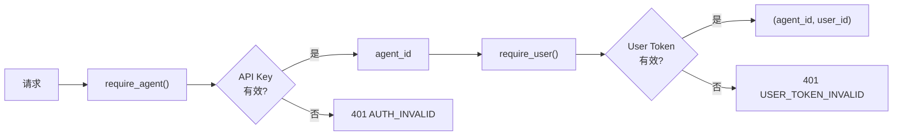

Clawdot Gateway 使用双层认证：**API Key** 标识 Agent 身份，**User Token** 标识外卖用户身份。

## 认证链



不同端点需要不同级别的认证：

| 端点 | API Key | User Token |
|------|---------|------------|
| `POST /auth/agents` | 不需要（用 Admin Secret）| 不需要 |
| `POST /user/bind/*` | 需要 | 不需要 |
| `GET /shops/*` | 需要 | 需要 |
| `*/addresses/*` | 需要 | 需要 |
| `*/orders/*` | 需要 | 需要 |

## API Key

<AccordionGroup>
  <Accordion title="格式" icon="key">
    ```
    clw_<32 位十六进制字符>
    ```

    示例：`clw_a1b2c3d4e5f6g7h8i9j0k1l2m3n4o5p6`

    通过 `Authorization: Bearer clw_...` 请求头传递。
  </Accordion>

  <Accordion title="存储方式" icon="database">
    API Key 在数据库中以 **SHA-256 哈希** 存储，服务端不保留明文。每次请求时对传入的 Key 计算哈希后与数据库比对。

    同时存储 Key 的前 8 个字符作为 `prefix`，用于日志和调试（不泄露完整 Key）。
  </Accordion>

  <Accordion title="验证流程" icon="check">
    1. 提取 `Authorization` 头中的 Bearer Token
    2. 计算 SHA-256 哈希
    3. 在 `api_keys` 表中查找匹配的 `key_hash`
    4. 验证 `is_active = true`
    5. 返回关联的 `agent_id`
  </Accordion>
</AccordionGroup>

## User Token

<AccordionGroup>
  <Accordion title="获取方式" icon="mobile">
    通过 SMS 验证码绑定流程获取：

    1. 调用 `POST /user/bind/request` 发送验证码
    2. 调用 `POST /user/bind/verify` 验证后获得 Token

    Token 为 UUID v4 格式，默认 90 天有效。
  </Accordion>

  <Accordion title="传递方式" icon="arrow-right">
    - **REST API：** 通过 `X-User-Token` 请求头传递
    - **MCP：** 作为每个工具的 `user_token` 参数传递
  </Accordion>

  <Accordion title="安全设计" icon="shield">
    Token 关联的外卖用户 ID 以 **AES-256-GCM** 加密存储：

    - 加密密钥：环境变量 `ENCRYPTION_KEY`（base64 编码的 32 字节密钥）
    - 手机号：SHA-256 哈希存储（用于同一 Agent 下的去重）
    - 每个 Agent + 手机号组合仅保留一个绑定
  </Accordion>
</AccordionGroup>

## 错误响应

认证失败返回统一格式：

```json
{
  "error": {
    "code": "AUTH_REQUIRED",
    "message": "Authorization header is required"
  }
}
```

| 错误码 | HTTP 状态 | 说明 |
|--------|-----------|------|
| `AUTH_REQUIRED` | 401 | 缺少 API Key |
| `AUTH_INVALID` | 401 | API Key 无效或已禁用 |
| `USER_TOKEN_REQUIRED` | 401 | 缺少 User Token |
| `USER_TOKEN_INVALID` | 401 | User Token 无效或已过期 |
