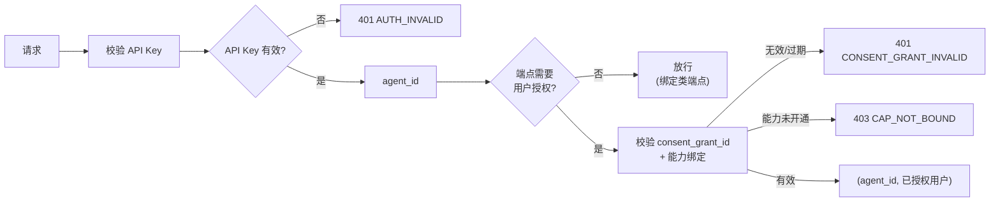

Clawdot Gateway 使用双层认证：**API Key** 标识 Agent 身份，**用户授权（consent grant）** 标识已授权的外卖用户。

## 认证链


```mermaid
flowchart LR
  A["请求"] --> B["校验 API Key"]
  B --> C{"API Key 有效?"}
  C -- 否 --> E["401 AUTH_INVALID"]
  C -- 是 --> D["agent_id"]
  D --> F{"端点需要<br/>用户授权?"}
  F -- 否 --> Z["放行<br/>(绑定类端点)"]
  F -- 是 --> G["校验 consent_grant_id<br/>+ 能力绑定"]
  G -- 无效/过期 --> H["401 CONSENT_GRANT_INVALID"]
  G -- 能力未开通 --> I["403 CAP_NOT_BOUND"]
  G -- 有效 --> J["(agent_id, 已授权用户)"]
```

不同端点需要不同级别的认证：

| 端点 | API Key | 用户授权 (consent_grant) |
|---|---|---|
| `POST /api/v1/auth/bind/request` · `bind/verify` | 需要 | 不需要（这是获取授权的入口）|
| `GET /api/v1/auth/status` | 需要 | 需要 |
| `POST /api/v1/auth/unbind` · `auth/homepage-url` | 需要 | 需要 |
| `/api/v1/addresses/*` · `/shops/*` · `/cart/*` | 需要 | 需要 |
| `/api/v1/orders/*` · `/payment/*` | 需要 | 需要 |

<Note>
  MCP 工具不使用 `X-Consent-Grant-Id` 请求头，而是在每个工具调用中传入 `consent_grant_id` 参数。
</Note>

## API Key

<AccordionGroup>
  <Accordion title="格式与传递" icon="key">
    格式为 `clw_` 前缀加随机字符，例如 `clw_a1b2c3d4...`。

    通过 `Authorization: Bearer clw_...` 请求头传递；所有 `/api/v1/*` 与 MCP 请求都需要它。在 Portal 创建 Agent 时生成。
  </Accordion>

  <Accordion title="安全" icon="shield">
    API Key 在服务端只存哈希、不保留明文，每次请求按哈希比对。被禁用的 Key 立即失效。
  </Accordion>
</AccordionGroup>

## 用户授权 (consent grant)

代表“某个外卖用户已授权某个 Agent 使用某项能力”。

<AccordionGroup>
  <Accordion title="获取方式" icon="mobile">
    走绑定流程获取（支持 SMS 验证码与 H5 两种模式）：

    1. `POST /api/v1/auth/bind/request` 发起授权（SMS 发验证码；H5 返回授权链接）
    2. `POST /api/v1/auth/bind/verify` 确认，成功返回 `consent_grant_id`

    详见 [发起绑定](/api-reference/user/bind-request) 与 [确认绑定](/api-reference/user/bind-verify)。
  </Accordion>

  <Accordion title="传递方式" icon="arrow-right">
    - **REST API：** 通过 `X-Consent-Grant-Id: <consent_grant_id>` 请求头传递（绑定类端点除外）。`consent_grant_id` 只走请求头，不要放进 JSON body。
    - **MCP：** 作为每个工具的 `consent_grant_id` 参数传入。
  </Accordion>

  <Accordion title="范围与有效期" icon="clock">
    `verify_user_bind` 成功返回：

    - `consent_grant_id` — 用户授权记录 ID（`cg_` 前缀）
    - `scopes` — 授权能力范围，例如 `["taobao_flash.delivery"]`
    - `expires_at` — 过期时间（ISO 8601）

    过期，或被 `revoke_user_bind`（`POST /api/v1/auth/unbind`）撤销后，该 `consent_grant_id` 在所有端点即时失效；需重新走绑定流程获取新的。用户的地址等数据保留，重新授权后自动可用。
  </Accordion>
</AccordionGroup>

## 错误响应

认证 / 授权失败返回统一格式：

```json
{
  "error": {
    "code": "CONSENT_GRANT_REQUIRED",
    "message": "Consent grant id is required"
  }
}
```

| 错误码 | HTTP | 说明 |
|---|---|---|
| `AUTH_REQUIRED` | 401 | 缺少 API Key |
| `AUTH_INVALID` | 401 | API Key 无效或已禁用 |
| `CONSENT_GRANT_REQUIRED` | 401 | 缺少 consent_grant_id |
| `CONSENT_GRANT_INVALID` | 401 | consent_grant_id 无效或已过期 |
| `CONSENT_GRANT_EXPIRED` | 401 | 用户授权已过期，需重新授权 |
| `CONSENT_GRANT_WRONG_CAP` | 403 | 授权属于其它能力 / 服务商 |
| `CAP_NOT_BOUND` | 403 | 当前 Agent 未开通该能力 |

完整错误码见 [错误处理](/gateway/error-handling)。
