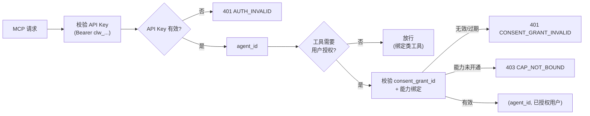
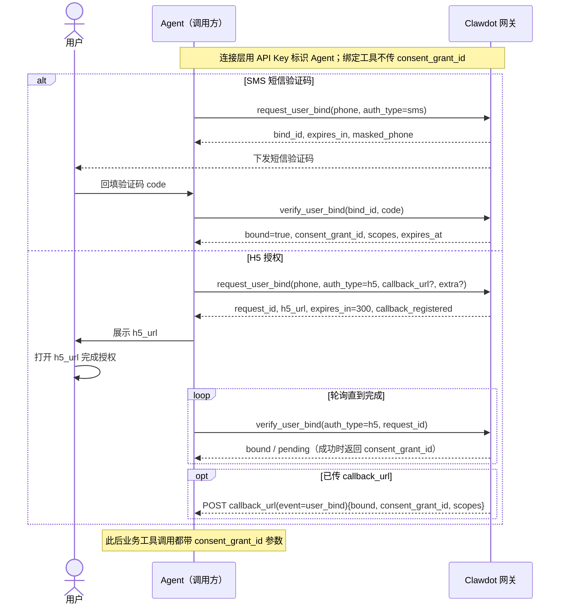

Clawdot Gateway 通过 MCP 暴露能力，认证分两层：

- **Agent 身份** — 连接层请求头 `Authorization: Bearer clw_...`，标识调用方 Agent。每个 MCP 请求都要带。
- **用户授权** — 业务工具的 `consent_grant_id` 参数（`cg_` 前缀），标识"某个外卖用户已授权该 Agent"。它是**工具参数**，不是请求头。

## 认证链


```mermaid
flowchart LR
  A["MCP 请求"] --> B["校验 API Key<br/>(Bearer clw_...)"]
  B --> C{"API Key 有效?"}
  C -- 否 --> E["401 AUTH_INVALID"]
  C -- 是 --> D["agent_id"]
  D --> F{"工具需要<br/>用户授权?"}
  F -- 否 --> Z["放行<br/>(绑定类工具)"]
  F -- 是 --> G["校验 consent_grant_id<br/>+ 能力绑定"]
  G -- 无效/过期 --> H["401 CONSENT_GRANT_INVALID"]
  G -- 能力未开通 --> I["403 CAP_NOT_BOUND"]
  G -- 有效 --> J["(agent_id, 已授权用户)"]
```

不同工具需要不同级别的认证：

| 工具 | API Key | consent_grant_id 参数 |
|---|---|---|
| `request_user_bind` · `verify_user_bind` | 需要 | 不需要（这是获取授权的入口）|
| `get_user_auth_status` · `revoke_user_bind` · `get_homepage_url` | 需要 | 需要 |
| `search_shops` · `get_shop_menu` · `get_shop_share_url` | 需要 | 需要 |
| `search_addresses` · `select_address` · `update_address` | 需要 | 需要 |
| `quote_cart` · `list_coupons` · `preview_order` · `create_order` · `get_order_status` | 需要 | 需要 |
| `get_sign_action` · `get_sign_status` | 需要 | 需要 |

<Note>
  绑定类工具（`request_user_bind` / `verify_user_bind`）是拿授权的入口，本身不传 `consent_grant_id`。授权成功后，其余所有业务工具调用都要带上 `consent_grant_id` 参数。
</Note>

## API Key

<AccordionGroup>
  <Accordion title="格式与传递" icon="key">
    格式为 `clw_` 前缀加随机字符，例如 `clw_a1b2c3d4...`。

    通过连接层请求头 `Authorization: Bearer clw_...` 传递，每个 MCP 请求都需要它。在控制台 `https://console.hicaspian.com/agents` 创建 Agent 时生成。
  </Accordion>

  <Accordion title="安全" icon="shield">
    API Key 在服务端只存哈希、不保留明文，每次请求按哈希比对。被禁用的 Key 立即失效。
  </Accordion>
</AccordionGroup>

## 用户授权 (consent_grant_id)

代表"某个外卖用户已授权某个 Agent 使用某项能力"。授权成功后铸造出 `consent_grant_id`，之后**每个业务工具调用都把它作为参数传入**。

### 绑定流程

走绑定流程获取 `consent_grant_id`，支持 SMS 验证码与 H5 两种模式：

1. `request_user_bind` 发起绑定（SMS 发验证码；H5 返回授权链接，仅需 Agent 身份，不传 `consent_grant_id`）
2. `verify_user_bind` 确认绑定，成功铸造 `consent_grant_id`

详见 [发起绑定](/mcp/user/bind-request) 与 [确认绑定](/mcp/user/bind-verify)。


```mermaid
sequenceDiagram
    actor U as 用户
    participant A as Agent（调用方）
    participant G as Clawdot 网关
    Note over A,G: 连接层用 API Key 标识 Agent；绑定工具不传 consent_grant_id
    alt SMS 短信验证码
        A->>G: request_user_bind(phone, auth_type=sms)
        G-->>A: bind_id, expires_in, masked_phone
        G-->>U: 下发短信验证码
        U->>A: 回填验证码 code
        A->>G: verify_user_bind(bind_id, code)
        G-->>A: bound=true, consent_grant_id, scopes, expires_at
    else H5 授权
        A->>G: request_user_bind(phone, auth_type=h5, callback_url?, extra?)
        G-->>A: request_id, h5_url, expires_in=300, callback_registered
        A->>U: 展示 h5_url
        U->>U: 打开 h5_url 完成授权
        loop 轮询直到完成
            A->>G: verify_user_bind(auth_type=h5, request_id)
            G-->>A: bound / pending（成功时返回 consent_grant_id）
        end
        opt 已传 callback_url
            G-->>A: POST callback_url(event=user_bind){bound, consent_grant_id, scopes}
        end
    end
    Note over A: 此后业务工具调用都带 consent_grant_id 参数
```

<AccordionGroup>
  <Accordion title="如何传递" icon="arrow-right">
    `consent_grant_id` 作为每个业务工具的参数传入，例如：

    ```json
    {
      "name": "search_shops",
      "arguments": {
        "consent_grant_id": "cg_...",
        "keyword": "咖啡"
      }
    }
    ```

    绑定类工具 `request_user_bind` / `verify_user_bind` 例外，它们不传 `consent_grant_id`。
  </Accordion>

  <Accordion title="范围与有效期" icon="clock">
    `verify_user_bind` 成功返回：

    - `consent_grant_id` — 用户授权记录 ID（`cg_` 前缀）
    - `scopes` — 授权能力范围，例如 `["taobao_flash.delivery"]`
    - `expires_at` — 过期时间（ISO 8601）

    过期，或被 `revoke_user_bind` 撤销后，该 `consent_grant_id` 即时失效；需重新走绑定流程获取新的。用户的地址等数据保留，重新授权后自动可用。
  </Accordion>
</AccordionGroup>

## 错误响应

认证 / 授权失败返回统一格式：

```json
{
  "error": {
    "code": "CONSENT_GRANT_REQUIRED",
    "message": "Consent grant id is required"
  }
}
```

| 错误码 | HTTP | 说明 |
|---|---|---|
| `AUTH_REQUIRED` | 401 | 缺少 API Key |
| `AUTH_INVALID` | 401 | API Key 无效或已禁用 |
| `CONSENT_GRANT_REQUIRED` | 401 | 缺少 consent_grant_id |
| `CONSENT_GRANT_INVALID` | 401 | consent_grant_id 无效或已过期 |
| `CONSENT_GRANT_EXPIRED` | 401 | 用户授权已过期，需重新授权 |
| `CONSENT_GRANT_WRONG_CAP` | 403 | 授权属于其它能力 / 服务商 |
| `CAP_NOT_BOUND` | 403 | 当前 Agent 未开通该能力 |

完整错误码见 [错误处理](/gateway/error-handling)。
