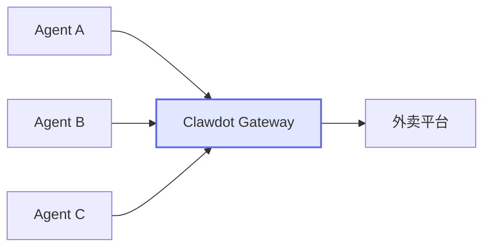

## 什么是 Gateway

Clawdot Gateway 是连接 AI Agent 与外卖平台的 API 网关。它将平台的复杂 API 封装为标准化的 REST 和 MCP 接口，让 Agent 可以专注于业务逻辑。

## Gateway 帮你处理了什么

| 你需要做的 | Gateway 帮你做的 |
|-----------|-----------------|
| 传入 `shop_id` | 多种 ID 格式自动转换 |
| 传入商品列表 | 规格/属性/加料解析 + 互斥规则计算 |
| 调用一次 preview | 两次渲染 + 自动选最优优惠券 |
| 传入 API Key | Token 管理、签名、UA 适配 |
| 收到标准错误码 | 平台错误归类为统一格式 |

## 双协议入口

<Columns cols={2}>
  <Card title="REST API" icon="terminal" href="/api-reference/introduction">
    标准 RESTful 接口，`/api/v1/*` 路径，适配任何 HTTP 客户端。
  </Card>
  <Card title="MCP Protocol" icon="plug" href="/gateway/mcp-overview">
    `/mcp` 端点，9 个工具，Claude Desktop 等 MCP 客户端直接连接。
  </Card>
</Columns>

## 核心功能

<Columns cols={3}>
  <Card title="商家搜索" icon="magnifying-glass">
    按关键词或默认 10 品类并行搜索，自动去重。
  </Card>
  <Card title="菜单解析" icon="utensils">
    完整规格/属性/加料体系，预计算默认选项。
  </Card>
  <Card title="智能下单" icon="cart-shopping">
    两步下单（预览+确认），自动选最优优惠券。
  </Card>
</Columns>

## 下一步

<Columns cols={2}>
  <Card title="架构详解" icon="sitemap" href="/gateway/architecture">
    三层架构设计、数据流和数据库模型。
  </Card>
  <Card title="认证机制" icon="lock" href="/gateway/authentication">
    API Key + User Token 双层认证体系。
  </Card>
</Columns>
