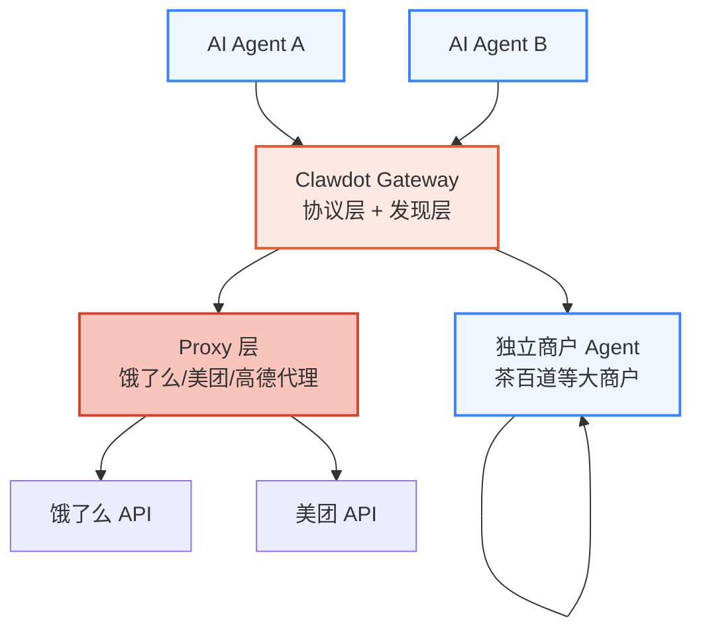

## 什么是 Gateway

Clawdot Gateway 是 Clawdot 的**协议层 + 发现层**（Protocol Hub + Discovery Layer），位于 4 层架构的第 3 层。它的核心职责是：

1. **定义标准协议** — 制定统一的商户接口规范（菜单查询、下单履约等）
2. **连接商户** — 支持两类商户接入：
   - **Proxy 层** — 代理饿了么/美团/高德等平台商户（冷启动阶段）
   - **独立 Agent** — 大型商户自建 Agent，直接实现标准协议（长期生态）
3. **统一接口** — 为 AI Agent 提供统一的 MCP 接口，隐藏商户差异

```mermaid
graph TB
  Agent1["AI Agent A"]
  Agent2["AI Agent B"]

  Gateway["Clawdot Gateway<br/>协议层 + 发现层"]

  ProxyLayer["Proxy 层<br/>饿了么/美团/高德代理"]
  IndependentAgent["独立商户 Agent<br/>茶百道等大商户"]

  PlatformAPI1["饿了么 API"]
  PlatformAPI2["美团 API"]

  Agent1 --> Gateway
  Agent2 --> Gateway

  Gateway --> ProxyLayer
  Gateway --> IndependentAgent

  ProxyLayer --> PlatformAPI1
  ProxyLayer --> PlatformAPI2
  IndependentAgent --> IndependentAgent

  style Gateway fill:#fde8e4,stroke:#E8593C,stroke-width:2px
  style Agent1 fill:#EFF6FF,stroke:#3B82F6,stroke-width:2px
  style Agent2 fill:#EFF6FF,stroke:#3B82F6,stroke-width:2px
  style ProxyLayer fill:#f9c4bc,stroke:#D14430,stroke-width:2px
  style IndependentAgent fill:#EFF6FF,stroke:#3B82F6,stroke-width:2px
```

## Gateway 帮你处理了什么

| 你需要做的 | Gateway 帮你做的 |
|-----------|-----------------|
| 传入 `shop_id` | 多种 ID 格式自动转换 |
| 传入商品列表 | 规格/属性/加料解析 + 互斥规则计算 |
| 调用一次 preview | 两次渲染 + 自动选最优优惠券 |
| 传入 API Key | Token 管理、签名、UA 适配 |
| 收到标准错误码 | 平台错误归类为统一格式 |

## MCP 接入

<Card title="MCP Protocol" icon="plug" href="/mcp/overview">
  `/mcp/v1` 端点，18 个工具，Claude Desktop 等 MCP 客户端直接连接。
</Card>

## 核心功能

<Columns cols={3}>
  <Card title="商家搜索" icon="search">
    按关键词或默认 10 品类并行搜索，自动去重。通过 Proxy 或直接调用商户 Agent。
  </Card>
  <Card title="菜单解析" icon="utensils">
    完整规格/属性/加料体系，预计算默认选项。标准化处理所有类型商户的菜单格式。
  </Card>
  <Card title="智能下单" icon="shopping-cart">
    两步下单（预览+确认），自动选最优优惠券。支持 Proxy 和独立商户两种下单模式。
  </Card>
</Columns>

## 商户接入模式

Gateway 支持两种商户接入方式，灵活满足不同规模商户的需求：

<Tabs>
  <Tab title="Proxy 层（冷启动）">
    **用途：** 快速覆盖已有平台商户，无需商户改动

    - Clawdot 为饿了么、美团、高德等平台的商户提供统一代理
    - Agent 使用标准协议，Proxy 负责转换为平台 API
    - 占比逐步下降，作为过渡性方案

    → [了解 Proxy 工作原理](/gateway/merchant-onboarding)
  </Tab>

  <Tab title="独立 Agent（生态）">
    **用途：** 大型商户深度集成，完全自主

    - 大型连锁品牌（如茶百道）自建商户 Agent
    - 直接实现 Gateway 标准协议
    - 最终成为生态的主体

    → [开始独立接入](/gateway/merchant-onboarding)
  </Tab>
</Tabs>

## 下一步

<Columns cols={2}>
  <Card title="标准协议" icon="handshake" href="/gateway/standard-protocol">
    了解 Gateway 的五大标准协议类别和实现方式。
  </Card>
  <Card title="商户接入" icon="user-plus" href="/gateway/merchant-onboarding">
    详细的商户接入流程和最佳实践指南。
  </Card>
  <Card title="架构详解" icon="network" href="/gateway/architecture">
    三层架构设计、数据流和数据库模型。
  </Card>
  <Card title="认证机制" icon="lock" href="/gateway/authentication">
    API Key + consent grant 双层认证体系。
  </Card>
</Columns>
