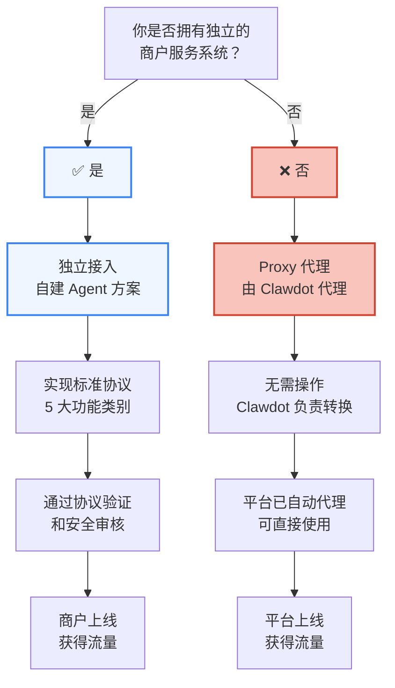

## 接入方式概览

Clawdot Gateway 为商户提供两条接入路径。选择适合你的方案，快速接入 AI Agent 生态。



<Tabs>
  <Tab title="Proxy 方案（推荐初期使用）">
    ## 什么是 Proxy 方案

    **适用于：** 来自饿了么、美团、高德等外卖平台的商户

    Clawdot 为你的商户自动代理，无需做任何开发工作。我们负责将 AI Agent 的标准协议请求转换为相应平台的 API 调用。

    ## 商户无需操作

    如果你是饿了么/美团/高德上的商户，Clawdot 已经自动为你创建了代理。你可以直接：

    1. **查看商户信息** — 登录 Clawdot 商户后台，确认你的商户已被代理
    2. **监控数据** — 查看通过 AI Agent 的订单数据、统计信息
    3. **接收订单** — Agent 通过 Gateway 下单后，订单将转发到你的平台账户
    4. **无代码集成** — 完全无需编码，Clawdot 负责所有适配工作

    ## Proxy 工作原理

    ```mermaid
    sequenceDiagram
      participant Agent as AI Agent
      participant Gateway as Clawdot Gateway
      participant Proxy as Proxy 层<br/>转换引擎
      participant Platform as 外卖平台<br/>美团/饿了么/高德
      participant Merchant as 你的商户账户

      Agent->>Gateway: 搜索商家
      Gateway->>Proxy: 标准协议请求
      Proxy->>Platform: 转换为平台 API
      Platform-->>Proxy: 平台响应
      Proxy-->>Gateway: 标准协议格式
      Gateway-->>Agent: 返回搜索结果

      Agent->>Gateway: 创建订单
      Gateway->>Proxy: 标准协议请求
      Proxy->>Platform: 转换为平台 API
      Platform-->>Merchant: 订单推送
      Merchant-->>Platform: 接单
      Platform-->>Proxy: 订单状态
      Proxy-->>Gateway: 标准协议响应
      Gateway-->>Agent: 订单确认
    ```

    ## 优势

    | 优势 | 说明 |
    |-----|------|
    | **零开发成本** | 无需改动现有系统 |
    | **快速上线** | 立即获得 AI Agent 能力 |
    | **平台覆盖** | 自动覆盖美团、饿了么、高德等多平台 |
    | **数据沉淀** | 所有交互数据存储在 Clawdot，支持数据分析 |
    | **自动优化** | Clawdot 不断优化 Proxy 转换策略 |

    ## 后续升级

    当你的商户规模增长、需要更深度的 AI 集成时，可以升级到**独立接入方案**。
  </Tab>

  <Tab title="独立接入方案（深度集成）">
    ## 什么是独立接入

    **适用于：** 拥有独立商户系统的大型商户（如茶百道、连锁品牌等）

    你的商户团队自建 Agent，直接实现 Clawdot 的标准协议。这样可以获得完全的控制权和最大的灵活性。

    ## 接入流程

    <Steps>
      <Step title="了解标准协议">
        详细学习 Clawdot 的 5 大标准协议类别：
        - 菜单查询（已实现）
        - 下单履约（已实现）
        - 预约管理（规划中）
        - 评价反馈（规划中）
        - 配送追踪（规划中）

        → [查看标准协议详解](/gateway/standard-protocol)
      </Step>

      <Step title="实现标准协议接口">
        在你的系统中实现以下接口：

        ```bash
        GET    /menu
        GET    /menu/search
        GET    /menu/item/{item_id}

        POST   /orders/preview
        POST   /orders
        GET    /orders/{order_id}
        PATCH  /orders/{order_id}
        ```

        使用标准的 REST API，支持 JSON 请求/响应格式。
      </Step>

      <Step title="本地测试">
        使用 Clawdot 提供的测试工具集：

        ```bash
        # 验证接口可访问性
        clawdot validate-api https://your-merchant.com

        # 运行协议兼容性测试
        clawdot test-protocol --endpoint https://your-merchant.com

        # 查看详细的测试报告
        clawdot test-report
        ```
      </Step>

      <Step title="提交验证申请">
        准备以下信息并提交到 Clawdot：

        - 商户基本信息（名称、联系方式、营业执照）
        - API 端点地址和文档
        - 测试账号（便于 Clawdot 进行功能测试）
        - 数据保护和隐私政策说明
        - Service Level Agreement (SLA) 承诺

        → [提交验证申请](https://portal.clawdot.com/merchant/onboard)
      </Step>

      <Step title="通过审核和安全测试">
        Clawdot 团队将进行：

        - **功能验证** — 测试所有 API 接口功能
        - **安全审核** — 审查认证机制、数据保护措施
        - **性能评估** — 测试 API 的响应时间和可靠性
        - **兼容性检查** — 确保与标准协议完全兼容

        预计审核周期：5-10 个工作日
      </Step>

      <Step title="上线和获取流量">
        审核通过后：

        1. **获得商户 ID** — Clawdot 分配唯一的商户 ID
        2. **生成 API Key** — 用于 Gateway 调用你的接口
        3. **配置上线** — 将商户信息添加到 Gateway 的商户库
        4. **开始接收订单** — AI Agent 可以调用你的接口
        5. **监控仪表盘** — 实时查看订单、流量、性能指标
      </Step>
    </Steps>

    ## 实现要求

    ### 功能要求

    | 功能 | 必需 | 说明 |
    |-----|-----|------|
    | 菜单查询 | ✅ | 必须完整实现商品、规格、属性、加料等 |
    | 下单履约 | ✅ | 必须支持预览、创建、查询、取消 |
    | 预约管理 | ⏳ | 如适用时请实现；规划中的功能 |
    | 评价反馈 | ⏳ | 规划中；未来必需 |
    | 配送追踪 | ⏳ | 规划中；未来必需 |

    ### 性能要求

    | 指标 | 要求 |
    |-----|------|
    | **响应时间** | P99 < 2s（菜单查询）、P99 < 3s（下单） |
    | **可用性** | >= 99.5% 月度可用性 |
    | **并发** | 支持至少 100 并发请求 |
    | **数据一致性** | 订单等关键数据必须一致 |

    ### 安全要求

    | 需求 | 说明 |
    |-----|------|
    | **认证** | 使用 API Key + 签名或 OAuth 2.0 |
    | **加密** | 敏感数据（用户 ID、电话等）需加密存储 |
    | **审计日志** | 记录所有 API 调用，支持追溯 |
    | **速率限制** | 实施合理的速率限制防止滥用 |

    ### 数据要求

    | 需求 | 说明 |
    |-----|------|
    | **标准格式** | 使用 Clawdot 定义的标准 JSON 格式 |
    | **完整性** | 所有必填字段必须返回 |
    | **准确性** | 价格、库存等关键数据必须实时准确 |
    | **隐私合规** | 遵守 GDPR、CCPA 等隐私法规 |

    ## 最佳实践

    ### 1. API 设计

    ```typescript
    // ✅ 好的实现
    interface MenuItem {
      id: string;
      name: string;
      price: number;
      description: string;
      specs: MenuSpec[];
      attributes: MenuAttribute[];
      addons: MenuAddon[];
    }

    // ❌ 避免
    interface MenuItem {
      id: string;
      name: string;
      raw_data: string; // 避免返回原始数据
    }
    ```

    ### 2. 错误处理

    ```typescript
    // ✅ 标准错误响应
    {
      "error_code": "ITEM_OUT_OF_STOCK",
      "error_message": "商品已售罄",
      "request_id": "req_123abc"
    }

    // ❌ 避免
    {
      "status": "error",
      "message": "something went wrong"
    }
    ```

    ### 3. 版本管理

    - API 版本通过 URL 路径表示：`/v1/`、`/v2/`
    - 向后兼容至少 1 年（推荐 2 年以上）
    - 提前 3 个月通知弃用计划

    ### 4. 文档和支持

    - 提供详细的 API 文档和代码示例
    - 建立技术支持渠道（邮件、Slack 等）
    - 发布 SDK（可选，但推荐）
    - 定期进行技术培训

    ## 常见问题

    <AccordionGroup>
      <Accordion title="如何处理菜单更新？">
        菜单应该实时返回。当商户在后台修改菜单时，通过 `GET /menu` 应该立即返回最新数据。

        如果你需要缓存，应该设置较短的 TTL（建议 5-10 分钟）。
      </Accordion>

      <Accordion title="订单数据如何保留？">
        Clawdot Gateway 会自动保留所有订单数据（包括原始响应）。你不需要额外存储，但建议你自己也保留备份。
      </Accordion>

      <Accordion title="如何处理多个商户？">
        如果你有多个门店或商户，每个都需要单独注册到 Gateway。提供不同的 API 端点或通过参数区分。
      </Accordion>

      <Accordion title="如何支持多语言？">
        Clawdot 目前主要支持中文。如果需要多语言，可以在商品名称和描述中包含多语言内容。
      </Accordion>

      <Accordion title="可以关闭某些功能吗？">
        在初期阶段，必须实现菜单查询和下单履约两个核心功能。其他功能可以暂时返回"不支持"的响应。
      </Accordion>
    </AccordionGroup>
  </Tab>
</Tabs>

## 对接流程对比

| 方面 | Proxy 方案 | 独立接入 |
|-----|---------|--------|
| **开发工作** | 无 | 需实现标准协议接口 |
| **上线时间** | 即时 | 5-10 个工作日（审核） |
| **成本** | 无 | 需要 API 开发、测试 |
| **灵活性** | 固定的代理转换逻辑 | 完全的自主权 |
| **数据控制** | Clawdot 统一管理 | 商户自主管理 |
| **深度集成** | 有限 | 深度集成，支持自定义 |
| **使用场景** | 冷启动、小型商户 | 大型商户、需要定制 |

## 获得帮助

<Columns cols={2}>
  <Card title="标准协议文档" icon="book" href="/gateway/standard-protocol">
    详细了解五大协议类别的接口规范。
  </Card>
  <Card title="API 参考" icon="code" href="/api-reference/introduction">
    完整的 API 文档和代码示例。
  </Card>
  <Card title="技术支持" icon="headset">
    邮件：[support@clawdot.com](mailto:support@clawdot.com)
    Slack：[加入我们的社区](https://clawdot.slack.com)
  </Card>
  <Card title="提交申请" icon="hand-point-right">
    [开始接入流程](https://portal.clawdot.com/merchant/onboard)
  </Card>
</Columns>
