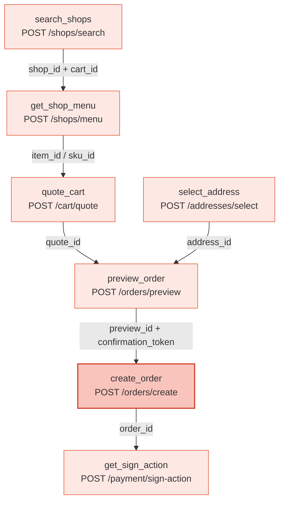

完成一笔订单是一条**有状态的链路**：每一步返回的 ID 必须原样回传给下一步，不可自造或跨链路混用。本页串起整条链路；每个端点的完整字段表见对应的 [API 参考](/mcp/shops/search)。

<Note>
  本页示例以 **MCP 工具** 为主（工具参数除 `consent_grant_id` 外与 REST body 一致）。每个工具一一对应一个 REST 端点，二者参数相同；REST 写法见各步骤末尾的链接与下方「认证」小节。
</Note>

## 概览



链路的 ID 传递关系：

| 这一步 | 产出 | 被谁消费 |
|---|---|---|
| `search_shops` | `shop_id` + `cart_id` | `get_shop_menu` / `quote_cart` / `preview_order` |
| `get_shop_menu` | `item_id` / `sku_id` / `ingredient_option_ids` | `quote_cart` / `preview_order` 的 `items` |
| `quote_cart` | `quote_id` | `preview_order`（可选，传入则校验报价上下文）|
| `select_address` | `address_id` | `quote_cart` / `preview_order` |
| `preview_order` | `preview_id` + `confirmation_token` | `create_order` |
| `create_order` | `order_id` + `payment_action` | `get_order_status` |
| `get_sign_action` | 签约 `action`（H5 链接）| 用户在浏览器完成免密签约 |

<Warning>
  所有金额字段单位为**分（整数）**，不是元。例如 `payable_price: 1500` 表示 ¥15.00。
</Warning>

## 完整链路

<Steps>

### 搜索 / 浏览商家

```python
search_shops(
    consent_grant_id="cg_...",
    keyword="生椰拿铁",   # 省略则浏览附近店铺（≤20）
    address_id="addr_...",  # 或直接传 lat/lng（GCJ-02）
)
```

不传 `keyword` 为**浏览模式**，返回附近至多 20 家店铺（含距离、评分、配送费、起送价等决策字段）；传 `keyword` 为**精确搜索**（约 5 家），可传店名、品类或具体商品名，命中的店铺带 `matched_items` 预览。

每个结果都附带 `shop_id` 与 `cart_id`：`cart_id` 已封装该店铺与本次配送坐标，是后续 `get_shop_menu` / `quote_cart` / `preview_order` 的入口，**原样回传**即可，下游接口因此免传经纬度。

<Note>
  完整字段见 [搜索店铺](/mcp/shops/search)。`matched_items` 仅供展示、不带 ID；下单必须用 `get_shop_menu` 返回的 `item_id` / `sku_id`。
</Note>

### 查看店铺菜单

```python
get_shop_menu(
    consent_grant_id="cg_...",
    shop_id="shop_...",   # 原样来自 search_shops
    cart_id="cart_...",   # 原样来自 search_shops
    keyword="拿铁",        # 可选：只返回名称/分类/描述命中的商品
    limit=20, offset=0,    # 可选：分页，按 next_offset 翻页直到 has_more=false
)
```

返回菜单项，每项含可下单的 `item_id` / `sku_id`，以及规格 / 属性 / 加料的可选项 `ingredient_option_ids`。菜单可能很大（100+ 项），用 `keyword` 或 `limit`/`offset` 渐进披露。同一 `cart_id` 上早前取到的 ID 仍可用于下单。

<Note>
  规格 / 属性 / 加料体系说明见 [商品规格说明](/gateway/item-specs)；完整字段见 [店铺菜单](/mcp/shops/detail)。
</Note>

### 准备收货地址

```python
search_addresses(consent_grant_id="cg_...", keyword="光谷世界城", lat=30.5, lng=114.4)
# → suggestions[].token（一次性，用于 select_address）+ saved_addresses

select_address(
    consent_grant_id="cg_...",
    contact_name="张三",
    contact_phone="13800138000",
    suggestion_token="...",     # 来自 search_addresses 的某条 suggestion
    address_detail="3 号楼 101",
)
```

`select_address` 返回该地址的 `address_id`，传给 `quote_cart` / `preview_order`。已有地址时，`search_addresses` 返回 `saved_addresses`（以及传了 `lat`/`lng` 时的 `nearest_address_id`），可直接复用其 `address_id`。

<Note>
  地址三件套：[搜索地址](/mcp/addresses/search) · [选择/登记地址](/mcp/addresses/select) · [更新地址](/mcp/addresses/update)。
</Note>

### 购物车算价

```python
quote_cart(
    consent_grant_id="cg_...",
    shop_id="shop_...",
    cart_id="cart_...",
    address_id="addr_...",
    items=[{"item_id": "...", "sku_id": "...", "quantity": 1, "ingredient_option_ids": []}],
)
```

对选好的商品算价，返回 `quote_id`（报价上下文）与价格明细。`quote_id` 可传给 `preview_order` 以校验报价上下文。

<Note>
  完整字段见 [购物车算价](/mcp/cart/quote)。
</Note>

### 预览订单

```python
preview_order(
    consent_grant_id="cg_...",
    shop_id="shop_...",
    cart_id="cart_...",
    address_id="addr_...",
    items=[{"item_id": "...", "sku_id": "...", "quantity": 1}],
    quote_id="...",          # 可选，传入则校验报价上下文
    coupon_ids=None,         # 三态：不传=自动选最优券；[]=不用券；["cpn_..."]=指定券
    order_remark="放门口",
)
```

校验店铺 / 地址 / 商品并应用优惠券，返回最终价格（`price.payable_price` 等，单位分），以及下单用的 `preview_id` + `confirmation_token`（同一次预览产出，须配对使用，有效期约 10 分钟）。

<Note>
  完整字段与 `coupon_ids` 三态说明见 [预览订单](/mcp/orders/preview)。
</Note>

### 创建订单

```python
create_order(
    consent_grant_id="cg_...",
    preview_id="prv_...",            # 来自同一次 preview_order
    confirmation_token="cf_...",     # 来自同一次 preview_order
    payment_method=None,
    callback_url="https://your-app.example.com/clawdot/callback",  # 可选：支付状态回调
)
```

用同一次预览的 `preview_id` + `confirmation_token` 正式下单，返回平台订单 `order_id`、`status` 与（需支付时的）`payment_action`。

<Note>
  本接口以 `confirmation_token` 为幂等键；同一令牌只能下一单，再次下单需重新预览取新令牌。可选传 `callback_url`，网关会轮询订单状态并在脱离未支付态时 POST 回调；不传则自行轮询 `get_order_status`（`GET /orders/{order_id}`）。完整字段、`status` 与回调 `ispay` 枚举见 [创建订单](/mcp/orders/create)。
</Note>

### 免密签约

```python
get_sign_action(
    consent_grant_id="cg_...",
    return_url="https://your-app.example.com/sign/callback",
)
```

为用户发起免密支付签约，返回一个 `action`：`action_type` 为 `open_h5` 时，把用户引导到 `action.action_url`（H5 签约页）完成签约，完成后浏览器跳回 `return_url`；为 `none` 时表示已签约。随后用 `get_sign_status`（`GET /payment/sign-status`）轮询结果。免密签约是免密支付类订单的前置条件。

<Note>
  完整字段见 [发起免密签约](/mcp/payment/sign-action)。
</Note>

</Steps>

## 查询订单

```python
get_order_status(consent_grant_id="cg_...", order_id="ord_...")
```

对应 `GET /orders/{order_id}`，返回订单状态与详情。详见 [查询订单](/mcp/orders/get)。

## 认证

每一步都需要双层认证：

- **API Key**（标识 Agent）：通过 `Authorization: Bearer clw_...` 请求头传递，MCP 与 REST 都一样。
- **用户授权 consent grant**（标识已授权用户，`cg_` 前缀）：
  - **MCP：** 作为每个工具的 `consent_grant_id` 参数传入（不是请求头）。
  - **REST：** 通过 `X-Consent-Grant-Id` 请求头传递。

详见 [认证机制](/gateway/authentication)。错误统一返回 `{"error": {"code", "message"}}`，见 [错误处理](/gateway/error-handling)。
