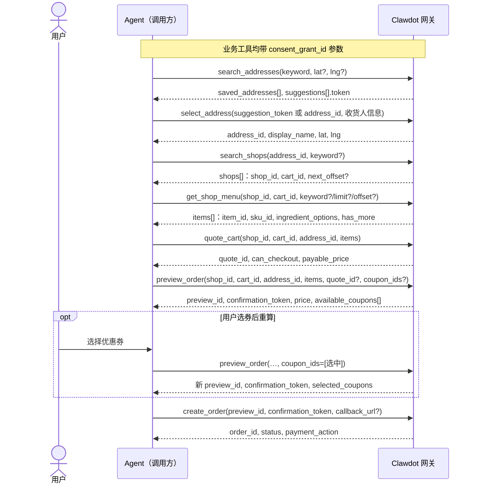
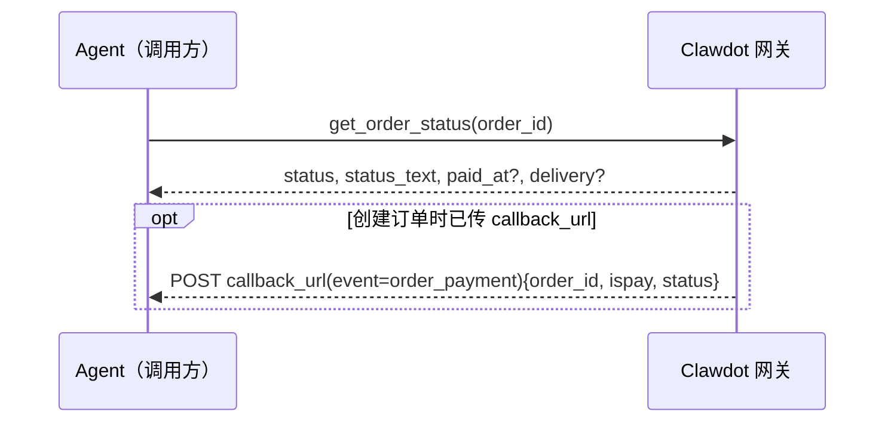

完成一笔订单是一条**有状态的链路**：每一步返回的 ID 必须原样回传给下一步，不可自造或跨链路混用。本页用 MCP 工具串起整条链路；每个工具的完整字段表见对应的 [工具参考](/mcp/shops/search)。

<Note>
  本页示例均为 **MCP 工具调用**：工具名 + JSON 参数，除绑定类工具外每个业务工具都带 `consent_grant_id` 参数（用户授权，`cg_` 前缀）。Agent 身份则在连接层用 `Authorization: Bearer clw_...` 请求头携带，见下方「认证」小节。
</Note>

## 概览

下单链路按固定顺序串起这些 MCP 工具：**先备好收货地址**（`search_addresses` → `select_address`），再 `search_shops` 选店、`get_shop_menu` 选品，然后 `quote_cart` 算价、`preview_order` 预览拿到下单令牌、`create_order` 正式下单。先定地址、再按地址搜可送达的店，下游工具因此都拿得到配送坐标。跨步 ID 由网关签发、原样回传。

<Note>
  **免密支付签约是账户级的一次性前置**（见下文「免密支付签约」），不属于每一单的链路、也不绑定某笔订单——不要把它当成下单的最后一步。
</Note>



链路的 ID 传递关系：

| 这一步 | 产出 | 被谁消费 |
|---|---|---|
| `search_addresses` | `suggestions[].token` / `saved_addresses[].address_id` | `select_address` |
| `select_address` | `address_id` | `search_shops` / `quote_cart` / `preview_order` |
| `search_shops` | `shop_id` + `cart_id` | `get_shop_menu` / `quote_cart` / `preview_order` |
| `get_shop_menu` | `item_id` / `sku_id` / `ingredient_option_ids` | `quote_cart` / `preview_order` 的 `items` |
| `quote_cart` | `quote_id` | `preview_order`（可选，传入则校验报价上下文）|
| `preview_order` | `preview_id` + `confirmation_token` | `create_order` |
| `create_order` | `order_id` + `payment_action` | `get_order_status` |

<Warning>
  所有金额字段单位为**分（整数）**，不是元。例如 `payable_price: 1500` 表示 ¥15.00。
</Warning>

## 完整链路

<Steps>

### 备好收货地址

```python
search_addresses(consent_grant_id="cg_...", keyword="光谷世界城", lat=30.5, lng=114.4)
# → suggestions[].token（一次性，用于 select_address）+ saved_addresses

select_address(
    consent_grant_id="cg_...",
    contact_name="张三",
    contact_phone="13800138000",
    suggestion_token="...",     # 来自 search_addresses 的某条 suggestion
    address_detail="3 号楼 101",
)
```

先定下"送到哪里"。`search_addresses` 按关键词搜 POI（传 `lat`/`lng` 时还会标注 `distance_meters` 与 `nearest_address_id`）；`select_address` 把一条 `suggestion_token` 落库为收货地址、返回 `address_id`。已有地址时，`search_addresses` 返回的 `saved_addresses[].address_id` 可直接复用，跳过 `select_address`。这个 `address_id` 既用于下一步搜店，也用于后续算价 / 预览。

<Note>
  用 `suggestion_token` 新建地址时，`contact_name` / `contact_phone` / `address_detail` 为必填。地址三件套：[搜索地址](/mcp/addresses/search) · [选择/登记地址](/mcp/addresses/select) · [更新地址](/mcp/addresses/update)。
</Note>

### 搜索 / 浏览商家

```python
search_shops(
    consent_grant_id="cg_...",
    address_id="addr_...",  # 上一步的收货地址，决定搜索/配送位置；或直接传 lat/lng（GCJ-02）
    keyword="生椰拿铁",       # 省略则浏览该地址附近店铺（≤20）
)
```

按收货地址搜可送达的店铺。不传 `keyword` 为**浏览模式**，返回附近至多 20 家店铺（含距离、评分、配送费、起送价等决策字段）；传 `keyword` 为**精确搜索**（约 5 家），可传店名、品类或具体商品名，命中的店铺带 `matched_items` 预览。

每个结果都附带 `shop_id` 与 `cart_id`：`cart_id` 已封装该店铺与本次配送坐标，是后续 `get_shop_menu` / `quote_cart` / `preview_order` 的入口，**原样回传**即可，下游工具因此免传经纬度。

<Note>
  完整字段见 [搜索店铺](/mcp/shops/search)。`matched_items` 仅供展示、不带 ID；下单必须用 `get_shop_menu` 返回的 `item_id` / `sku_id`。`address_id` 与 `lat`/`lng` 二者至少给一个，否则报 `COORDS_REQUIRED`。
</Note>

### 查看店铺菜单

```python
get_shop_menu(
    consent_grant_id="cg_...",
    shop_id="shop_...",   # 原样来自 search_shops
    cart_id="cart_...",   # 原样来自 search_shops
    keyword="拿铁",        # 可选：只返回名称/分类/描述命中的商品
    limit=20, offset=0,    # 可选：分页，按 next_offset 翻页直到 has_more=false
)
```

返回菜单项，每项含可下单的 `item_id` / `sku_id`，以及规格 / 属性 / 加料的可选项 `ingredient_option_ids`。菜单可能很大（100+ 项），用 `keyword` 或 `limit`/`offset` 渐进披露。同一 `cart_id` 上早前取到的 ID 仍可用于下单。

<Note>
  规格 / 属性 / 加料体系说明见 [商品规格说明](/gateway/item-specs)；完整字段见 [店铺菜单](/mcp/shops/detail)。
</Note>

### 购物车算价

```python
quote_cart(
    consent_grant_id="cg_...",
    shop_id="shop_...",
    cart_id="cart_...",
    address_id="addr_...",
    items=[{"item_id": "...", "sku_id": "...", "quantity": 1, "ingredient_option_ids": []}],
)
```

对选好的商品算价，返回 `quote_id`（报价上下文）、`can_checkout` 与 `payable_price` 等价格明细。`quote_id` 可传给 `preview_order` 以校验报价上下文。

<Note>
  完整字段见 [购物车算价](/mcp/cart/quote)。
</Note>

### 预览订单

```python
preview_order(
    consent_grant_id="cg_...",
    shop_id="shop_...",
    cart_id="cart_...",
    address_id="addr_...",
    items=[{"item_id": "...", "sku_id": "...", "quantity": 1}],
    quote_id="...",          # 可选，传入则校验报价上下文
    coupon_ids=None,         # 三态：不传=自动选最优券；[]=不用券；["cpn_..."]=指定券
    order_remark="放门口",
)
```

校验店铺 / 地址 / 商品并应用优惠券，返回最终价格（`price.payable_price` 等，单位分）、当前订单可用的 `available_coupons[]`，以及下单用的 `preview_id` + `confirmation_token`（同一次预览产出，须配对使用，有效期约 10 分钟）。账户级可用券另见 `list_coupons`；当前订单实际可用券以本步返回的 `available_coupons` 为准——用户选券后用其 `coupon_id` 重新 `preview_order(coupon_ids=[…])` 即可重算。

<Note>
  完整字段与 `coupon_ids` 三态说明见 [预览订单](/mcp/orders/preview)。
</Note>

### 创建订单

```python
create_order(
    consent_grant_id="cg_...",
    preview_id="prv_...",            # 来自同一次 preview_order
    confirmation_token="cf_...",     # 来自同一次 preview_order
    payment_method=None,
    callback_url="https://your-app.example.com/clawdot/callback",  # 可选：支付状态回调
)
```

用同一次预览的 `preview_id` + `confirmation_token` 正式下单，返回平台订单 `order_id`、`status` 与（需支付时的）`payment_action`。

<Note>
  本工具以 `confirmation_token` 为幂等键；同一令牌只能下一单，再次下单需重新预览取新令牌。可选传 `callback_url`，网关会轮询订单状态并在脱离未支付态时回调（见下方「查询订单与支付结果」）；不传则自行轮询 `get_order_status`。完整字段、`status` 与回调 `ispay` 枚举见 [创建订单](/mcp/orders/create)。
</Note>

</Steps>

## 免密支付签约（账户级，一次性）

免密签约让用户授权**免密支付**：签约一次，后续免密支付类订单即可自动扣款。它是**账户级、一次性的前置设置**，**不绑定某一笔订单、也不是每单都要做**——所以独立于上面的下单链路。建议在需要免密支付前先用 `get_sign_status` 查是否已签约，未签约再发起：

```python
get_sign_action(
    consent_grant_id="cg_...",
    return_url="https://your-app.example.com/sign/callback",
)
```

返回一个 `action`：`action_type` 为 `open_h5` 时，把用户引导到 `action.action_url`（H5 签约页）完成签约，完成后浏览器跳回 `return_url`；为 `none` 时表示已签约。随后用 `get_sign_status` 轮询签约结果。

<Note>
  完整字段见 [发起免密签约](/mcp/payment/sign-action) · [查询签约状态](/mcp/payment/sign-status)。
</Note>

## 查询订单与支付结果

下单后用 `get_order_status` 主动查询订单当前状态与详情：

```python
get_order_status(consent_grant_id="cg_...", order_id="ord_...")
```

如果 `create_order` 时传了 `callback_url`，网关还会在订单脱离未支付态时主动 POST 一次支付结果回调（`event=order_payment`），无需一直轮询。两条路径如下：



回调体含 6 个键：`event`、`order_id`、`ispay`、`status`、`status_text`、`consent_grant_id`。其中 `ispay` 枚举：`success`（进入已支付流水）、`closed`（取消或关闭）、`timeout`（约 15 分钟轮询窗超时仍未支付）、`unknown`（授权被撤销/轮换或订单引用失效）。

<Note>
  完整字段见 [查询订单](/mcp/orders/get)；`status` 与回调 `ispay` 枚举见 [创建订单](/mcp/orders/create)。
</Note>

## 认证

每个工具调用都需要双层认证：

- **Agent 身份（API Key）**：连接 MCP 时通过 `Authorization: Bearer clw_...` 请求头携带，每个请求都要带。在控制台 [`https://console.hicaspian.com/agents`](https://console.hicaspian.com/agents) 创建 Agent 时生成。
- **用户授权 consent grant**（标识已授权用户，`cg_` 前缀）：作为每个业务工具的 `consent_grant_id` 参数传入（不走请求头）。绑定类工具 `request_user_bind` / `verify_user_bind` 例外——它们是拿授权的入口，本身不传 `consent_grant_id`。

详见 [认证机制](/gateway/authentication)。错误统一返回 `{"error": {"code", "message"}}`，见 [错误处理](/gateway/error-handling)。
