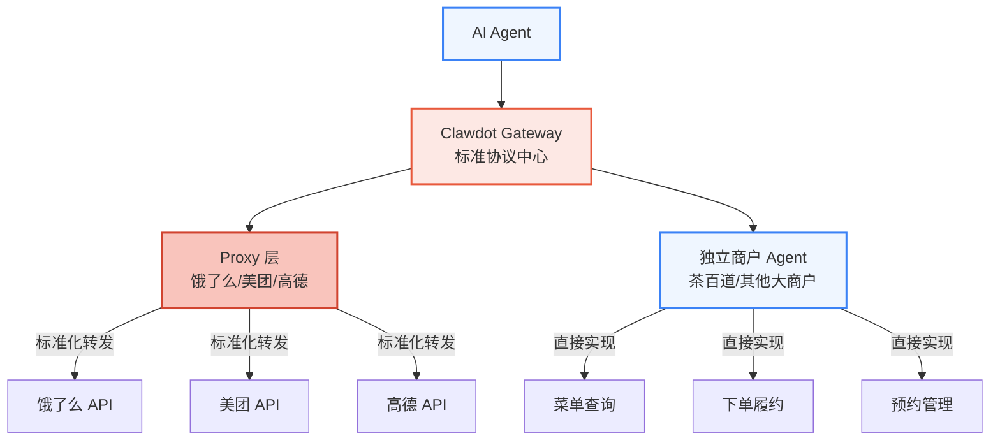
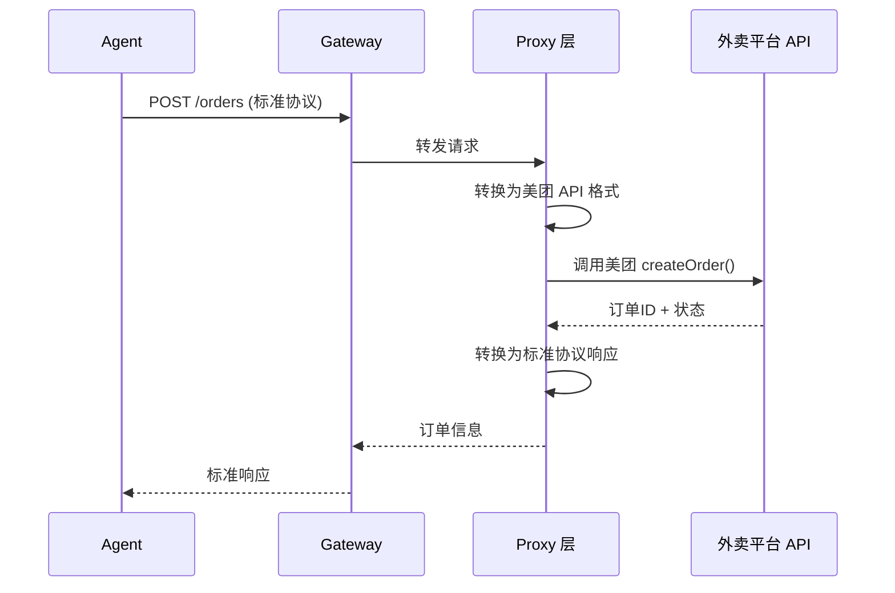
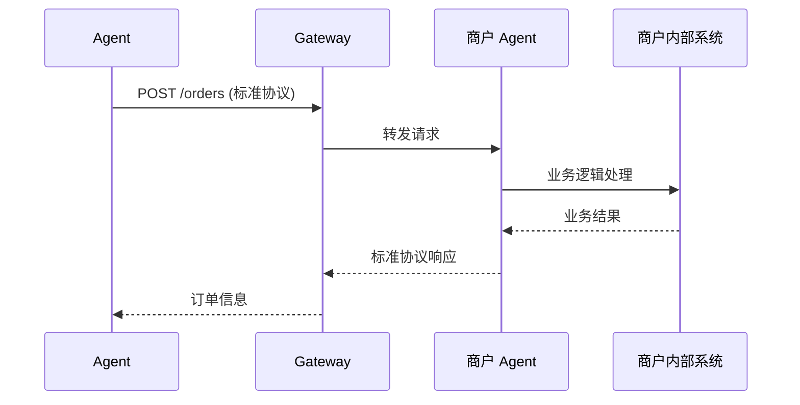
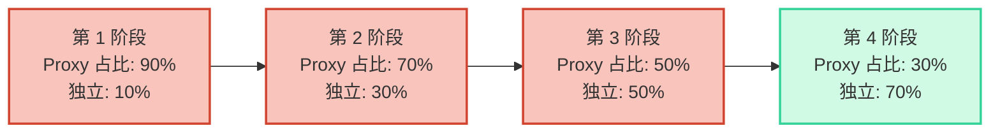

## 什么是标准协议

Clawdot Gateway 定义了一套标准化协议，所有接入的商户服务都必须遵循。无论是通过 Clawdot Proxy 代理的饿了么/美团商户，还是自建的大型商户 Agent，都需要使用这套统一的接口规范。这确保了 AI Agent 可以用一套逻辑与所有商户互动。



## 五大协议类别

Gateway 标准协议包含 5 个核心功能类别。目前已实现菜单查询和下单履约，其他功能类别处于规划阶段。

<Tabs>
  <Tab title="菜单查询 (Menu Query)">
    **状态：** ✅ 已实现

    商户菜单的浏览、搜索、查询接口。Agent 通过此协议了解商户的商品、规格、属性、加料等完整信息。

    **标准接口：**
    - `GET /menu` — 获取完整菜单（分类、商品、规格、属性、加料）
    - `GET /menu/search` — 搜索商品（关键词、品类、价格范围）
    - `GET /menu/item/{item_id}` — 获取单个商品详情

    **标准响应格式：**
    ```json
    {
      "categories": [
        {
          "id": "cat_001",
          "name": "热饮",
          "items": [
            {
              "id": "item_001",
              "name": "美式咖啡",
              "price": 12.00,
              "description": "...",
              "specs": [
                {
                  "id": "spec_001",
                  "name": "温度",
                  "type": "single",
                  "required": true,
                  "options": ["热", "冰"]
                }
              ],
              "attributes": [...],
              "addons": [...]
            }
          ]
        }
      ]
    }
    ```
  </Tab>

  <Tab title="下单履约 (Order Fulfillment)">
    **状态：** ✅ 已实现

    订单的预览、创建、履约跟踪接口。Agent 通过此协议完成用户的下单需求。

    **标准接口：**
    - `POST /orders/preview` — 订单预览（价格计算、优惠券应用）
    - `POST /orders` — 创建订单
    - `GET /orders/{order_id}` — 查询订单状态
    - `PATCH /orders/{order_id}` — 取消订单

    **标准响应格式：**
    ```json
    {
      "order_id": "ord_12345",
      "status": "created",
      "items": [
        {
          "item_id": "item_001",
          "quantity": 2,
          "selected_specs": {...}
        }
      ],
      "subtotal": 24.00,
      "discounts": 2.00,
      "delivery_fee": 5.00,
      "total": 27.00,
      "estimated_delivery_time": "30-40min"
    }
    ```
  </Tab>

  <Tab title="预约管理 (Booking & Scheduling)">
    **状态：** 📅 规划中

    支持商户的预约、排号、时间段预订等功能。适用于需要提前预约的服务型商户（如餐厅、美发店等）。

    **计划接口：**
    - `GET /availability` — 查询可用时间段
    - `POST /bookings` — 创建预约
    - `GET /bookings/{booking_id}` — 查询预约详情
    - `PATCH /bookings/{booking_id}` — 修改预约

    **使用场景：**
    - 餐厅预订座位
    - 美发店预约服务时间
    - 康养中心预约课程
  </Tab>

  <Tab title="评价反馈 (Ratings & Reviews)">
    **状态：** 📅 规划中

    用户对商户、商品、服务的评价和反馈接口。支持商户获取用户满意度反馈。

    **计划接口：**
    - `POST /reviews` — 提交评价
    - `GET /reviews/{order_id}` — 查询订单评价
    - `PATCH /reviews/{review_id}` — 编辑评价
    - `POST /complaints` — 投诉举报

    **评价维度：**
    - 商品满意度
    - 配送体验
    - 商户服务
    - 异常处理反馈
  </Tab>

  <Tab title="配送追踪 (Delivery Tracking)">
    **状态：** 📅 规划中

    订单配送过程中的实时追踪接口。支持获取配送员信息、位置更新、预计送达时间等。

    **计划接口：**
    - `GET /deliveries/{order_id}` — 获取配送信息
    - `GET /deliveries/{order_id}/tracking` — 实时位置追踪
    - `POST /deliveries/{order_id}/contact` — 联系配送员

    **使用场景：**
    - 用户查询配送进度
    - Agent 为用户更新配送状态
    - 异常订单处理
  </Tab>
</Tabs>

## 协议的两种实现方式

### 1. Proxy 层（冷启动阶段）

**角色：** Clawdot 为饿了么/美团/高德等平台的商户提供代理服务。

**特点：**
- 商户无需改动，Clawdot Proxy 负责将 Agent 的标准协议请求转换为平台 API 调用
- 数据完整保留，所有交互数据存储在 Gateway 数据库中
- Proxy 逐步学习和优化转换策略

**流程：**


### 2. 独立商户 Agent（独立接入）

**角色：** 大型商户（如茶百道、其他连锁品牌）自建 Agent，直接实现标准协议。

**特点：**
- 商户完全掌控自己的业务逻辑
- 直接实现标准协议的各个接口
- 与 AI Agent 进行深度集成

**要求：**
- 实现标准协议的所有 5 大功能类别
- 通过 Gateway 的协议验证和安全审核
- 提供稳定可靠的服务（SLA 承诺）

**流程：**


## 占比演进策略

Gateway 的商户构成会随着平台发展而逐步变化：



**策略说明：**
- **冷启动期（Phase 1-2）** — Proxy 占绝对多数，快速覆盖大量商户，验证 Agent 模式可行性
- **增长期（Phase 3）** — Proxy 和独立 Agent 各占一半，重点吸引大型连锁品牌自建
- **成熟期（Phase 4）** — 独立 Agent 成为主体，形成开放生态，Proxy 作为补充

## 标准协议的核心价值

| 价值 | 说明 |
|-----|------|
| **统一 Agent 逻辑** | 无论商户来自哪个平台，Agent 只需调用一套协议 |
| **降低接入成本** | 新商户接入时，只需实现标准协议而非适配多个平台 API |
| **数据完整性** | Gateway 完整记录所有交互数据，便于分析优化 |
| **生态开放性** | 为未来的生态扩展（如第三方服务商）奠定基础 |
| **风险管控** | 集中化协议验证，降低接入商户的不规范风险 |

## 下一步

<Columns cols={2}>
  <Card title="商户接入" icon="handshake" href="/gateway/merchant-onboarding">
    了解如何接入 Gateway 和实现标准协议。
  </Card>
  <Card title="API 参考" icon="code" href="/api-reference/introduction">
    查看详细的 API 文档和代码示例。
  </Card>
</Columns>
