Clawdot Gateway 在 REST API 之外同时提供 MCP (Model Context Protocol) 接口，使用 **Streamable HTTP** 传输协议，底层复用与 REST API 相同的服务层。MCP 暴露 **18 个工具**，每个对应一个 REST 端点。

## 连接方式

**Endpoint：**

```
http://eleme-gateway.hicaspian.com/mcp/v1
```

<Note>
  网关把 MCP 应用挂载在 `/mcp` 下（`app.mount("/mcp", create_mcp_app())`），FastMCP 的内部路由是版本化的（`streamable_http_path="/v1"`），所以对外公开的端点是 `/mcp/v1`，**不是** `/mcp/mcp`。
</Note>

## 认证

两层认证与 REST API 一致——**Agent 身份**走连接层，**用户授权**走工具参数：

<Tabs>
  <Tab title="Agent 身份（API Key）">
    在**连接层**通过 `Authorization: Bearer clw_...` 请求头传递，由 `MCPAuthMiddleware` 校验，每个 MCP 请求都需要。

    ```
    Authorization: Bearer clw_<32位hex>
    ```

    在 Portal（[Clawdot Portal](http://console.hicaspian.com/agents)）创建 Agent 时生成。
  </Tab>
  <Tab title="用户授权（consent grant）">
    作为**每个工具的 `consent_grant_id` 参数**传入（`cg_` 前缀），不走请求头。

    ```json
    {
      "consent_grant_id": "cg_...",
      "shop_id": "...",
      "...": "..."
    }
    ```

    绑定类工具（`request_user_bind` / `verify_user_bind`）除外——它们是获取授权的入口，只需 Agent 身份，本身不传 `consent_grant_id`。
  </Tab>
</Tabs>

<Warning>
  `consent_grant_id` 是 MCP 工具的**参数**，不是请求头。REST API 才用 `X-Consent-Grant-Id` 请求头。详见 [认证机制](/gateway/authentication)。
</Warning>

## 与 REST API 的关系

MCP 工具与 REST 端点一一对应，共享同一套服务层与契约：

- **参数：** 除 `consent_grant_id` 外，工具参数与对应 REST 端点的请求体字段一致（同名、同类型）。
- **返回：** 与对应 REST 端点的响应结构一致。
- **错误：** 统一 `{"error": {"code", "message"}}` 格式，详见 [错误处理](/gateway/error-handling)。

<Warning>
  所有金额字段单位为**分（整数）**，不是元。例如 `1500` 表示 ¥15.00。
</Warning>

## 工具列表

MCP Server 暴露 **18 个工具**，按功能分组如下。每个工具链接到其工具页，并标注对应的 REST 端点。

### 授权

| MCP 工具 | 对应 REST 端点 | 说明 |
|----------|----------------|------|
| [`request_user_bind`](/mcp/user/bind-request) | `POST /auth/bind/request` | 发起绑定（仅需 Agent 身份）|
| [`verify_user_bind`](/mcp/user/bind-verify) | `POST /auth/bind/verify` | 确认绑定（仅需 Agent 身份）|
| [`get_user_auth_status`](/mcp/user/auth-status) | `GET /auth/status` | 查询授权状态 |
| [`revoke_user_bind`](/mcp/user/unbind) | `POST /auth/unbind` | 解除绑定 |
| [`get_homepage_url`](/mcp/user/homepage-url) | `POST /auth/homepage-url` | 获取主页链接 |

### 店铺

| MCP 工具 | 对应 REST 端点 | 说明 |
|----------|----------------|------|
| [`search_shops`](/mcp/shops/search) | `POST /shops/search` | 搜索 / 浏览商家 |
| [`get_shop_menu`](/mcp/shops/detail) | `POST /shops/menu` | 商家菜单 |
| [`get_shop_share_url`](/mcp/shops/share-url) | `POST /shops/share-url` | 商家分享链接 |

### 地址

| MCP 工具 | 对应 REST 端点 | 说明 |
|----------|----------------|------|
| [`search_addresses`](/mcp/addresses/search) | `POST /addresses/search` | 搜索 / 列出地址 |
| [`select_address`](/mcp/addresses/select) | `POST /addresses/select` | 选择 / 保存地址 |
| [`update_address`](/mcp/addresses/update) | `POST /addresses/update` | 编辑地址 |

### 下单

| MCP 工具 | 对应 REST 端点 | 说明 |
|----------|----------------|------|
| [`quote_cart`](/mcp/cart/quote) | `POST /cart/quote` | 购物车算价 |
| [`list_coupons`](/mcp/coupons/list) | `POST /coupons/list` | 优惠券列表 |
| [`preview_order`](/mcp/orders/preview) | `POST /orders/preview` | 预览订单 |
| [`create_order`](/mcp/orders/create) | `POST /orders/create` | 创建订单 |
| [`get_order_status`](/mcp/orders/get) | `GET /orders/{order_id}` | 查询订单 |

### 支付

| MCP 工具 | 对应 REST 端点 | 说明 |
|----------|----------------|------|
| [`get_sign_action`](/mcp/payment/sign-action) | `POST /payment/sign-action` | 获取免密签约动作 |
| [`get_sign_status`](/mcp/payment/sign-status) | `GET /payment/sign-status` | 查询签约状态 |

## 下单链路

从搜索到下单的工具调用顺序，每一步的输出喂给下一步：

```mermaid
flowchart LR
  A["search_shops"] -->|"shop_id + cart_id"| B["get_shop_menu"]
  B -->|"选品"| C["quote_cart"]
  C -->|"quote_id"| D["select_address"]
  D -->|"address_id"| E["preview_order"]
  E -->|"preview_id +<br/>confirmation_token"| F["create_order"]
  F -->|"order_id"| G["get_sign_action"]
  G -->|"免密签约"| H["完成支付"]
```



1. `search_shops` → 得 `shop_id` + `cart_id`（`cart_id` 已封装配送坐标）
2. `get_shop_menu` → 选品，拿到 `item_id` / `sku_id`
3. `quote_cart` → 算价得 `quote_id`
4. `select_address` → 得 `address_id`
5. `preview_order` → 得 `preview_id` + `confirmation_token`
6. `create_order` → 得 `order_id`
7. `get_sign_action` → 免密签约完成支付

各工具的完整参数与返回值见对应工具页。
