Clawdot Gateway 通过 **MCP (Model Context Protocol)** 对外提供 Agent 接口，使用 **Streamable HTTP** 传输协议。MCP Server 暴露 **18 个工具**，覆盖从用户绑定授权、搜索商家、加购算价，到预览下单、免密支付的完整外卖链路。本页介绍怎么连、怎么认证、有哪些工具、怎么按顺序把它们串成一单。

## 连接方式

**Endpoint：**

```
https://eleme-gateway.hicaspian.com/mcp/v1
```

<Note>
  网关把 MCP 应用挂载在 `/mcp` 下（`app.mount("/mcp", create_mcp_app())`），FastMCP 的内部路由是版本化的（`streamable_http_path="/v1"`），所以对外公开的端点是 `/mcp/v1`，**不是** `/mcp/mcp`。
</Note>

## 认证

两层认证——**Agent 身份**走连接层，**用户授权**走工具参数：

<Tabs>
  <Tab title="Agent 身份（API Key）">
    在**连接层**通过 `Authorization: Bearer clw_...` 请求头传递，由 `MCPAuthMiddleware` 校验，每个 MCP 请求都需要。

    ```
    Authorization: Bearer clw_<32位hex>
    ```

    在控制台（[console.hicaspian.com/agents](https://console.hicaspian.com/agents)）创建 Agent 时生成。
  </Tab>
  <Tab title="用户授权（consent grant）">
    作为**每个工具的 `consent_grant_id` 参数**传入（`cg_` 前缀），不走请求头。

    ```json
    {
      "consent_grant_id": "cg_...",
      "shop_id": "...",
      "...": "..."
    }
    ```

    绑定类工具（`request_user_bind` / `verify_user_bind`）除外——它们是获取授权的入口，只需 Agent 身份，本身不传 `consent_grant_id`。
  </Tab>
</Tabs>

<Warning>
  `consent_grant_id` 是业务工具的**参数**，作为 JSON 入参传入，不是请求头。详见 [认证机制](/gateway/authentication)。
</Warning>

## 工具契约

所有工具遵循同一套调用约定：

- **参数：** 以 JSON 对象传入。除绑定类工具外，业务工具都带 `consent_grant_id`；跨步骤的 ID（`cart_id` / `quote_id` / `preview_id` / `confirmation_token` 等）由网关签发，须**原样回传**，不可自造或跨链路混用。
- **返回：** 结构化 JSON，每个工具的完整字段见对应工具页。
- **错误：** 统一 `{"error": {"code", "message"}}` 格式，详见 [错误处理](/gateway/error-handling)。

<Warning>
  所有金额字段单位为**分（整数）**，不是元。例如 `1500` 表示 ¥15.00。
</Warning>

## 工具列表

MCP Server 暴露 **18 个工具**，按功能分组如下。每个工具链接到其工具页（含完整参数与返回字段）。

### 授权

| MCP 工具 | 说明 |
|----------|------|
| [`request_user_bind`](/mcp/user/bind-request) | 发起绑定（SMS / H5，仅需 Agent 身份）|
| [`verify_user_bind`](/mcp/user/bind-verify) | 确认绑定，成功铸造 `consent_grant_id`（仅需 Agent 身份）|
| [`get_user_auth_status`](/mcp/user/auth-status) | 查询授权状态 |
| [`revoke_user_bind`](/mcp/user/unbind) | 解除绑定（旧 `consent_grant_id` 即时失效）|
| [`get_homepage_url`](/mcp/user/homepage-url) | 获取淘闪主页链接 |

### 店铺

| MCP 工具 | 说明 |
|----------|------|
| [`search_shops`](/mcp/shops/search) | 搜索 / 浏览商家 |
| [`get_shop_menu`](/mcp/shops/detail) | 商家菜单 |
| [`get_shop_share_url`](/mcp/shops/share-url) | 商家分享链接 |

### 地址

| MCP 工具 | 说明 |
|----------|------|
| [`search_addresses`](/mcp/addresses/search) | 搜索 / 列出地址 |
| [`select_address`](/mcp/addresses/select) | 选择 / 保存地址 |
| [`update_address`](/mcp/addresses/update) | 编辑地址 |

### 下单

| MCP 工具 | 说明 |
|----------|------|
| [`quote_cart`](/mcp/cart/quote) | 购物车算价 |
| [`list_coupons`](/mcp/coupons/list) | 优惠券列表 |
| [`preview_order`](/mcp/orders/preview) | 预览订单 |
| [`create_order`](/mcp/orders/create) | 创建订单 |
| [`get_order_status`](/mcp/orders/get) | 查询订单 |

### 支付

| MCP 工具 | 说明 |
|----------|------|
| [`get_sign_action`](/mcp/payment/sign-action) | 获取免密签约动作 |
| [`get_sign_status`](/mcp/payment/sign-status) | 查询签约状态 |

## 下单链路

从搜索到下单的工具调用顺序，每一步的输出喂给下一步：

```mermaid
flowchart LR
  A["search_shops"] -->|"shop_id + cart_id"| B["get_shop_menu"]
  B -->|"选品"| C["quote_cart"]
  C -->|"quote_id"| D["select_address"]
  D -->|"address_id"| E["preview_order"]
  E -->|"preview_id +<br/>confirmation_token"| F["create_order"]
  F -->|"order_id"| G["get_sign_action"]
  G -->|"免密签约"| H["完成支付"]
```



1. `search_shops` → 得 `shop_id` + `cart_id`（`cart_id` 已封装配送坐标）
2. `get_shop_menu` → 选品，拿到 `item_id` / `sku_id`
3. `quote_cart` → 算价得 `quote_id`
4. `select_address` → 得 `address_id`
5. `preview_order` → 得 `preview_id` + `confirmation_token`
6. `create_order` → 得 `order_id`
7. `get_sign_action` → 免密签约完成支付

各工具的完整参数与返回值见对应工具页。
