Clawdot Gateway 通过 **MCP (Model Context Protocol)** 对外提供 Agent 接口，使用 **Streamable HTTP** 传输协议。MCP Server 暴露 **18 个工具**，覆盖从用户绑定授权、搜索商家、加购算价，到预览下单、免密支付的完整外卖链路。本页介绍怎么连、怎么认证、有哪些工具、怎么按顺序把它们串成一单。

## 连接方式

**Endpoint：**

```
https://eleme-gateway.hicaspian.com/mcp/v1
```

<Note>
  网关把 MCP 应用挂载在 `/mcp` 下（`app.mount("/mcp", create_mcp_app())`），FastMCP 的内部路由是版本化的（`streamable_http_path="/v1"`），所以对外公开的端点是 `/mcp/v1`，**不是** `/mcp/mcp`。
</Note>

## 认证

两层认证——**Agent 身份**走连接层，**用户授权**走工具参数：

<Tabs>
  <Tab title="Agent 身份（API Key）">
    在**连接层**通过 `Authorization: Bearer clw_...` 请求头传递，由 `MCPAuthMiddleware` 校验，每个 MCP 请求都需要。

    ```
    Authorization: Bearer clw_<32位hex>
    ```

    在控制台（[console.hicaspian.com/agents](https://console.hicaspian.com/agents)）创建 Agent 时生成。
  </Tab>
  <Tab title="用户授权（consent grant）">
    作为**每个工具的 `consent_grant_id` 参数**传入（`cg_` 前缀），不走请求头。

    ```json
    {
      "consent_grant_id": "cg_...",
      "shop_id": "...",
      "...": "..."
    }
    ```

    绑定类工具（`request_user_bind` / `verify_user_bind`）除外——它们是获取授权的入口，只需 Agent 身份，本身不传 `consent_grant_id`。
  </Tab>
</Tabs>

<Warning>
  `consent_grant_id` 是业务工具的**参数**，作为 JSON 入参传入，不是请求头。详见 [认证机制](/gateway/authentication)。
</Warning>

## 工具契约

所有工具遵循同一套调用约定：

- **参数：** 以 JSON 对象传入。除绑定类工具外，业务工具都带 `consent_grant_id`；跨步骤的 ID（`cart_id` / `quote_id` / `preview_id` / `confirmation_token` 等）由网关签发，须**原样回传**，不可自造或跨链路混用。
- **返回：** 结构化 JSON，每个工具的完整字段见对应工具页。
- **错误：** 统一 `{"error": {"code", "message"}}` 格式，详见 [错误处理](/gateway/error-handling)。

<Warning>
  所有金额字段单位为**分（整数）**，不是元。例如 `1500` 表示 ¥15.00。
</Warning>

## 多语言

平台可按语言返回内容：店铺名、商品名、规格与加料、标签、订单状态、错误提示等展示文案，都会按所选语言返回。枚举 `zh`（中文，默认）/ `en` / `ja` / `ko` / `ru` / `ms` / `es`，传其它值返回 400。如需同时保留中文原文，见下方「双语响应」。

设定方式两种，按需选一种：

- **绑定时设定：** `request_user_bind` 传 `lang`，该用户之后所有调用都用这个语言，不必每次传。
- **单次指定：** 在支持的工具上传 `lang`，只影响该次调用。

支持 `lang` 的工具：`search_addresses`、`search_shops`、`get_shop_info`、`get_shop_menu`、`get_item_options`、`get_item_description`、`quote_cart`、`list_coupons`、`preview_order`、`create_order`、`get_order_status`、`list_orders`。

`create_order` 的 `callback_url` 回调里，`status_text` 也按绑定时设定的语言返回。

<Note>
  **接入前请注意三点**

  1. **商品描述类内容首次可能仍是中文**：商品描述、推荐理由，以及地址搜索结果第 11 条起的地址，首次查询可能是中文，稍后再查即为所选语言。按拿到的内容直接展示即可。
  2. **响应里出现 `localization: "degraded"` 时**，表示翻译服务暂时不可用，本次内容可能含中文。这是临时状态，重试即可恢复；正常情况下没有这个字段。
  3. **以下页面固定为中文，不受 `lang` 影响**：支付页、订单详情页（`detail_url` 与支付链接打开的页面）、骑手端。向外语用户提供这些链接时请一并说明。
</Note>

收货人姓名（`contact_name`）不翻译，原样保存与展示，以便与配送信息一致。姓名上限 12 个字符，超出返回 400；外文姓名建议用「名 + 姓首字母」，如 Alexander Petrov → Alexander P。

## 双语响应

需要同时保留中文原文时（比如给人工核对商品名），传 `include_chinese=true`（布尔值，默认 `false`）：

- **默认关闭**：不传 `include_chinese`，或传 `false`，响应里不会出现 `<key>_zh`；只有显式传 `true` 才返回中文原文。
- **搭配 `lang` 一起传**：`lang` 传目标语言（如 `en`），`include_chinese` 传 `true`，两个参数一起生效。
- **`lang` 是中文（`zh`）或不传 `lang` 时，`include_chinese` 不起作用**，不会报错——中文响应本来就是中文，不需要再附一份。
- 生效范围与单值 `lang` 一致：可以在 `request_user_bind` 绑定时设定，也可以在支持 `lang` 的工具里逐次指定。**绑定时设定的 `include_chinese`，只在本次调用完全不传 `lang`、也不传 `include_chinese` 时才生效**；本次调用只要传了 `lang`，`include_chinese` 就按本次传的值处理（不传按 `false`），不会继续沿用绑定时的设定——单次调用要双语，请把 `lang` 和 `include_chinese` 一起传，否则本次按不返回中文处理。

传 `include_chinese=true` 时，响应里每个**翻译成功**的字段，会在原字段旁多出一个 `<key>_zh`，值是这个字段对应的中文原文：

```json
{
  "shop": {
    "shop_id": "shop_xxx",
    "name": "Zhang Liang Malatang (Xixi Beiyuan)",
    "name_zh": "张亮麻辣烫(西溪北苑店)",
    "available": true
  },
  "items": [{
    "item_id": "item_xxx",
    "name": "Deluxe Single Meat Roll Set",
    "name_zh": "豪华单人肉卷套餐",
    "category_name": "Value Sets",
    "category_name_zh": "特惠套餐",
    "price": 5588,
    "image_url": "https://cube.elemecdn.com/...",
    "sku_options": [{
      "sku_id": "sku_xxx",
      "name": "Beef Roll Set",
      "name_zh": "肥牛卷套餐",
      "price": 5588
    }],
    "tags": ["Milk Tea", "Dessert"],
    "tags_zh": ["奶茶", "甜品"]
  }]
}
```

`<key>_zh` 的规则：

- **类型与原字段完全一致**：字符串对字符串；字符串数组对字符串数组，且顺序、长度都相同（如上面的 `tags` / `tags_zh`）。
- **只在这个字段本次翻译成功时才出现**。没有 `_zh` 就说明该字段这次没翻译成功，此时原字段本身是中文——可以逐字段判断翻译是否成功，不用看响应里的其他状态字段。
- **只覆盖店铺 / 商品 / 规格 / 加料 / 标签这类商家信息**。平台自己生成的提示语（如营业时间提示、起送差额提示）只返回一种语言，没有 `_zh`。
- `item_id` / `sku_id` / `price` / `image_url`、坐标、时间戳这类字段不分语言，没有 `_zh` 版本。
- `delivery_fee_text`（配送费文字说明，如"配送¥2"）是例外：即使翻译成功，也不会有 `delivery_fee_text_zh`。配送费金额本身在 `delivery_fee` 字段（数字），不受语言影响。

还原成单一语言，用下面这段通用函数即可，不需要认识任何具体字段名：

```javascript
// 只要目标语言：去掉所有 _zh
function stripZh(node) {
  if (Array.isArray(node)) return node.map(stripZh);
  if (node && typeof node === "object") {
    const out = {};
    for (const k of Object.keys(node)) {
      if (k.endsWith("_zh")) continue;
      out[k] = stripZh(node[k]);
    }
    return out;
  }
  return node;
}

// 只要中文：有 _zh 就用 _zh，没有 _zh 说明原字段本来就是中文
function preferZh(node) {
  if (Array.isArray(node)) return node.map(preferZh);
  if (node && typeof node === "object") {
    const out = {};
    for (const k of Object.keys(node)) {
      if (k.endsWith("_zh")) continue;
      const zhKey = k + "_zh";
      out[k] = preferZh(zhKey in node ? node[zhKey] : node[k]);
    }
    return out;
  }
  return node;
}
```

## 工具列表

MCP Server 暴露 **18 个工具**，按功能分组如下。每个工具链接到其工具页（含完整参数与返回字段）。

### 授权

| MCP 工具 | 说明 |
|----------|------|
| [`request_user_bind`](/mcp/user/bind-request) | 发起绑定（SMS / H5，仅需 Agent 身份）|
| [`verify_user_bind`](/mcp/user/bind-verify) | 确认绑定，成功铸造 `consent_grant_id`（仅需 Agent 身份）|
| [`get_user_auth_status`](/mcp/user/auth-status) | 查询授权状态 |
| [`revoke_user_bind`](/mcp/user/unbind) | 解除绑定（旧 `consent_grant_id` 即时失效）|
| [`get_homepage_url`](/mcp/user/homepage-url) | 获取淘闪主页链接 |

### 店铺

| MCP 工具 | 说明 |
|----------|------|
| [`search_shops`](/mcp/shops/search) | 搜索 / 浏览商家 |
| [`get_shop_menu`](/mcp/shops/detail) | 商家菜单 |
| [`get_shop_share_url`](/mcp/shops/share-url) | 商家分享链接 |

### 地址

| MCP 工具 | 说明 |
|----------|------|
| [`search_addresses`](/mcp/addresses/search) | 搜索 / 列出地址 |
| [`select_address`](/mcp/addresses/select) | 选择 / 保存地址 |
| [`update_address`](/mcp/addresses/update) | 编辑地址 |

### 下单

| MCP 工具 | 说明 |
|----------|------|
| [`quote_cart`](/mcp/cart/quote) | 购物车算价 |
| [`list_coupons`](/mcp/coupons/list) | 优惠券列表 |
| [`preview_order`](/mcp/orders/preview) | 预览订单 |
| [`create_order`](/mcp/orders/create) | 创建订单 |
| [`get_order_status`](/mcp/orders/get) | 查询订单 |

### 支付

| MCP 工具 | 说明 |
|----------|------|
| [`get_sign_action`](/mcp/payment/sign-action) | 获取免密签约动作 |
| [`get_sign_status`](/mcp/payment/sign-status) | 查询签约状态 |

## 下单链路

从搜索到下单的工具调用顺序，每一步的输出喂给下一步：

```mermaid
flowchart LR
  A["search_shops"] -->|"shop_id + cart_id"| B["get_shop_menu"]
  B -->|"选品"| C["quote_cart"]
  C -->|"quote_id"| D["select_address"]
  D -->|"address_id"| E["preview_order"]
  E -->|"preview_id +<br/>confirmation_token"| F["create_order"]
  F -->|"order_id"| G["get_sign_action"]
  G -->|"免密签约"| H["完成支付"]
```



1. `search_shops` → 得 `shop_id` + `cart_id`（`cart_id` 已封装配送坐标）
2. `get_shop_menu` → 选品，拿到 `item_id` / `sku_id`
3. `quote_cart` → 算价得 `quote_id`
4. `select_address` → 得 `address_id`
5. `preview_order` → 得 `preview_id` + `confirmation_token`
6. `create_order` → 得 `order_id`
7. `get_sign_action` → 免密签约完成支付

各工具的完整参数与返回值见对应工具页。
