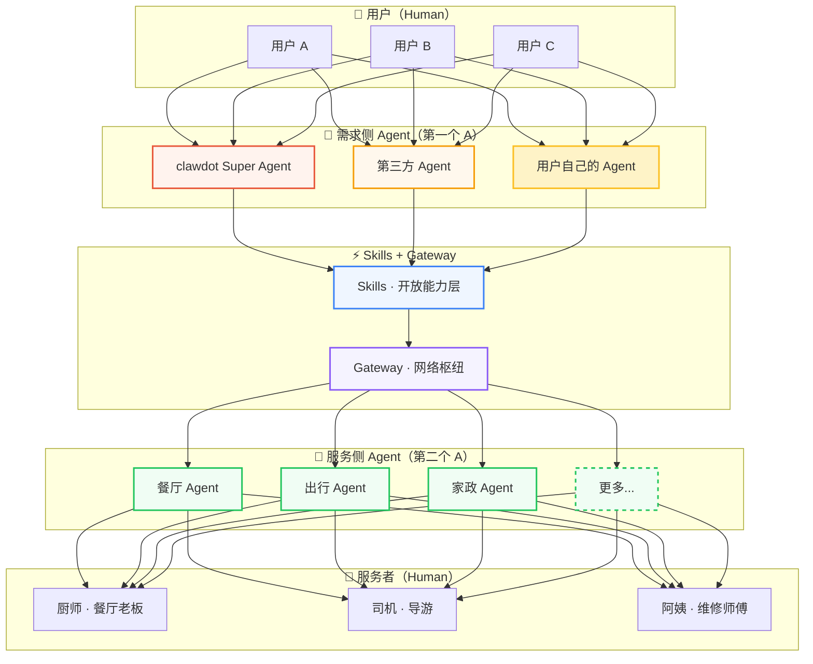

## 一张网，不是一条管道

H2A2A2H，全称 **Human → Agent → Agent → Human**。

这是虾点对未来本地生活服务形态的核心判断：人不再需要亲自去"找"服务，而是通过 Agent 表达需求；服务者也不需要学会"做流量"，他们的 Agent 会把好手艺传达给需要的人。中间的一切协商、匹配、撮合，由 Agent 与 Agent 之间完成。

这不是一条从左到右的流水线。这是一张开放的网络——任何 Agent 都可以接入，任何服务者都可以被连接。

---

## 网络的四个角色

### 第一个 H — 你（消费者）

你只需要说出你想要什么。

"今晚想吃点清淡的，两个人，预算 150 以内。" "明天出差帮我安排一下。" "周末带孩子去个有意思的地方。"

你不用打开 App 翻来翻去，不用读几十条评价，不用纠结到底选哪家。你只需要像跟一个懂你的朋友说话一样，表达你的需求。

### 第一个 A — 需求侧 Agent

你的 Agent 理解你、记得你、为你行动。

它知道你不吃香菜、喜欢靠窗的位置、周五晚上偏好日料。它不是冰冷的搜索引擎，而是一个懂你的生活管家。

而且，这不只是虾点自己的 Super Agent。这是一个开放的网络——第三方 Agent、你自己的 Personal Agent，都可以接入虾点的 Skills 来为你服务。

<Columns cols={3}>
  <Card title="clawdot Super Agent" icon="sparkles">
    虾点自己的 Agent，满血技能，搞定吃、行、玩、生活的全部场景。
  </Card>
  <Card title="第三方 Agent" icon="blocks">
    其他平台的 Agent 也可以调用虾点的 Skills，接入同一张服务网络。
  </Card>
  <Card title="Personal Agent" icon="user">
    你自己的 Agent 同样可以调用虾点的能力，获得本地生活服务。
  </Card>
</Columns>

### A ↔ A — Agent 协商层

这是真正革命性的部分。

消费者的 Agent 和服务者的 Agent 直接对话协商。没有中心化平台在中间做撮合，没有竞价排名，没有流量税。需求和供给基于真实能力、真实口碑进行最优匹配。

在这一层，**Skills** 是 Agent 的能力来源——吃、行、玩、生活，每一个服务类别都是一项 Skill，能力可以无限扩展。**Gateway** 是网络的中心枢纽，服务侧的 Agent 通过 SDK 注册到 Gateway，需求侧的 Agent 通过 Skills 调用 Gateway，两侧在这里完成连接。

### 第二个 A — 服务侧 Agent

每个服务者都有自己的 Agent。

餐厅 Agent 帮老板管排期、接单、回复客户。家政 Agent 帮阿姨排班、报价、协调时间。出行 Agent 帮司机调度、匹配订单。

手艺人只需要专注手艺，Agent 帮他们把好服务传达给需要的人。通过 SDK 零门槛接入，不需要懂 AI，不需要重做系统。

### 第二个 H — 服务者（人）

技术的终点，是人与人的温暖连接。

Agent 帮你更快地找到好的服务，但最终享受服务的体验，是人与人之间的。做了二十年湘菜的师傅亲手炒的菜，认真负责的保洁阿姨打扫的家，手艺精湛的维修师傅修好的水管——这些温度，是 AI 无法替代的。

---

## 为什么是网络，而不是平台

传统的本地生活服务是一个中心化平台：平台制定规则，商家买流量，消费者被算法推荐。平台越大，抽成越高，服务者和消费者都在为"连接的成本"买单。

虾点不是平台。虾点是一张网络。

在这张网里，每一个人和每一个 Agent 都是一个节点，彼此连接，彼此成就。没有人"拥有"这张网——**虾点属于生活中的每一个人。**

| | 网络（虾点） | 传统平台 |
|---|---|---|
| **连接方式** | Agent 与 Agent 直接协商 | 平台撮合，算法推荐 |
| **接入门槛** | 任何 Agent 都可以接入 | 必须在平台内运营 |
| **服务者获客** | 好服务自然触达对的人 | 买流量、做运营 |
| **成本结构** | 去中心化，合理透明 | 高额佣金和流量税 |
| **网络归属** | 属于每一个参与者 | 属于平台公司 |

---

## 爱心：流淌在每一条连接中

爱心不是这张网的某一层，而是贯穿整张网络的价值基因。

AI Agent 天然适合服务那些最需要帮助的人。独居老人需要有人帮忙跑腿买药，行动不便的人需要更贴心的上门服务，不会用智能手机的长辈需要一个耐心的代理人。

在传统平台上，这些人群往往被忽略，因为他们不是"高价值用户"。但在虾点的网络里，每一个需要帮助的人，都能通过 Agent 被看见、被匹配、被善待。

<Columns cols={3}>
  <Card title="Agent 助老" icon="heart-handshake">
    帮助老年人通过简单的语音交互获得本地生活服务。一句话，搞定买菜、买药、叫服务。
  </Card>
  <Card title="Agent 助残" icon="accessibility">
    为行动不便的人群提供更贴心的服务匹配和上门服务协调。
  </Card>
  <Card title="社区守望" icon="users">
    基于 Agent 的社区互助网络，让邻里之间的善意自然流动起来。
  </Card>
</Columns>
