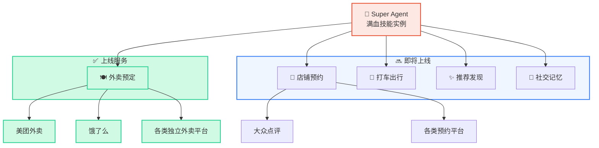
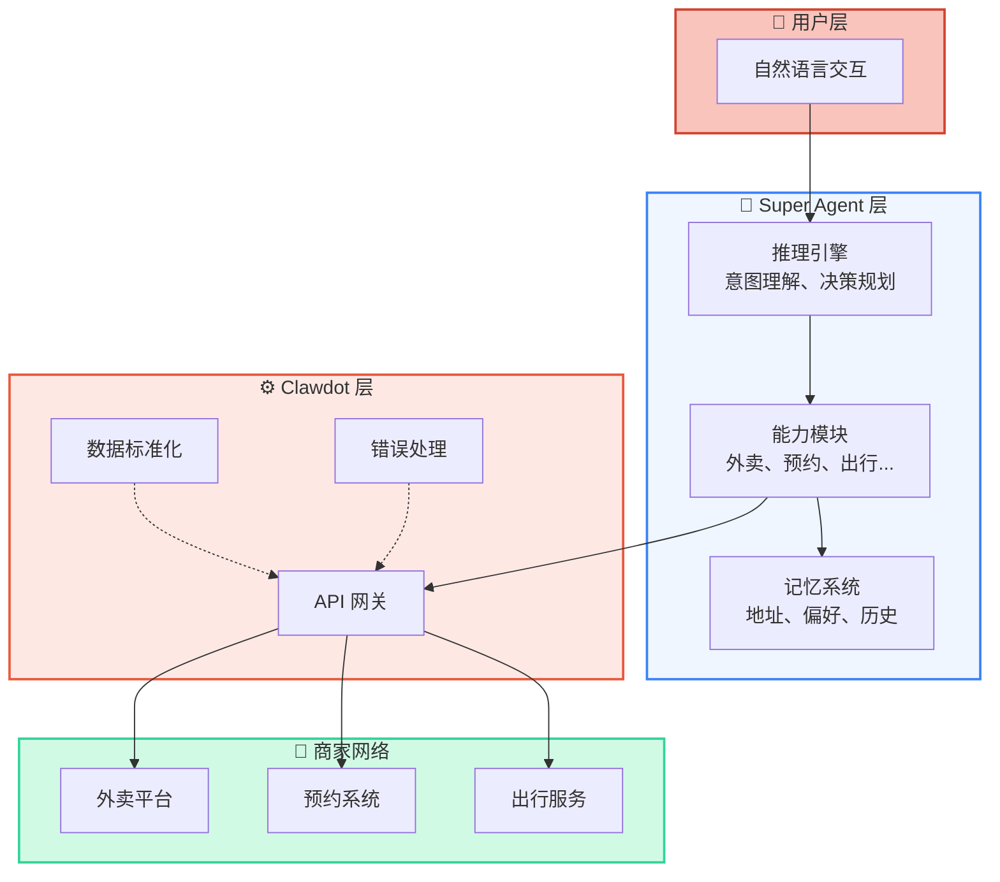
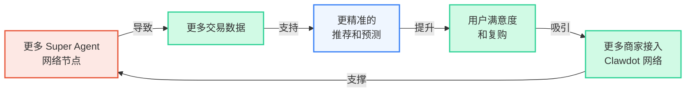
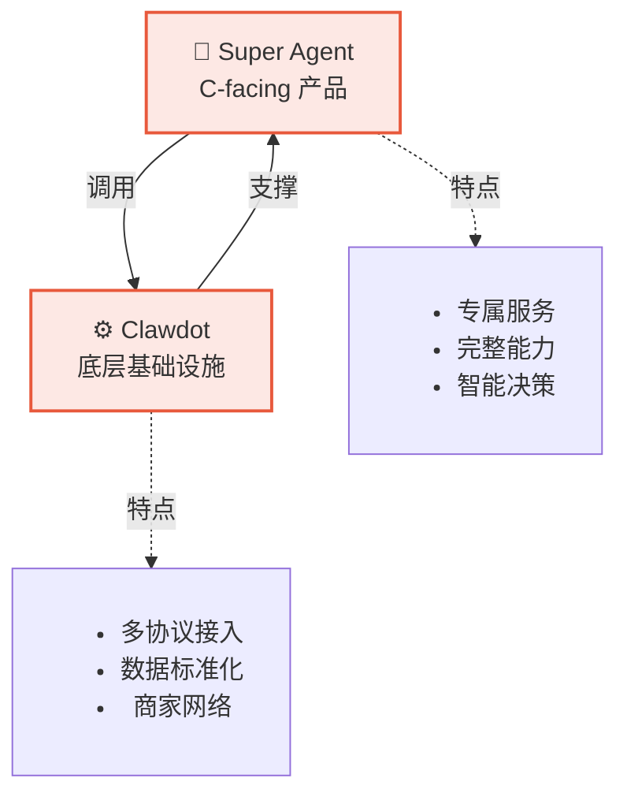

## 全景概览

Super Agent 是一个满血的智能助手，配备完整的本地生活服务能力矩阵。每个实例都具备以下所有能力，一对多地连接各类商家和服务：



## 能力详情

<CardGroup cols={2}>
  <Card title="🍽️ 外卖预定" icon="utensils">
    **状态**: ✅ 上线

    让 Super Agent 成为你的外卖小帮手。搜索商家、浏览菜单、智能下单、追踪订单。

    **核心功能**:
    - 按关键词/位置搜索商家
    - 完整菜单浏览（含规格、属性、加料）
    - 智能默认规格选择
    - 预览订单 → 创建订单（两步下单，金额单位为分）
    - 实时订单追踪

    **支持平台**: 美团、饿了么、各类独立外卖平台

    [了解更多 →](/super-agent/food-delivery)
  </Card>

  <Card title="📅 店铺预约" icon="calendar">
    **状态**: 🔜 即将上线

    帮你预约餐厅、酒店、美发、医美等各类服务。Agent 理解你的需求，自动选择时间和人数。

    **规划功能**:
    - 搜索预约商家
    - 查看时间表和评价
    - 智能选择最优时间
    - 确认预约和提醒
    - 预约变更管理

    **支持平台**: 大众点评、各类预约系统
  </Card>

  <Card title="🚗 打车出行" icon="car">
    **状态**: 🔜 即将上线

    一句话叫车，Super Agent 帮你完成从位置识别到上车出行的全流程。

    **规划功能**:
    - 位置识别（"我家"、"公司"、"机场"）
    - 路线规划和费用估算
    - 一键叫车
    - 实时车位追踪
    - 到达提醒

    **支持平台**: 滴滴、高德、各类出行服务
  </Card>

  <Card title="✨ 推荐发现" icon="sparkles">
    **状态**: 🔜 即将上线

    Super Agent 记住你的口味，主动发现你感兴趣的商家和菜品。不用搜索，直接推荐。

    **规划功能**:
    - 学习你的偏好（菜系、价格、评分）
    - 定期推荐新商家
    - 菜品组合推荐
    - 活动提醒（优惠券、新菜推出）
    - 朋友推荐（社交推荐）

    **结合能力**: 与外卖、预约等深度集成
  </Card>

  <Card title="💬 社交记忆" icon="comments">
    **状态**: 🔜 即将上线

    Super Agent 是你的私人助手，记住你的习惯、偏好、常用地址和交易历史。

    **规划功能**:
    - 记住常用地址（家、公司、常去餐厅）
    - 口味偏好学习（喜欢的菜系、忌口）
    - 消费习惯分析
    - 朋友信息记忆（谁喜欢什么）
    - 交易历史查询

    **结合能力**: 为所有其他能力提供上下文
  </Card>
</CardGroup>

## 能力进展表

| 能力 | 当前状态 | 上线时间 | 支持平台 | 相关文档 |
|------|--------|--------|--------|--------|
| 外卖预定 | ✅ 上线 | 2026-Q1 | 美团、饿了么等 | [查看](/super-agent/food-delivery) |
| 店铺预约 | 🔜 开发中 | 2026-Q2 | 大众点评等 | — |
| 打车出行 | 🔜 规划中 | 2026-Q3 | 滴滴、高德等 | — |
| 推荐发现 | 🔜 规划中 | 2026-Q3 | 全平台 | — |
| 社交记忆 | 🔜 规划中 | 2026-Q4 | 内建 | — |

## 能力的三层架构



## 飞轮效应

Super Agent 的能力增长遵循飞轮效应：



**飞轮的四个环节**：

1. **节点增长** → 更多用户拥有 Super Agent 实例
2. **数据积累** → 交易、偏好、地址等数据不断积累
3. **智能提升** → AI 基于数据做出更聪明的推荐和决策
4. **生态繁荣** → 用户体验好 → 商家愿意接入 → 能力更多

## 与 Clawdot 的关系



## 快速对比

| 特性 | Super Agent | Clawdot |
|------|-----------|---------|
| **用户** | C-facing（消费者） | B-facing（开发者、商家） |
| **核心价值** | 智能助手，一对一专属服务 | API 网关，连接 AI 和商家网络 |
| **能力** | 完整的业务流程（搜索、下单、追踪等） | 底层 API 原子能力 |
| **交互方式** | 自然语言对话 | API / MCP 调用 |
| **记忆能力** | 记住用户偏好、历史、地址 | 无状态服务 |
| **个性化程度** | 高（每个用户独立实例） | 低（通用 API） |

## 如何使用各项能力

<Tabs>
  <Tab title="外卖预定" icon="utensils">
    **当前可用**

    最简单的开始方式：
    ```
    用户：帮我点个外卖
    Super Agent：推荐几家热门外卖店给你...
    ```

    详见 [外卖点餐文档](/super-agent/food-delivery)
  </Tab>

  <Tab title="其他能力" icon="lock">
    **即将推出**

    其他能力正在开发中，预计在以下时间上线：
    - **Q2 2026**: 店铺预约
    - **Q3 2026**: 打车出行、推荐发现
    - **Q4 2026**: 社交记忆

    敬请期待！
  </Tab>
</Tabs>

## 常见问题

<AccordionGroup>
  <Accordion title="Super Agent 和普通聊天机器人有什么区别？" icon="question">
    普通聊天机器人只能**说**不能**做**，而 Super Agent 既能说也能做：

    - **能说**：理解自然语言，给出友好的回复
    - **能做**：调用 Clawdot API，真正完成下单、预约等操作
    - **有记忆**：记住用户偏好、地址、历史等，提供个性化服务

    所以 Super Agent 是真正的私人助手，不只是聊天机器。
  </Accordion>

  <Accordion title="Super Agent 如何保证交易安全？" icon="shield">
    Super Agent 基于 Clawdot 底层基础设施，安全性有多重保障：

    1. **双层认证**：API Key（`clw_` 前缀）标识 Agent 身份，用户授权 consent grant（`cg_` 前缀）标识已授权的外卖用户
    2. **操作确认**：下单分 `preview_order`（预览价格）与 `create_order`（创建订单）两步，必须先向用户展示价格并获得确认，再用预览返回的 `confirmation_token` 下单
    3. **链路加密**：所有 API 调用都经过加密
    4. **交易追踪**：每笔交易都可以追踪、审计、追责
    5. **第三方监管**：与商家平台直接对接，符合平台规范

    用户完全可以放心使用。
  </Accordion>

  <Accordion title="Super Agent 的数据会被用来做什么？" icon="database">
    Super Agent 收集的数据（地址、偏好、交易历史）用途：

    1. **改善服务**：更精准的推荐和预测
    2. **个性化体验**：记住你的习惯，提供快捷操作
    3. **聚合分析**：（仅数据聚合，不涉及个人隐私）

    所有数据都是**用户私有的**，不会被分享给第三方。详见隐私政策。
  </Accordion>

  <Accordion title="Super Agent 如何盈利？" icon="coins">
    Super Agent 的商业模式：

    - **交易佣金**：每笔交易从商家收取少量佣金
    - **增值服务**：Premium 功能（如专属优惠、优先配送）
    - **广告**：商家可以付费进行推荐排序（透明化）
    - **数据服务**：（仅限聚合数据，保护用户隐私）

    目标是建立一个三赢的生态：用户便利、商家获客、平台可持续。
  </Accordion>

  <Accordion title="如何添加新的能力或商家？" icon="plus">
    Super Agent 的能力扩展非常灵活：

    **新能力**：通过 Clawdot Gateway 的能力框架，可以快速集成新的服务类别（如跑腿、维修等）。

    **新商家**：商家可以通过 Clawdot 网络接入，自动获得 Super Agent 的支持，无需单独对接。

    这是 Clawdot 的核心价值 —— 一次接入，全网覆盖。
  </Accordion>
</AccordionGroup>

## 下一步

<CardGroup cols={2}>
  <Card title="了解工作原理" icon="gears" href="/super-agent/how-it-works">
    Super Agent 如何调用 Clawdot API，完成交易
  </Card>

  <Card title="试用外卖功能" icon="utensils" href="/super-agent/food-delivery">
    最详细的外卖点餐使用指南
  </Card>

  <Card title="查看产品路线图" icon="map" href="/overview/roadmap">
    了解 Super Agent 的后续规划
  </Card>

  <Card title="联系我们" icon="envelope">
    有建议或问题？欢迎反馈
  </Card>
</CardGroup>
