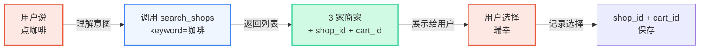
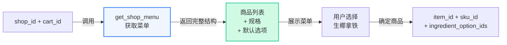
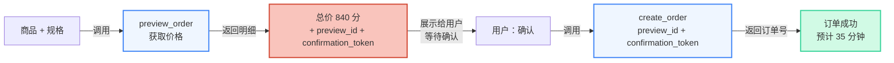

## 概述

外卖点餐是 Super Agent 的首个落地场景，也是最典型的能力体现。Super Agent 通过 Clawdot Gateway 连接到外卖平台，让 AI 能够完成从搜索商家到创建订单的完整流程，为用户提供一键下单体验。

## 能力矩阵

Super Agent 在外卖场景下的核心能力（每个能力一一对应一个 MCP 工具 / REST 端点，共 18 个工具与 18 个端点）：

| 能力 | 说明 | MCP 工具 |
|------|------|--------|
| 商家搜索 | 按关键词或位置搜索 / 浏览附近 | `search_shops` |
| 菜单浏览 | 完整菜单含规格、属性、加料及默认选项 | `get_shop_menu` |
| 地址管理 | 关键词搜索 POI、登记 / 复用收货地址 | `search_addresses` / `select_address` |
| 购物车算价 | 对选好的商品算价，拿到报价上下文 | `quote_cart` |
| 智能下单 | 预览 + 创建两步流程，自动选最优优惠券 | `preview_order` / `create_order` |
| 订单追踪 | 查询订单状态 | `get_order_status` |

<Note>
  下单是一条**有状态的链路**：每一步返回的 ID 必须原样回传给下一步，不可自造或跨链路混用。完整链路与字段表见 [下单流程](/gateway/order-flow)。
</Note>

## 典型对话场景

以下是一个完整的外卖点餐对话流程示例：

```
用户：帮我点杯咖啡

Agent：我来帮你搜索附近的咖啡店。
      → 调用 search_shops(keyword="咖啡")

      找到 3 家：
      1. 瑞幸咖啡(国贸店) - 配送费 ¥0，约 35 分钟
      2. 星巴克(CBD店) - 配送费 ¥5，约 40 分钟
      3. Manner Coffee - 配送费 ¥0，约 30 分钟

      你想看哪家的菜单？

用户：瑞幸吧

Agent：→ 调用 get_shop_menu(shop_id="shop_...", cart_id="cart_...")

      瑞幸咖啡热销：
      1. 生椰拿铁 ¥9.9（原价 ¥19）
      2. 冰美式 ¥9.9
      3. 厚乳拿铁 ¥13.9

      要点什么？

用户：一杯生椰拿铁，冰的

Agent：→ 调用 preview_order(
        shop_id="shop_...",
        cart_id="cart_...",
        address_id="addr_...",
        items=[{
          item_id="...",
          sku_id="...",
          quantity=1
        }]
      )

      订单确认：
      - 生椰拿铁 × 1（大杯，冰）
      - 配送费 ¥0
      - 优惠券减 ¥1.5
      - 实付 ¥8.4
      （金额字段单位为分，payable_price=840 即 ¥8.40）

      确认下单吗？

用户：确认

Agent：→ 调用 create_order(
        preview_id="prv_...",
        confirmation_token="cf_..."
      )

      已下单！预计 35 分钟送达。
      订单号：1234567890
```

<Note>
  搜索商家与查看菜单都需要先准备好收货坐标。地址流程是 `search_addresses` 拿到候选 → `select_address` 登记得到 `address_id`，再用于搜索、算价与预览。上面对话省略了这一步，假设用户已有常用地址。
</Note>

## Agent 设计建议

<AccordionGroup>
  <Accordion title="使用默认规格" icon="bolt">
    `get_shop_menu` 返回的每个商品都带 `ingredient_option_ids`（规格 / 属性 / 加料的可选项），并标注了商家推荐的默认组合。除非用户明确要求定制（"大杯改中杯"、"加一份浓缩"、"无糖"），否则直接用默认值即可。

    这样做的好处：
    - 避免处理复杂的规格互斥逻辑（某些规格组合不允许）
    - 加快下单流程
    - 选择最受欢迎的配置

    **示例**（下单时 `items` 是一个 list，每项给出 `item_id` / `sku_id` 和选中的 `ingredient_option_ids`）：
    ```
    items=[
      {
        "item_id": "...",
        "sku_id": "...",          // 大杯对应的 sku
        "quantity": 1,
        "ingredient_option_ids": ["...", "..."]  // 冰、标准糖等默认项
      }
    ]
    ```
  </Accordion>

  <Accordion title="预览后必须创建" icon="circle-check">
    下单是严格的两步流程：

    1. **preview_order** → 获取最终价格，以及配对的 `preview_id` + `confirmation_token`
    2. **create_order** → 用同一次预览的 `preview_id` + `confirmation_token` 正式下单

    务必在第一步后向用户展示明细（商品、配送费、优惠券、最终价格），获得用户明确确认后再调用 `create_order`。这避免了误操作导致的错误下单。`confirmation_token` 是幂等键，同一令牌只能下一单。

    **错误做法** ❌：
    ```
    Agent: "帮你下单了"
    User: "什么？我没同意！"
    ```

    **正确做法** ✅：
    ```
    Agent: "瑞幸拿铁 ¥8.4，确认下单吗？"
    User: "确认"
    Agent: "已下单，订单号 12345"
    ```
  </Accordion>

  <Accordion title="地址管理策略" icon="location-dot">
    地址管理是提升用户体验的关键：

    **首次使用**：
    1. 调用 `search_addresses(keyword="光谷世界城", lat=..., lng=...)` 搜索 POI
    2. 展示返回的 `suggestions` 让用户选择
    3. 用选中条目的 `suggestion_token` 调用 `select_address(...)`，登记并得到 `address_id`

    **后续使用**：
    1. `search_addresses` 同时返回 `saved_addresses[]`（按最近使用排序）
    2. 直接复用其 `address_id`，或提示用户选择
    3. 传了 `lat`/`lng` 时还会给出 `nearest_address_id`，可直接用最近的那个
    4. 不需要每次都重新搜索

    这大大减少了重复交互，尤其对于经常下单的用户。
  </Accordion>

  <Accordion title="错误处理" icon="triangle-exclamation">
    外卖场景中常见的错误和处理方式：

    | 错误 | 原因 | 处理方案 |
    |------|------|--------|
    | `preview_id` / `confirmation_token` 过期 | 超过约 10 分钟 | 重新调用 `preview_order` 取新的令牌对 |
    | 商家关店 | 商家正在打烊或集中配送 | 提示用户选择其他商家，重新搜索 |
    | 限流错误 | 用户操作过于频繁 | 等待后重试，提示用户避免频繁下单 |
    | 库存不足 | 商品已售罄 | 提示用户选择其他商品 |
    | 地址无法配送 | 配送范围外 | 提示用户确认地址，或选择其他商家 |

    **通用原则**：
    - 总是向用户展示友好的错误提示，而不是技术错误码
    - 提供解决方案或替代方案
    - 必要时主动中止流程，等待用户新的指示

    完整错误码见 [错误处理](/gateway/error-handling)。
  </Accordion>
</AccordionGroup>

## 核心流程深入

完整链路：`search_shops` → `get_shop_menu` → `quote_cart` → `select_address` → `preview_order` → `create_order` → `get_sign_action`。下面拆解其中几个关键环节。

### 1. 搜索商家



**关键点**：
- 不传 `keyword` 为浏览模式（附近至多 20 家，带距离 / 评分 / 配送费）；传 `keyword` 为精确搜索
- 每个结果都附带 `shop_id` 与 `cart_id`，`cart_id` 已封装店铺与配送坐标，原样回传给后续接口
- 金额字段（如 `min_order_amount`）单位为分

### 2. 获取菜单和规格



**关键点**：
- 菜单可能很大（100+ 项），可用 `keyword` 或 `limit`/`offset` 渐进披露
- 每项含可下单的 `item_id` / `sku_id` 与可选项 `ingredient_option_ids`
- Agent 基于用户表述（"冰的"）与默认值合并，组成下单用的 `items`

### 3. 预览 + 创建



**关键点**：
- `preview_order` 自动选择最优优惠券（`coupon_ids` 三态：不传=自动选最优；`[]`=不用券；指定列表=用指定券）
- `preview_id` + `confirmation_token` 须配对使用，有效期约 10 分钟
- 用户确认后才能 `create_order`，`confirmation_token` 为幂等键
- 下单后返回 `order_id` 与（需支付时的）`payment_action`；免密支付类订单还需先用 `get_sign_action` 完成签约

## 最佳实践总结

<CardGroup cols={2}>
  <Card title="✅ 推荐做法" icon="circle-check" color="green">
    - 使用菜单默认规格，加快流程
    - 预览后展示价格，等待确认再 `create_order`
    - 复用 `saved_addresses`，避免重复输入
    - 主动更新订单状态
    - 提供友好的错误提示
  </Card>

  <Card title="❌ 避免做法" icon="circle-xmark" color="red">
    - 直接创建而不预览
    - 让用户手动处理规格互斥
    - 每次都重新搜索地址
    - 返回技术错误码给用户
    - 忽略 `confirmation_token` 过期
  </Card>
</CardGroup>

## 相关阅读

- [下单流程](/gateway/order-flow) — 完整端到端链路与每步字段
- [认证机制](/gateway/authentication) — API Key 标识 Agent，consent grant 标识已授权用户
- [商品规格说明](/gateway/item-specs) — 规格 / 属性 / 加料体系
- [MCP 工具总览](/mcp/overview) — 18 个工具的契约

<Note>
  认证为双层：`Authorization: Bearer clw_...` 标识 Agent；用户授权（`cg_` 前缀的 consent grant）在 MCP 工具里作为 `consent_grant_id` 参数传入，在 REST 里通过 `X-Consent-Grant-Id` 请求头传递。MCP 公开端点为 `/mcp/v1`。创建 Agent、签发 API Key 走 [Portal](https://portal.clawdot.ai)。
</Note>
