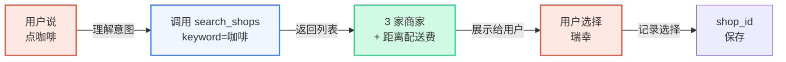
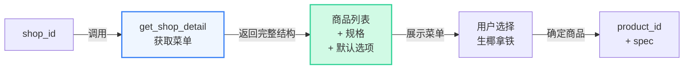
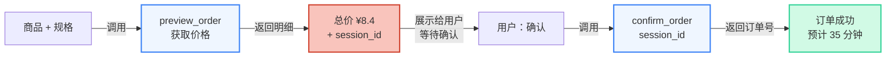

## 概述

外卖点餐是 Super Agent 的首个落地场景，也是最典型的能力体现。Super Agent 通过 Clawdot Gateway 连接到外卖平台，让 AI 能够完成从搜索商家到确认下单的完整流程，为用户提供一键下单体验。

## 能力矩阵

Super Agent 在外卖场景下的核心能力：

| 能力 | 说明 | API 工具 |
|------|------|--------|
| 商家搜索 | 按关键词或位置搜索，支持 10 品类并行 | `search_shops` |
| 菜单浏览 | 完整菜单含规格、属性、加料及默认选项 | `get_shop_detail` |
| 地址管理 | POI 搜索、地址创建与列表管理 | `search_pois` / `create_address` / `list_addresses` |
| 智能下单 | 预览 + 确认两步流程，自动选最优优惠券 | `preview_order` / `confirm_order` |
| 订单追踪 | 查询订单状态 | `get_order` |

## 典型对话场景

以下是一个完整的外卖点餐对话流程示例：

```
用户：帮我点杯咖啡

Agent：我来帮你搜索附近的咖啡店。
      → 调用 search_shops(keyword="咖啡")

      找到 3 家：
      1. 瑞幸咖啡(国贸店) - 配送费 ¥0，约 35 分钟
      2. 星巴克(CBD店) - 配送费 ¥5，约 40 分钟
      3. Manner Coffee - 配送费 ¥0，约 30 分钟

      你想看哪家的菜单？

用户：瑞幸吧

Agent：→ 调用 get_shop_detail(shop_id="luckin_001")

      瑞幸咖啡热销：
      1. 生椰拿铁 ¥9.9（原价 ¥19）
      2. 冰美式 ¥9.9
      3. 厚乳拿铁 ¥13.9

      要点什么？

用户：一杯生椰拿铁，冰的

Agent：→ 调用 preview_order(
        shop_id="luckin_001",
        items=[{
          product_id="coconut_latte",
          sku_specs=default_ingredients,
          quantity=1
        }]
      )

      订单确认：
      - 生椰拿铁 × 1（大杯，冰）
      - 配送费 ¥0
      - 优惠券减 ¥1.5
      - 实付 ¥8.4

      确认下单吗？

用户：确认

Agent：→ 调用 confirm_order(session_id="sess_abc123...")

      已下单！预计 35 分钟送达。
      订单号：1234567890
```

## Agent 设计建议

<AccordionGroup>
  <Accordion title="使用默认规格" icon="bolt">
    菜单中每个商品都有 `default_ingredients` 字段，包含了商家推荐的规格组合。除非用户明确要求定制（"大杯改中杯"、"加一份浓缩"、"无糖"），否则直接使用默认值即可。

    这样做的好处：
    - 避免处理复杂的规格互斥逻辑（某些规格组合不允许）
    - 加快下单流程
    - 选择最受欢迎的配置

    **示例**：
    ```
    {
      "product_id": "coconut_latte",
      "name": "生椰拿铁",
      "default_ingredients": {
        "size": "large",      // 大杯
        "temperature": "iced", // 冰的
        "sugar_level": "standard"
      }
    }
    ```
  </Accordion>

  <Accordion title="预览后必须确认" icon="circle-check">
    下单是严格的两步流程：

    1. **preview_order** → 获取最终价格和 `session_id`
    2. **confirm_order** → 使用 `session_id` 确认下单

    务必在第一步后向用户展示明细（商品、配送费、优惠券、最终价格），获得用户明确确认后再调用 confirm。这避免了误操作导致的错误下单。

    **错误做法** ❌：
    ```
    Agent: "帮你下单了"
    User: "什么？我没同意！"
    ```

    **正确做法** ✅：
    ```
    Agent: "瑞幸拿铁 ¥8.4，确认下单吗？"
    User: "确认"
    Agent: "已下单，订单号 12345"
    ```
  </Accordion>

  <Accordion title="地址管理策略" icon="location-dot">
    地址管理是提升用户体验的关键：

    **首次使用**：
    1. 调用 `search_pois(keyword="我家", city="北京")` 搜索 POI
    2. 展示搜索结果让用户选择
    3. 调用 `create_address(poi_id, name="我家")` 保存为常用地址

    **后续使用**：
    1. 调用 `list_addresses()` 获取已保存的地址
    2. 直接使用，或提示用户选择
    3. 不需要每次都重新搜索

    这大大减少了重复交互，尤其对于经常下单的用户。
  </Accordion>

  <Accordion title="错误处理" icon="triangle-exclamation">
    外卖场景中常见的错误和处理方式：

    | 错误 | 原因 | 处理方案 |
    |------|------|--------|
    | `session_id` 过期 | 超过 10 分钟 | 重新调用 `preview_order` 获取新的 session_id |
    | 商家关店 | 商家正在打烊或集中配送 | 提示用户选择其他商家，重新搜索 |
    | 限流错误 | 用户操作过于频繁 | 等待后重试，提示用户避免频繁下单 |
    | 库存不足 | 商品已售罄 | 提示用户选择其他商品 |
    | 地址无法配送 | 配送范围外 | 提示用户确认地址，或选择其他商家 |

    **通用原则**：
    - 总是向用户展示友好的错误提示，而不是技术错误码
    - 提供解决方案或替代方案
    - 必要时主动中止流程，等待用户新的指示
  </Accordion>
</AccordionGroup>

## 核心流程深入

### 1. 搜索商家



**关键点**：
- 搜索支持关键词和位置两种模式
- 返回结果已排序（根据距离、评分等）
- 商家信息包含实时的配送费和预计时间

### 2. 获取菜单和规格



**关键点**：
- 菜单已被标准化，规格互斥关系已处理
- `default_ingredients` 是商家推荐的规格组合
- Agent 基于用户表述（"冰的"）与默认值合并

### 3. 预览 + 确认



**关键点**：
- `preview_order` 自动选择最优优惠券
- `session_id` 只有 10 分钟有效期
- 用户确认后才能 `confirm_order`
- 下单后返回订单号和预计配送时间

## 最佳实践总结

<CardGroup cols={2}>
  <Card title="✅ 推荐做法" icon="circle-check" color="green">
    - 使用 `default_ingredients`，加快流程
    - 预览后展示价格，等待确认
    - 保存常用地址，避免重复输入
    - 主动更新订单状态
    - 提供友好的错误提示
  </Card>

  <Card title="❌ 避免做法" icon="circle-xmark" color="red">
    - 直接确认而不预览
    - 让用户手动处理规格互斥
    - 每次都重新搜索地址
    - 返回技术错误码给用户
    - 忽略 `session_id` 过期
  </Card>
</CardGroup>
