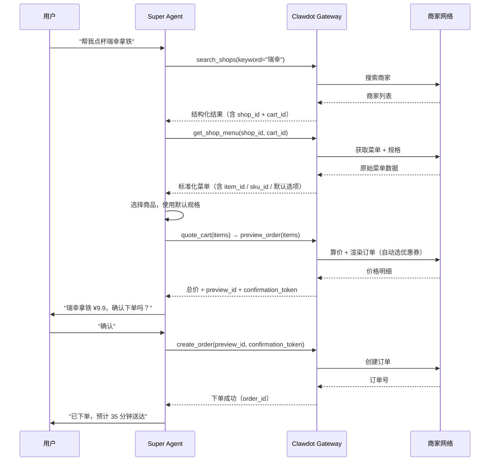
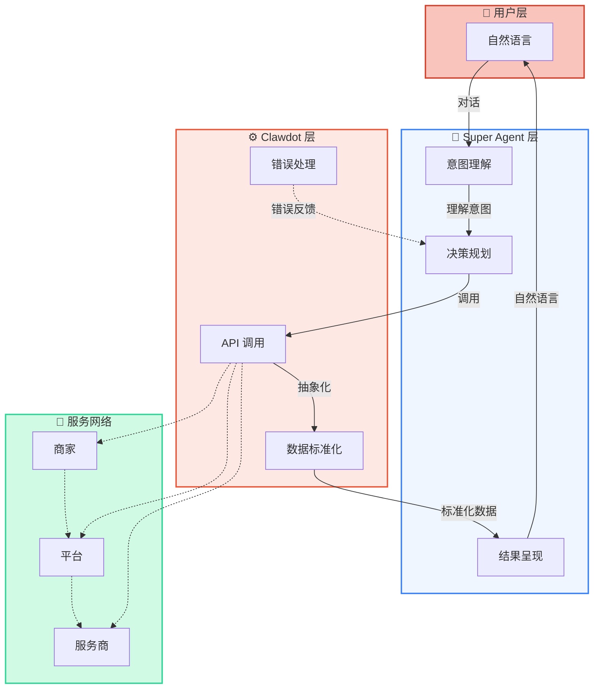

## 端到端流程

Super Agent 通过 Clawdot Gateway 连接用户、AI 和商家网络，完成一个完整的交易流程：



<Note>
  所有金额字段单位为**分（整数）**。例如 `payable_price: 990` 表示 ¥9.90。
</Note>

## Clawdot 的抽象层

AI Agent 直接对接商家平台会遇到复杂性。Clawdot Gateway 在中间提供了统一的抽象，让 Agent 工作变得简单：

| Agent 看到的 | Gateway 帮你处理的 |
|-------------|-------------------|
| 简单的 `shop_id` + `cart_id` | 多种 ID 格式转换（加密 ID、内部 ID、第三方 ID），坐标随 `cart_id` 封装 |
| 标准化的菜单结构 | 规格/属性/加料解析，互斥规则计算 |
| `ingredient_option_ids` 一键下单 | 遍历所有规格组，排除互斥项，选择默认项 |
| 一个最终价格 | 两次渲染：先获取优惠券列表，再用最优券重新渲染 |
| 统一的认证方式 | API Key 与 consent grant 校验、请求签名、User-Agent 适配 |
| 统一的错误码 | 各种平台错误归类为标准错误码 |

## Super Agent 的角色



## MCP 接入

Clawdot Gateway 对外以 **MCP（Model Context Protocol）** 暴露能力——这是为 Claude 等 AI 模型设计的 AI 原生调用方式。Super Agent 用 MCP 客户端（Streamable HTTP）连接公开端点 `https://eleme-gateway.hicaspian.com/mcp/v1`，每个请求在 HTTP 头携带 `Authorization: Bearer clw_...` 标识 Agent，用户授权则作为每个业务工具的 `consent_grant_id` 参数传入：

```
# 商家搜索 / 浏览
search_shops(consent_grant_id, keyword, address_id, lat, lng)

# 店铺菜单
get_shop_menu(consent_grant_id, shop_id, cart_id)

# 地址管理
search_addresses(consent_grant_id, keyword, lat, lng)   # 返回 saved_addresses + suggestions[].token
select_address(consent_grant_id, suggestion_token, contact_name, contact_phone)

# 算价与下单
quote_cart(consent_grant_id, shop_id, cart_id, address_id, items)
preview_order(consent_grant_id, shop_id, cart_id, address_id, items)
create_order(consent_grant_id, preview_id, confirmation_token)
get_order_status(consent_grant_id, order_id)
```

工具的参数与返回值都按 AI 的调用习惯做了优化。完整工具清单见 [MCP 概览](/mcp/overview)。

<Note>
  MCP 工具与底层是同一套网关服务层，对外只通过 MCP 接口提供。
</Note>

## 工作流程细节

完整下单链路是一条**有状态的链路**，每步返回的 ID 必须原样回传给下一步：`search_addresses` → `select_address` → `search_shops` → `get_shop_menu` → `quote_cart` → `preview_order` → `create_order`。先定地址、再按地址搜可送达的店，下游工具因此都拿得到配送坐标。完整字段表见 [下单流程](/gateway/order-flow)。

<AccordionGroup>
  <Accordion title="地址管理阶段" icon="location-dot">
    先定下"送到哪里"，下游搜店与算价 / 预览都以这个地址为准。首次使用时：
    1. 调用 `search_addresses` 搜索用户说的地址，返回 `suggestions[].token`
    2. 用户从候选列表中选择
    3. 调用 `select_address`（传 `suggestion_token` + 联系人）登记为收货地址，返回 `address_id`

    后续使用：`search_addresses` 同时返回 `saved_addresses[]`（传了 `lat`/`lng` 时还带 `nearest_address_id`），可直接复用其 `address_id`，减少交互步骤。
  </Accordion>

  <Accordion title="搜索阶段" icon="magnifying-glass">
    Agent 调用 `search_shops`（传上一步的 `address_id`）按收货地址搜可送达的商家。不传 `keyword` 为浏览模式（返回附近至多 20 家店铺，含距离、评分、配送费等决策字段）；传 `keyword` 为精确搜索（约 5 家，可传店名、品类或具体商品名）。每个结果都附带 `shop_id` 与 `cart_id`，`cart_id` 已封装店铺与配送坐标，是后续步骤的入口。
  </Accordion>

  <Accordion title="菜单浏览阶段" icon="list">
    Agent 调用 `get_shop_menu`（传 `shop_id` + `cart_id`）获取某个商家的完整菜单。返回包含：
    - 商品列表及价格（单位分）
    - 可下单的 `item_id` / `sku_id`
    - 商品规格（大小、冷热、甜度等）与加料的 `ingredient_option_ids`
    - **默认选项** —— 包含了商家推荐的规格组合

    菜单可能很大（100+ 项），可用 `keyword` 或 `limit`/`offset` 渐进披露。
  </Accordion>

  <Accordion title="算价 + 预览 + 下单阶段" icon="clipboard-check">
    这是核心的有状态链路：

    **算价** → `quote_cart`
    - 输入：`shop_id` + `cart_id` + `address_id` + `items`（list）
    - 输出：`quote_id` + 价格明细

    **预览** → `preview_order`
    - 输入：`shop_id` + `cart_id` + `address_id` + `items`（可选传 `quote_id` 校验报价上下文）
    - 输出：最终价格（单位分）+ `preview_id` + `confirmation_token`（须配对使用，有效期约 10 分钟）

    **下单** → `create_order`
    - 输入：同一次预览的 `preview_id` + `confirmation_token`
    - 输出：`order_id`、`status` 与（需支付时的）`payment_action`

    中间必须向用户展示价格，获得明确确认后才能调用 `create_order`。`confirmation_token` 是幂等键，同一令牌只能下一单。
  </Accordion>

  <Accordion title="订单追踪阶段" icon="truck">
    下单后，Agent 可以调用 `get_order_status` 查询订单状态：
    - 等待商家接单
    - 商家正在打单
    - 骑手已取餐
    - 骑手配送中
    - 已送达

    可用于主动更新用户订单进展。下单时也可在 `create_order` 传 `callback_url`，由网关轮询并在订单脱离未支付态时 POST 回调。
  </Accordion>

  <Accordion title="免密签约阶段" icon="credit-card">
    免密签约是**账户级、一次性的前置**：签约一次后，后续免密支付类订单即可自动扣款——它**不绑定某一笔订单、也不是每单都要做**，所以独立于上面的下单链路（不要把它当成下单的最后一步）。建议先用 `get_sign_status` 查是否已签约，未签约再调用 `get_sign_action`（传 `return_url`，不带 `order_id`）获取签约 `action`。`action_type` 为 `open_h5` 时把用户引导到 `action.action_url` 完成签约，完成后浏览器跳回 `return_url`；为 `none` 时表示已签约。随后用 `get_sign_status` 轮询结果。
  </Accordion>
</AccordionGroup>

<Note>
  在 [Portal](https://console.hicaspian.com/agents) 创建 Agent 获取 API Key；用户授权（consent grant）走绑定流程（SMS 验证码或 H5）获取。完整链路与字段见 [下单流程](/gateway/order-flow) 与 [认证机制](/gateway/authentication)。
</Note>
