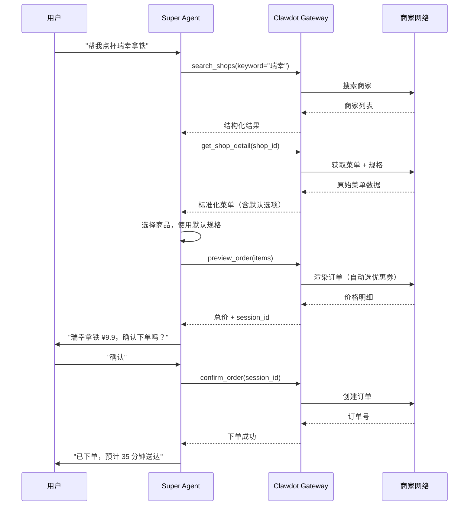
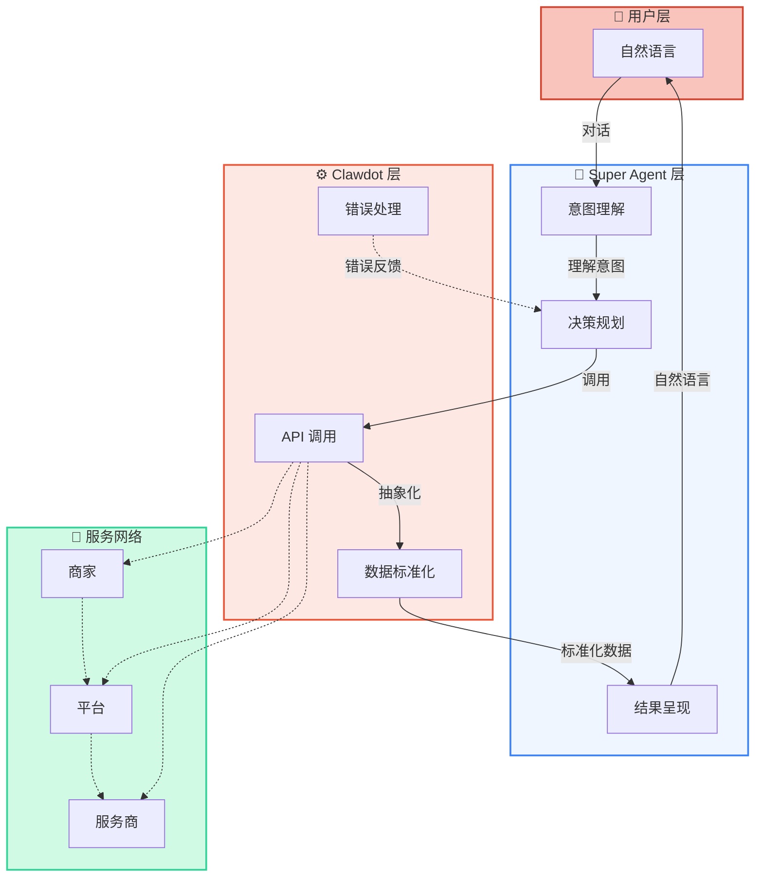

## 端到端流程

Super Agent 通过 Clawdot Gateway 连接用户、AI 和商家网络，完成一个完整的交易流程：



## Clawdot 的抽象层

AI Agent 直接对接商家平台会遇到复杂性。Clawdot Gateway 在中间提供了统一的抽象，让 Agent 工作变得简单：

| Agent 看到的 | Gateway 帮你处理的 |
|-------------|-------------------|
| 简单的 `shop_id` | 多种 ID 格式转换（加密 ID、内部 ID、第三方 ID）|
| 标准化的菜单结构 | 规格/属性/加料解析，互斥规则计算 |
| `default_ingredients` 一键下单 | 遍历所有规格组，排除互斥项，选择默认项 |
| 一个最终价格 | 两次渲染：先获取优惠券列表，再用最优券重新渲染 |
| 统一的认证方式 | Token 自动刷新、请求签名、User-Agent 适配 |
| 统一的错误码 | 各种平台错误归类为标准错误码 |

## Super Agent 的角色



## 双协议入口

同一个 Clawdot Gateway 实例同时暴露两种协议，满足不同的接入需求：

<Tabs>
  <Tab title="REST API">
    标准 HTTP 接口，适合任何编程语言和框架。Agent 通过 HTTP 请求与 Gateway 通信：

    ```bash
    # 搜索商家
    GET /api/v1/shops/search?keyword=瑞幸 \
      -H "Authorization: Bearer {token}"

    # 获取商家详情（含菜单）
    GET /api/v1/shops/{shop_id} \
      -H "Authorization: Bearer {token}"

    # 预览订单
    POST /api/v1/orders/preview \
      -H "Authorization: Bearer {token}" \
      -d '{"shop_id": "...", "items": [...]}'

    # 确认下单
    POST /api/v1/orders \
      -H "Authorization: Bearer {token}" \
      -d '{"session_id": "..."}'

    # 查询订单
    GET /api/v1/orders/{order_id} \
      -H "Authorization: Bearer {token}"
    ```

    认证通过 HTTP Header 传递（Bearer Token）。
  </Tab>

  <Tab title="MCP Protocol">
    Model Context Protocol 是 AI 原生的调用方式，专为 Claude 等 AI 模型设计。Super Agent 直接通过 MCP 工具调用：

    ```
    # 商家搜索
    search_shops(keyword, city, limit)

    # 商家详情
    get_shop_detail(shop_id)

    # 地址管理
    search_pois(keyword, city)
    list_addresses()
    create_address(poi_id, name)
    select_address(address_id)

    # 订单操作
    preview_order(items)
    confirm_order(session_id)
    get_order(order_id)
    ```

    MCP 工具更符合 AI 的思维方式，参数和返回值都经过优化，用户体验更流畅。
  </Tab>
</Tabs>

## 工作流程细节

<AccordionGroup>
  <Accordion title="搜索阶段" icon="magnifying-glass">
    Agent 调用 `search_shops` 搜索商家。Gateway 支持按关键词、位置、品类等维度搜索，并可并行搜索 10 个品类。结果返回商家 ID、名称、距离、配送费等关键信息。
  </Accordion>

  <Accordion title="菜单浏览阶段" icon="list">
    Agent 调用 `get_shop_detail` 获取某个商家的完整菜单。返回包含：
    - 商品列表及价格
    - 商品规格（大小、冷热、甜度等）
    - 加料及收费
    - **默认选项** —— 包含了商家推荐的规格组合
  </Accordion>

  <Accordion title="地址管理阶段" icon="location-dot">
    首次使用时：
    1. 调用 `search_pois` 搜索用户说的地址
    2. 用户从 POI 列表中选择
    3. 调用 `create_address` 保存为常用地址

    后续使用：调用 `list_addresses` 复用已保存的地址，减少交互步骤。
  </Accordion>

  <Accordion title="预览 + 确认阶段" icon="clipboard-check">
    这是核心的两步流程：

    **第一步：预览** → `preview_order`
    - 输入：商家 ID + 商品列表
    - 输出：总价、优惠券、配送费、`session_id`

    **第二步：确认** → `confirm_order`
    - 输入：`session_id`
    - 输出：订单号、预计配送时间

    中间必须向用户展示价格，获得明确确认后才能下单。
  </Accordion>

  <Accordion title="订单追踪阶段" icon="truck">
    下单后，Agent 可以调用 `get_order` 查询订单状态：
    - 等待商家接单
    - 商家正在打单
    - 骑手已取餐
    - 骑手配送中
    - 已送达

    可用于主动更新用户订单进展。
  </Accordion>
</AccordionGroup>
